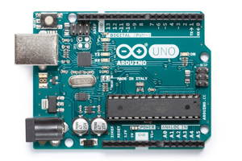

# Arduino Language

The RedBot robot runs apps written in a programming language called [Arduino](https://www.arduino.cc/reference/en/).

Arduino is actually a code library written in another computer language called [C++](https://en.wikipedia.org/wiki/C%2B%2B) \(similar to how jQuery is a code library written in JavaScript\). If and when necessary, your Arduino program can also incorporate code written directly in C++.

## Arduino Devices

The Arduino language is designed to make it easier to write programs for microcontrollers, which are small, low-cost, low-power computers that control physical inputs and outputs \(such as sensors, lights, motors, etc.\).



A microcontroller contains a processor \(CPU\), memory \(RAM\), storage \(Flash\), and input/output pins. An Arduino-based microcontroller is integrated into a circuit board that typically also has:

* USB port \(for data transfer and/or for power\)
* power supply input \(to use battery power instead of USB power\)
* input/output pins \(to plug in wires for sensors, etc.\)
* one or more built-in LED lights \(to indicate device has power, etc.\)
* one or more built-in buttons \(to restart device, etc.\).

A microcontroller doesn't have a keyboard, monitor, or other peripherals that full-size computers typically use. A microcontroller is also much less powerful than a full-size computer: a microcontroller has a slower processor, less memory, less storage, etc.

So why even use a microcontroller if it seems so limited in power? Microcontrollers are perfectly suited for performing dedicated computing tasks that don't require a full-size computer. Microcontrollers are also small enough \(and cheap enough\) that they can be embedded inside other devices. Want to create a "smart" device? Use a microcontroller, and create a program for it.

## Arduino Code Editor

You will need to use an Arduino code editor to create and save your Arduino apps, as well as to upload apps to your robot. You can use either the **Arduino Create web editor** or the **Arduino IDE desktop editor**. Here are [instructions for setting up your Arduino code editor](arduino-code-editor/).  

## Arduino Devices Store and Run One Program at a Time

Arduino devices, such as the RedBot, can only store and run **one** program at a time. If you want to change the program running on the device, you have to upload a different program onto the device.

However, you can create and save **multiple** programs in your Arduino account \(if using the online Arduino Create web editor\) or on your computer \(if using the Arduino IDE desktop editor\).

A USB cable is used to connect your Arduino device \(such as your robot\) to your computer, in order to upload an Arduino program onto the device.

The USB connection can also be used to transmit data between the Arduino device and your computer while a program is running on the Arduino device. This data communication can be displayed in a serial monitor available in the Arduino code editor. This is often used as a way to troubleshoot programs \(by displaying messages or data\) or to verify that sensors are working correctly \(by displaying sensor measurements\).

Some Arduino devices have a built-in WiFi chip that allows them to wirelessly update their program and transmit data. However, the RedBot circuit board does **not** have WiFi capabilities built-in.

## Arduino Program Structure

An Arduino program \(or app\) is also referred to as a **sketch** because the Arduino language is designed to allow you to quickly create a program — just like a sketch is a quick drawing.

The [Arduino Programming Language Reference](https://www.arduino.cc/reference/en/) is helpful for understanding the structure and syntax of Arduino code.

All Arduino programs include these two core functions:

* **Setup Function** — which runs one-time when your program first starts. The `setup()` function is typically used to set pin modes for the device's inputs and outputs, initialize certain settings or variables, and perform any other code that should occur at the start of the program.
* **Loop Function** — which starts to run when the `setup()` function is done, and then runs over and over in an endless loop. The `loop()` function typically contains the main tasks of your program.

```cpp
void setup() {
    // add code here

}

void loop() {
    // add code here

}
```

In fact, if you wanted your device to only perform a task one-time, you could list all your code inside the `setup()` function and just leave the `loop()` function empty. However, in nearly all cases, you'll put the code for your tasks into the `loop()`, so the device can continuously perform whatever tasks you've programmed it to do.

If your device is restarted — by pressing its "reset" button or by turning the power off and then back on — the device's program will start over by running the `setup()` function one-time and then running the `loop()` function repeatedly.

Here's two simple rules to follow when coding an Arduino program: 1. Your program **must** have a `setup()` function and a `loop()` function, even if there is no code inside the function. 2. Your program **cannot** have more than one `setup()` function or more than one `loop()` function.

Besides having the required `setup()` and `loop()` functions, most Arduino programs will also have:

* **libraries** — which are included as "links" at the very beginning of the program. These external code libraries provide additional functions that your program can utilize. For example, your robot programs will need to include the SparkFun `RedBot.h` library, which has methods \(functions\) used to control the RedBot motors and sensors.
* **global variables and objects** — which are typically declared before the `setup()` function. These variables are used to store data that will be used in your program's functions. In your robot program, some of your variables will be objects created from classes defined in the RedBot library.
* **custom functions** — which are typically listed at the very end of your program, after the `loop()` function. Custom functions are used to contain code that performs specific tasks. Custom functions are optional, but they can help break up your code into smaller modules that can be easier to understand \(and easier to re-use\). The code inside a custom function is only run if and when the custom function is "called" within the `setup()` or `loop()` function. A custom function can also be "called" within another custom function.
* **comments** — which can be embedded throughout a program wherever they may be helpful. Comments are just notes that help explain the code to people reading the program. Comments are optional, but they can help clarify portions of the code to yourself or to others. You decide if and where to add comments. Any comments in the program are ignored when the program is compiled and uploaded to the device. Comments can be [single-line](https://www.arduino.cc/reference/en/language/structure/further-syntax/singlelinecomment/) or [multi-line](https://www.arduino.cc/reference/en/language/structure/further-syntax/blockcomment/).

To summarize, here is the typical code structure \(in order\) for an Arduino program:

1. Comments \(can be embedded throughout program\)
2. Included Libraries \(if necessary\)
3. Global Variables and Objects
4. Setup Function \(required - must have one and only one setup\)
5. Loop Function \(required - must have one and only one loop\)
6. Custom Functions \(optional - can have has many as necessary\)

Here's an example of a simple Arduino program, so you can see how its code structure follows this pattern:

```cpp
/*
Example Arduino Program
Push Button to Produce Beep
*/

// SparkFun RedBot Library - Version: Latest
#include <RedBot.h>

// global variables
const int speaker = 9; // speaker connected to pin 9
RedBotButton button;

// setup function runs one-time at start
void setup() {
    pinMode(speaker, OUTPUT);
}

// loop function runs over and over after setup done
void loop() {
    // see if button pushed
    if (button.read() == true) {
        singleBeep(); // call custom function
    }
}

// custom function runs only when it is called
void singleBeep() {
    tone(speaker, 3000); // turn on sound at frequency 3000 Hz
    delay(200); // wait 0.2 seconds
    noTone(speaker); // turn off sound
}
```

For comparison, here's a modified version of the same program. It does the **exact same task**, except the program does not include any comments, libraries, global variables, or custom functions. It just has the `setup()` and `loop()` functions:

```cpp
void setup() {
    pinMode(12, INPUT_PULLUP);
    pinMode(9, OUTPUT);
}

void loop() {
    if (digitalRead(12) == LOW) {
        tone(9, 3000);
        delay(200);
        noTone(9);
    }
}
```

While this second version of the program is obviously much more concise, it is actually more difficult to understand what the program is supposed to do. This is one reason \(among many other reasons\) why comments, libraries, variables, and custom functions are useful in programming.

