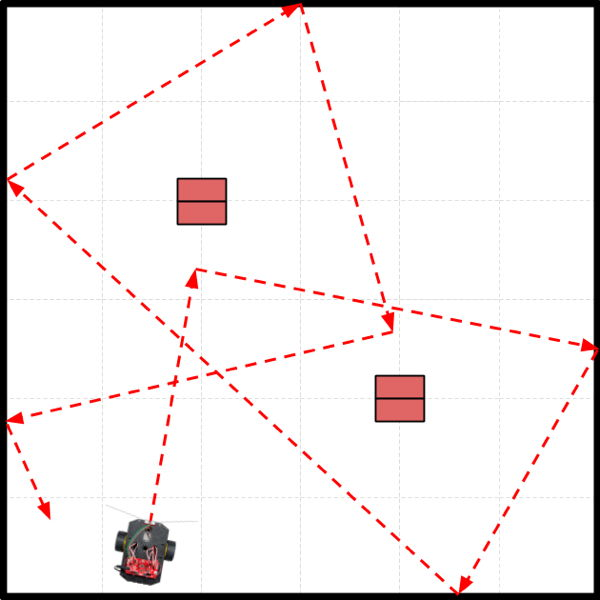

# Autonomous Navigation

The robot uses its sensors to detect features in environment \(obstacles, etc.\), and then decides what actions to take \(stop, turn, drive, etc.\).

* **ADVANTAGE:**  The robot can adapt to changes in its environment \(e.g., obstacles in different positions, etc.\). The robot can be programmed to perform more complex behaviors \(e.g., [solving a maze](https://www.instructables.com/id/Robot-Maze-Solver/), etc.\).
* **DISADVANTAGE:**  The robot may not necessarily follow a pre-determined path. The robot's behavior is limited by which sensors it has. Depending on the behavior needed, it may be more challenging to program the robot's rules.

## Example Task Scenario

In this task scenario, a security robot will patrol an area in a semi-random pattern. The robot will use its IR line sensors to avoid crossing the line around the area's perimeter. When the robot detects the line, the robot will turn back towards the interior of the area. In addition, the robot will use its ultrasonic sensor to avoid colliding with any obstacles within the area by changing direction when an obstacle is too close. \(The red rectangles are cardboard boxes representing obstacles.\)

Every time the robot makes a turn, the angle has been programmed to be slightly random \(though within a certain range\), which makes the robot's pattern different every time the demo is run. \(Therefore, the diagram only shows one possible path.\) The robot can be started from anywhere in the environment \(pointing in any direction\), and the robot will still perform its task of patrolling within the area while avoiding obstacles. You can also change the number of obstacles and their positions at any time.

For the purposes of the demonstration, the robot will only patrol for a limited amount of time \(30 seconds\). In addition, the demo environment is obviously much smaller than a real environment for a security guard patrol.



## Example Code

Here is a possible way to code a custom function to perform this task scenario:

```cpp
void task1() {
  // add code to perform task scenario 1

  // drive autonomously by avoiding lines and obstacles

  // get current time in milliseconds
  unsigned long time = millis();
  
  // make end time 30 seconds from now
  unsigned long endTime = time + 30000; 

  // while current time is less than end time, run demo
  while (time < endTime) {
    avoidLine();
    avoidCollision();
    time = millis(); // check current time again
  }

  // time's up
  motors.stop();
  doubleBeep();

  // at end of this task, reset for next task
  started = false;
  nextTask = 2;
}
```


