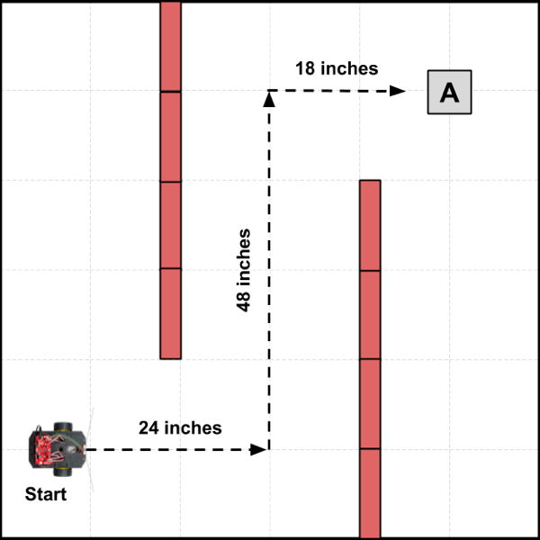

# Distance Navigation

When using distance navigation, the robot drives straight for a specific distance, and then turns to start driving in a new direction. The robot's path is programmed as an ordered sequence of specific driving distances and specific turns \(i.e., pivot angles\).

* **ADVANTAGE**:  The robot can be programmed to follow any path needed \(i.e., path is not defined by lines or markers\).
* **DISADVANTAGE**:  The robot's turns may not be perfectly accurate every time. After making several turns, the robot might be off-course from its intended path.

## Example Task Scenario

In this task scenario, a hospital lab delivery robot will navigate through the hospital hallways \(red rectangles represent walls\) to an nurse's station \(labeled as "A"\), pick up blood samples \(simulated step\), and deliver the samples to the hospital lab for analysis \(labeled as "Start"\).

For the purposes of the demonstration, the distances traveled are obviously much shorter than a real hospital environment.



## Example Code

Here is a possible way to code a custom function to perform this task scenario:

```cpp
void task1() {
  // add code to perform task scenario 1

  // drive from Start to Nurse Station A
  driveDistance(24);
  pivotAngle(-90); // turn left
  driveDistance(48);
  pivotAngle(90); // turn right
  driveDistance(18);

  // Simulated Step: pause and pick up samples at Station A
  pauseRobot(); // wait until button pressed

  // turn around and drive back to Start
  pivotAngle(180); // turn around
  driveDistance(18);
  pivotAngle(-90); // turn left
  driveDistance(48);
  pivotAngle(90); // turn right
  driveDistance(24);

  // Simulated Step: Samples are delivered to lab at Start
  doubleBeep();

  // at end of this task, reset for next task
  started = false;
  nextTask = 2;
}
```


