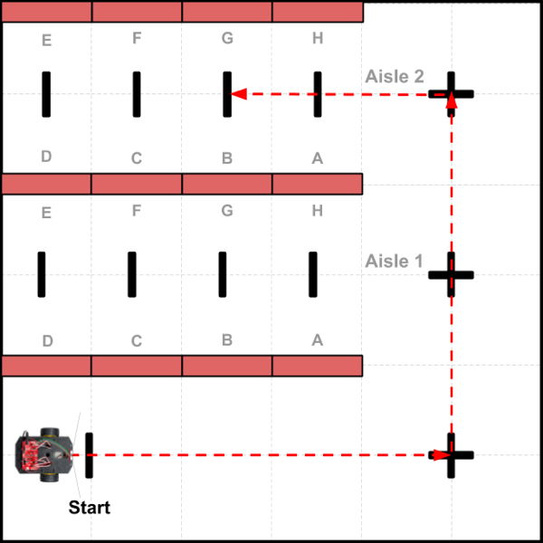

# Line Counting Navigation

When using line counting navigation, the robot drives straight while counting line markers it crosses, and then turns at a specific line number to start driving on a new path. The robot's path is programmed as an ordered sequence of specific line counts and turns.

* **ADVANTAGE:**  You only have to place line markers for stops or turns along a path \(instead of the entire path\).
* **DISADVANTAGE:**  The robot can only stop or turn at a line marker. The robot's turns may not be perfectly accurate every time. If the robot were to get too far off-course from its intended path, it might not drive over the line markers \(and won't detect them\).

Line counting navigation is similar to the directions that a person might give you to get to a destination in a city \(such as "Go straight for two more blocks. Then turn left..."\).

## Example Task Scenario

In this task scenario, a store robot will navigate through the store aisles \(red rectangles are cardboard boxes representing store shelves\) to a specific location \(Shelf B in Aisle 2\), deliver a box of items to be stocked \(simulated step\), and then drive back to the stockroom \(labeled as "Start"\). The black lines and "plus signs" are line markers that the robot will use for navigation.

For the purposes of the demonstration, the distances traveled are much shorter than what would be required in an actual store environment.



## Example Code

Here is a possible way to code a custom function to perform this task scenario:

```cpp
void task1() {
  // Example of Line Counting Navigation

  // Deliver box to Shelf B in Aisle 2, and return to start

  // drive from Start to Aisle 2
  countLine(2); // Start line + lower right line (Aisle 0)
  pivotAngle(-90); // turn left
  countLine(2); // Aisle 1 line + Aisle 2 line

  // drive to Shelf B
  pivotAngle(-90); // turn left
  countLine(2); // A line + B line
  pivotAngle(-90); // turn left to face Shelf B

  // Simulated Step: deliver box of items to be stocked
  pauseRobot(); // wait until button pressed

  // return to Start
  pivotAngle(-90); // turn left to exit Aisle 2
  countLine(2); // A line + Aisle 2 line
  pivotAngle(90); // turn right
  countLine(2); // Aisle 1 line + lower right line
  pivotAngle(90); // turn right
  countLine(1); // next line is Start
  pivotAngle(180); // turn around
  doubleBeep();

  // at end of this task, reset for next task
  started = false;
  nextTask = 2;
}
```


