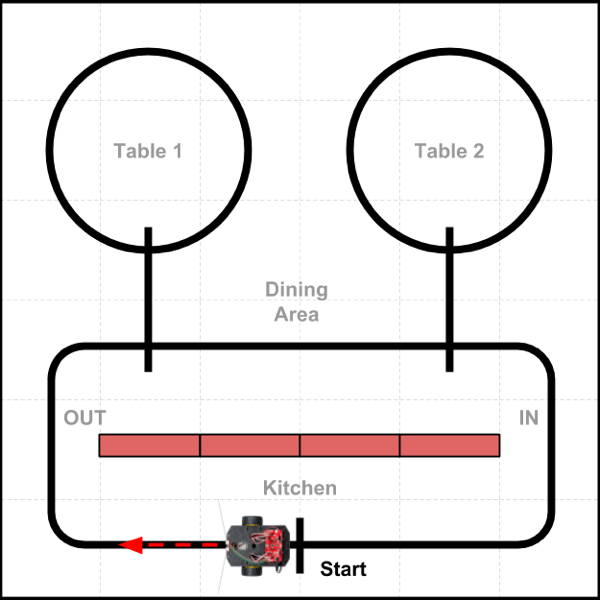

# Line Following + Counting Navigation

In this example, the robot will navigate by following a line while also counting other lines it crosses, and then making turns \(or stops\) at specific line counts. The robot's path is programmed as an ordered sequence of specific line counts and turns.

* **ADVANTAGE:**  You can create complex line patterns with straight paths, curved paths, and loops. Even if the robot's turns aren't perfect, the robot will usually self-correct its direction as it starts to follow its new line path.
* **DISADVANTAGE:**  The robot can only stop or turn at a line intersection. You have to create a continuous line for each path.

Line following + counting navigation is similar to the directions that a person might give you to get to a destination in the country \(such as "Follow this road as it curves around. At the second stop sign, turn right..."\).

## Example Task Scenario

The diagram below represents a scenario where a restaurant robot will deliver a food order from the kitchen out to Table 2, drive around the table \(delivering each person's order\), and then return to the kitchen. \(The red rectangles are cardboard boxes that represent a wall between the kitchen and dining area.\) The robot will follow the current line it is on while also counting other lines that it crosses, which help determine where it makes turns or stops. There is also a line marker \(labeled "Start"\) in the kitchen area, so the robot knows where to stop in the kitchen.



For the purposes of the demonstration, the distances traveled are much shorter than what would be required in an actual restaurant environment.

## Example Code

Here is a possible way to code a custom function to perform this task scenario:

```cpp
void task1() {
  // Example of Line Following + Counting Navigation

    // Drive from kitchen to Table 2, drive around table, and return to start

  // drive from Start line to Table 2 line
  followCountLine(2); // 2nd line will be path to Table 2
  pivotAngle(-90); // pivot -90 angle = turn left
  followCountLine(1); // next line is the circle around table
  pivotAngle(-90);
  singleBeep(); // alert guests that food has arrived
  followCountLine(1); // drive once around table

  // turn and return to kitchen
  pivotAngle(-90);
  followCountLine(1); // next line is main path
  pivotAngle(-90);
  followCountLine(1); // next line is Start
  singleBeep(); // alert staff that robot is ready for next order

  // at end of this task, reset for next task
  started = false;
  nextTask = 2;
}
```


