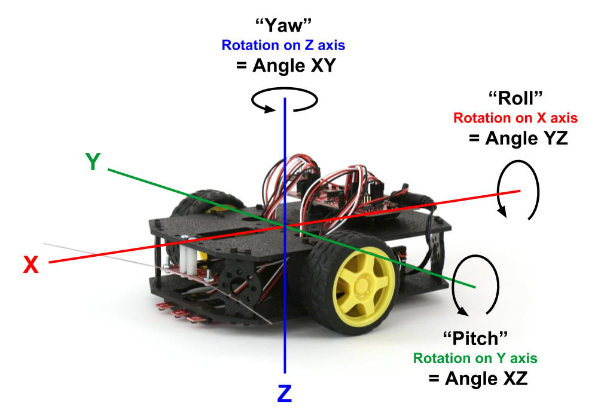

# Accelerometer

The RedBot has an accelerometer that can be used to measure changes in motion or orientation along 3 axes \(X, Y, Z\). Accelerometers are used in a variety of devices, including smartphones, fitness trackers, etc.

The accelerometer is a small circuit board that should be connected to I/O pins A4 and A5 on the main RedBot circuit board.


The accelerometer can measure:

* the acceleration of the device \(i.e., the device speeding up or slowing down\)
* the acceleration due to Earth's gravity \(i.e., the orientation of the device\)

Although you can measure the robot's acceleration, you **won't** use the accelerometer to measure the robot's speed. This is because when an object is traveling at a constant speed, its acceleration is actually **zero**. An object is only accelerating if its speed is changing \(i.e., speeding up or slowing down\). Besides you will be able to directly control your robot's speed by adjusting its motor power.

However, you can use the accelerometer to detect when the robot is physically bumped – this type of change in motion is a "pulse" acceleration that is detectable by the accelerometer.

You can also use the accelerometer to detect the orientation of a device by measuring the acceleration due to Earth's gravity, which is a constant downward force acting on all objects. The accelerometer can determine if the device is parallel to Earth's surface or if the device is tilted at an angle.


The accelerometer measures the acceleration along each axis \(X, Y, Z\) and then uses these measurements to calculate the robot's angle in the XZ plane, YZ plane, and XY plane.

The accelerometer measurements can be used to perform these useful robot behaviors:

1. The robot can [**detect when it is upside-down**](../robot-behaviors/detecting-other-conditions.md#checkupsidedown) by measuring its tilt from front-to-back \(pitch\) and from side-to-side \(roll\).
2. The robot can [**detect when it has been bumped**](../robot-behaviors/detecting-other-conditions.md#checkbump) by detecting a "pulse" acceleration.

## How to Code Accelerometer

To use the accelerometer in your robot app, you will need to:

1. Create a `RedBotAccel` object
2. Use the object's `read()` method to get accelerometer measurements
3. Add code statement\(s\) to perform action\(s\) based on the measurements

## Create RedBotAccel Object

The SparkFun `RedBot` library has a class named `RedBotAccel` which contains methods \(functions\) to control the accelerometer.

Before the `setup()` function, create a `RedBotAccel` object by assigning it to a variable:

```
RedBotAccel accel;
```

You may have noticed that you **didn't** have to indicate which I/O pins the accelerometer is connected to. This is because the RedBot library assumes the accelerometer is connected to pins A4 and A5 on the RedBot circuit board.


**REDBOT LIBRARY:**  Be sure your robot app has an `#include` statement for the SparkFun RedBot library. [Here's how to include the RedBot library](../arduino-code-editor/include-redbot-library.md).


## Read Accelerometer

The `RedBotAccel` object has a `read()` method which is used to get new accelerometer measurements for each of the 3 axes \(X, Y, Z\):

```cpp
accel.read();
```

The new measurements are stored as properties of the object:

* `accel.x` — acceleration along X axis
* `accel.y` — acceleration along Y axis
* `accel.z` — acceleration along Z axis
* `accel.angleXZ` — device's angle in XZ plane \(pitch\)
* `accel.angleYZ` — device's angle in YZ plane \(roll\)
* `accel.angleXY` — device's angle in XY plane \(yaw\)

The accelerometer measures the acceleration along each axis \(X, Y, Z\) and then uses these measurements to calculate the device's angle in the XZ plane, YZ plane, and XY plane.

This diagram shows how the accelerometer's X, Y, and Z axes are oriented on the RedBot and what the XZ, YZ, and XY angles represent. These angles are also referred to as **pitch**, **roll**, and **yaw**.



For a wheeled vehicle, pitch and roll are the most important angles to measure as they indicate the tilt of the vehicle from front-to-back and from side-to-side.

#### PITCH \(Angle XZ\)

Angle XZ represents **pitch**. Pitch is the front-to-back rotation on the robot's Y axis. The pitch angle can range from -180° to 180°.

* If the robot is perfectly level from front-to-back, the pitch is zero \(angle XZ = 0\).
* If the front of the robot is tilted up, the pitch is a positive value \(angle XZ &gt; 0\). For example, if the front of the RedBot were pointing straight up, the pitch would be 90°.
* If the front of the robot is tilted down, the pitch is a negative value \(angle XZ &lt; 0\). For example, if the front of the robot were pointing straight down, the pitch would be -90°.

#### ROLL \(Angle YZ\)

Angle YZ represents **roll**. Roll is the side-to-side rotation on the robot's X axis. The roll angle can range from -180° to 180°.

* If the robot is perfectly level from side-to-side, the roll is zero \(angle YZ = 0\).
* If the left side of the robot is tilted up, the roll is a positive value \(angle YZ &gt; 0\). For example, if the left side of the robot were pointing straight up, the roll would be 90°.
* If the left side of the robot is tilted down, the roll is a negative value \(angle XZ &lt; 0\). For example, if the left side of the robot were pointing straight down, the roll would be -90°.

#### YAW \(Angle XY\)

Angle XY represents **yaw**. Yaw is the right-to-left rotation on the robot's Z axis. The yaw angle can range from -180° to 180°.

However, when the robot is on a level surface, the yaw value **cannot** be accurately determined because the acceleration due to Earth's gravity is acting in the same direction \(i.e., downward\) as the Z axis.

Therefore, you **cannot** use the accelerometer's XY angle to determine which clockwise direction the robot is pointed. \(However, there are other sensors – not included in this kit – which can be used to accurately measure the yaw angle.\)

## Test Accelerometer

To test out your accelerometer, you can view the accelerometer measurements using the serial monitor in the Arduino code editor.

Add this code statement **within** the `setup()` function:

```cpp
Serial.begin(9600);
```

This starts a serial data connection between your robot and your computer and sets the data transfer rate to 9600 bits per second.

A custom function named `testAccelerometer()` can be used to read the accelerometer and send \(`print`\) the measurements to your computer as serial data.

Add the `testAccelerometer()` function **after** the `loop()` function:

```cpp
void testAccelerometer() {

  // get new accelerometer data
  accel.read();

  // send data to serial monitor
  Serial.print("Pitch: ");
  Serial.print(accel.angleXZ);
  Serial.print("\tRoll: ");
  Serial.print(accel.angleYZ);
  Serial.print("\tYaw: ");
  Serial.println(accel.angleXY);

  // brief delay before next reading
  delay(100);
}
```

Add this code statement **within** the `loop()` function to call the custom function:

```cpp
testAccelerometer();
```

This should be only code statement listed within the `loop()` function.

After uploading the app to your robot, do **not** unplug the USB cable. You have to keep the robot connected to your computer to allow the serial data communication.

In your Arduino code editor, open the serial monitor, so you can view the serial data:

* **Arduino Create \(Web Editor\):**  Click the **Monitor** menu link in the left navigation to display the serial monitor in the middle panel.
* **Arduino IDE \(Desktop Editor\):**  Under the **Tools** menu, select "Serial Monitor." A new window will appear displaying the serial monitor.

It may take a few seconds for the serial connection to be detected by the editor. Then you should see the accelerometer measurements being displayed in the serial monitor window.

Place the robot on a level surface, such as your desk or table. If the surface is perfectly level, the values for pitch \(angle XZ\) and roll \(angle YZ\) will be zero. However, you may discover that your values are close to zero \(instead of exactly zero\).

Follow the steps below to test your robot's pitch, roll, and yaw.

#### PITCH

Pitch is the front-to-back rotation on the robot's Y axis. Pitch can range from -180° to 180°.

1. Hold the robot in the air, and slowly rotate the robot from front-to-back to tilt the front end up. Watch the pitch value change in the serial monitor as you change the tilt. When the robot's front end is tilted straight up, the pitch will be 90°.
2. Rotate the robot so it is level from front-to-back. When it is level, the pitch will be 0°.
3. Rotate the robot so its front end is tilts down. When the robot's front end is tilted straight down, the pitch will be -90°.

#### ROLL

Roll is the side-to-side rotation on the robot's X axis. Roll can range from -180° to 180°.

1. Hold the robot in the air, and slowly rotate the robot from side-to-side, so the left side is tilted up. Watch the pitch change in the serial monitor as you change the tilt. When the robot's left side is tilted straight up, the roll will be 90°.
2. Rotate the robot so it is level from side-to-side. When it is level, the roll will be 0°.
3. Rotate the robot so its left side is tilted down. When the robot's left side is tilted straight down, the roll will be -90°.

#### YAW

Yaw is the right-to-left rotation on the device's Z axis. Yaw can range from -180° to 180°.

However, when the robot is on a level surface, the yaw value **cannot** be accurately determined because the acceleration due to Earth's gravity is acting in the same direction \(i.e., downward\) as the Z axis.

1. Place the robot back down on a level surface, such as your desk or table. Check the yaw value in the serial monitor.
2. Rotate the robot clockwise to the right, while checking the yaw value in the serial monitor. You'll notice that the yaw value changes **randomly** – and does **not** represent which direction the robot is pointed \(i.e., the robot's rotation on the Z axis\).
3. Rotate the robot counter-clockwise to the left, while checking the yaw value in the serial monitor. Again, the yaw value changes randomly – and does **not** represent the robot's direction.

