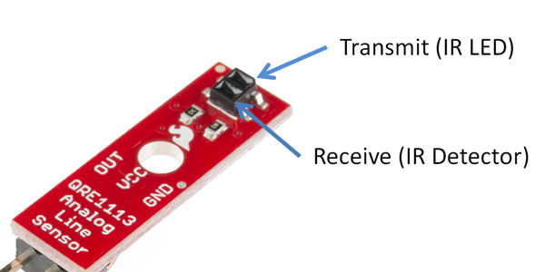

# IR Line Sensors

The RedBot has three "line following" sensors \(left, center, and right\). The bottom of each sensor has an LED that transmits infrared \(IR\) light, which is invisible to the human eye. The bottom of each sensor also has an IR detector, which measures how much of the IR light is reflected back by the surface that the robot is driving on.



The amount of reflected IR light that is detected depends on several factors, including the color of the surface, as well as the distance between the sensor and the surface:

* A light-colored surface will reflect more IR light, while a dark-colored surface will reflect less IR light.
* If the surface is farther away, the IR light will become more scattered, and less IR light will be reflected back to the detector.

Each IR line sensor is connected to the RedBot circuit board by a 3-wire jumper cable \(white, red, and black wires for data, power, and ground\):

* The left line sensor data wire should be connected to I/O pin A3
* The center line sensor data wire should be connected to I/O pin A6
* The right line sensor data wire should be connected to I/O pin A7

Measurements from the IR sensors can be used to perform several useful robot behaviors:

1. The robot can [**follow a line**](../robot-behaviors/detecting-lines.md#followline) by adjusting the left and right motor powers to steer the robot and keep it centered on the line as it drives.
2. The robot can [**avoid a line**](../robot-behaviors/detecting-lines.md#avoidline) by turning away from a line that it detects. In this case, the line acts as a border to keep the robot inside \(or outside\) a certain path or area.
3. The robot can [**count lines**](../robot-behaviors/detecting-lines.md#countline) that it crosses while driving and then stop once it reaches a desired line number. This allows the robot to navigate using a pattern of line markers.
4. The robot can [**follow a line while counting lines**](../robot-behaviors/detecting-lines.md#followcountline) that it crosses and then stop once it reaches a desired line number. This allows the robot to navigate using a pattern of intersecting line paths.
5. The robot can [**detect a surface drop-off**](../robot-behaviors/detecting-other-conditions.md#checkdropoff) ****\(such as:  stair step leading down, hole, etc.\) and take actions to protect itself \(brake, reverse, change direction, etc.\).

## How to Use IR Sensors in App

To use the IR sensors in your robot app, you will need to:

1. Create a `RedBotSensor` object for each IR sensor \(left, center, and right\)
2. Use each IR sensor object's `read()` method to get a measurement
3. Add code statement\(s\) to perform action\(s\) based on the IR sensor measurements

## Create RedBotSensor Objects

The SparkFun `RedBot` library has a class named `RedBotSensor` which contains methods \(functions\) to control analog sensors, such as the IR line following sensors.

Before the `setup()` function, create a `RedBotSensor` object for each IR sensor by assigning each object a variable name and indicating its pin number within parentheses:

```cpp
RedBotSensor leftLine(A3);
RedBotSensor centerLine(A6);
RedBotSensor rightLine(A7);
```


**REDBOT LIBRARY:**  Be sure your robot app has an `#include` statement for the SparkFun RedBot library. [Here's how to include the RedBot library](../arduino-code-editor/include-redbot-library.md).


## Read IR Sensors

To check the measurements from the IR line following sensors, use the `RedBotSensor` object's `read()` method to get a measurement from each sensor:

* `leftLine.read()`
* `centerLine.read()`
* `rightLine.read()`

The `read()` method will return an `int` value \(integer\) between 0-1023 that represents a measurement of how much reflected IR light was detected:

* **Lower values** indicate **more** IR light was reflected back. This indicates a **lighter-colored** surface.
* **Higher values** indicate **less** IR light was reflected back. This indicates a **darker-colored** surface.

If the values are **very high**, this probably indicates a **surface drop-off** \(such as: a stair step leading down, the edge of a table, a hole in the surface, etc.\).

Since you will typically want to compare the readings from all 3 sensors at the same time, your code could assign the sensor readings to local variables, and then perform actions based on the values stored in those variables:

```cpp
// get IR sensor readings
int leftSensor = leftLine.read();
int centerSensor = centerLine.read();
int rightSensor = rightLine.read();

// add code to do something based on sensor readings
```

You will need to add code to do something based on the sensor readings. For example, you might use `if` statements to perform certain actions if one or more sensor readings are greater than \(or less than\) a specific value.

## Test IR Sensors

To test out your IR sensors, you can view the sensor measurements using the serial monitor in the Arduino code editor.

Add this code statement **within** the `setup()` function:

```cpp
Serial.begin(9600);
```

This starts a serial data connection between your robot and your computer and sets the data transfer rate to 9600 bits per second.

A custom function named `testLineSensors()` can be used to read each IR sensor and send \(`print`\) the measurements to your computer as serial data.

Add the `testLineSensors()` function **after** the `loop()` function:

```cpp
void testLineSensors() {
  // get IR sensor readings
  int leftSensor = leftLine.read();
  int centerSensor = centerLine.read();
  int rightSensor = rightLine.read();

  // send data to serial monitor
  Serial.print("L: ");
  Serial.print(leftSensor);
  Serial.print("\tC: ");
  Serial.print(centerSensor);
  Serial.print("\tR:");
  Serial.println(rightSensor);

  // brief delay before next reading
  delay(100);
}
```

Add this code statement **within** the `loop()` function:

```cpp
testLineSensors();
```

This should be only code statement listed within the `loop()` function.

After uploading the app to your robot, do **not** unplug the USB cable. You have to keep the robot connected to your computer to allow the serial data communication.

In your Arduino code editor, open the serial monitor, so you can view the serial data:

* **Arduino Create \(Web Editor\):**  Click the **Monitor** menu link in the left navigation to display the serial monitor in the middle panel.
* **Arduino IDE \(Desktop Editor\):**  Under the **Tools** menu, select "Serial Monitor." A new window will appear displaying the serial monitor.

It may take a few seconds for the serial connection to be detected by the editor. Then you should see the sensor measurements being displayed in the serial monitor window.

You can try the following tests to see how the sensor measurements change:

* Create a dark line on a sheet of white paper. Position the robot's IR sensors on the dark line to view the measurements. Then position the IR sensors on the white paper to compare the measurements. Try testing other surface colors.
* Try slowly lifting the front edge of the robot off the table to see how the sensor measurements change with distance from the surface.
* Manually roll the robot towards the edge of a table to see how the measurements change when the sensors are hanging over a surface drop-off.


