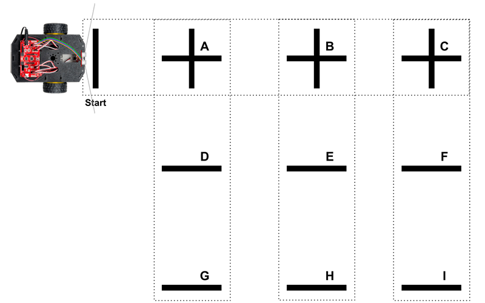

# IR Line Sensors

The RedBot has three "line following" sensors \(left, center, and right\). The bottom of each sensor has an LED that transmits infrared \(IR\) light, which is invisible to the human eye. The bottom of each sensor also has an IR detector, which measures how much of the IR light is reflected back by the surface that the robot is driving on.


The amount of reflected IR light that is detected depends on several factors, including the color of the surface, as well as the distance between the sensor and the surface:

* A light-colored surface will reflect more IR light, while a dark-colored surface will reflect less IR light.
* If the surface is farther away, the IR light will become more scattered, and less IR light will be reflected back to the detector.

The IR sensors can help the RedBot perform several useful tasks by comparing the measurements from the three IR sensors:

1. The RedBot can **follow a line** by adjusting the left and right motor powers to steer the robot and keep it centered on the line as it drives.
2. The RedBot can **avoid a line** by turning away from a line that it detects. In this case, the line acts as a border to keep the robot inside \(or outside\) a certain path or area.
3. The RedBot can **count lines** that it crosses while driving and then stop once it reaches a desired line number.
4. The RedBot can **detect a surface drop-off** \(such as:  stair step leading down, hole, etc.\) and take actions to protect itself \(brake, reverse, change direction, etc.\).

## How to Use IR Sensors in App

To use the IR sensors in your robot app, you will need to:

1. Create a `RedBotSensor` object for each IR sensor \(left, center, and right\)
2. Use each IR sensor object's `read()` method to get a measurement
3. Add code statement\(s\) to perform action\(s\) based on the IR sensor measurements

## Create RedBotSensor Objects

The SparkFun `RedBot` library has a class named `RedBotSensor` which contains methods \(functions\) to control analog sensors, such as the IR line following sensors.

Before your `setup()` function, create a `RedBotSensor` object for each IR sensor by assigning each object a variable name and indicating its pin number within parentheses:

```cpp
RedBotSensor leftLine(A3);
RedBotSensor centerLine(A6);
RedBotSensor rightLine(A7);
```


**REDBOT LIBRARY:**  Be sure your robot app has an `#include` statement for the SparkFun RedBot library. [Here's how to include the RedBot library](../arduino-code-editor/include-redbot-library.md).


## Check IR Sensor Measurements

To check the measurements from the IR line following sensors, use the `RedBotSensor` object's `read()` method to get a measurement from each sensor:

* `leftLine.read()`
* `centerLine.read()`
* `rightLine.read()`

The `read()` method will return an `int` value \(integer\) between 0-1023 that represents a measurement of how much reflected IR light was detected:

* **Lower values** indicate **more** IR light was reflected back. This indicates a **lighter-colored** surface.
* **Higher values** indicate **less** IR light was reflected back. This indicates a **darker-colored** surface.

If the values are **very high**, this probably indicates a **surface drop-off** \(such as: a stair step leading down, the edge of a table, a hole in the surface, etc.\).

Since you will typically want to compare the readings from all 3 sensors at the same time, your code could assign the sensor readings to local variables, and then perform actions based on the values stored in those variables:

```cpp
// get IR sensor readings
int leftSensor = leftLine.read();
int centerSensor = centerLine.read();
int rightSensor = rightLine.read();

// add code to do something based on sensor readings
```

You will need to add code to do something based on the sensor readings. For example, you might use `if` statements to perform certain actions if one or more sensor readings are greater than \(or less than\) a specific value.

## Use Serial Monitor to View IR Sensor Measurements

To test out your IR sensors, you can view the sensor measurements using the serial monitor in the Arduino code editor.

### 1. Start Serial Connection

Add this code into your `setup()` function to start a serial connection between your RedBot and the code editor:

```cpp
// start serial connection to view sensor data
Serial.begin(9600);
```

### 2. Send Data Over Serial Connection

Add this custom function named `testLineSensors()` after your `loop()` function. This custom function will send \(print\) the sensor measurements over the serial connection:

### testLineSensors\(\) function

```cpp
void testLineSensors() {
    // get IR sensor readings
    int leftSensor = leftLine.read();
    int centerSensor = centerLine.read();
    int rightSensor = rightLine.read();

    // send data to serial monitor
    Serial.print("L: ");
    Serial.print(leftSensor);
    Serial.print("\tC: ");
    Serial.print(centerSensor);
    Serial.print("\tR:");
    Serial.println(rightSensor);

    // small delay before next test reading
    delay(100);
}
```

Then be sure to call this custom function in your `loop()` function:

```cpp
void loop() {
    testLineSensors();
}
```

**NOTE:** Be sure that your program also contains the necessary code to create the `RedBotSensor` objects named `leftLine`, `centerLine`, and `rightLine`.

### 3. View Data in Serial Monitor

After uploading the program to the RedBot, **keep the RedBot connected to your computer using the USB cable** \(because the serial data is transferred over USB\).

Open the Serial Monitor window in your Arduino code editor:

* **Arduino Create Web Editor**: Click the "Monitor" menu in the left navigation panel.
* **Arduino IDE Desktop Editor:** Under the "Tools" menu, select "Serial Monitor".

It may take a few seconds for the serial connection to be detected by the editor. Then you should see the sensor measurements being displayed in the serial monitor window.

Try the following tests to see how the sensor measurements change:

* Place the RedBot on a light-colored surface \(e.g., place a white sheet of paper on a table\) to see what the measurements are. Then place the RedBot on a dark-colored surface to see how the measurements change. Try different colors to compare the measurements.
* Use a marker to draw a thick dark line on a white sheet of paper. Then manually roll the RedBot over the line to see how the sensor measurements change. See if you can position the RedBot so that only one sensor detects the line. Then see if you can adjust the position so a different sensor detects the line. Make the line wider to see how this affects the measurements.
* Use opaque tape \(masking tape, painting tape, electrical tape, etc.\) to make a "line" on a surface \(such as a table or floor\). Ideally, the colors of the tape and the surface should contrast: either use light-colored tape on a dark-colored surface, or use dark-colored tape on a light-colored surface. Then manually roll the RedBot over the line to see how the sensor measurements change.
* Try slowly lifting the front edge of the RedBot off the table to see how the sensor measurements change with distance.
* Manually roll the RedBot towards the edge of a table to see how the measurements change when the sensors are hanging over the edge.

## Count Lines and Stop at Target Number

You can also use the IR sensors to count the number of lines that the RedBot crosses as it drives. You can make the RedBot automatically stop once it reaches a specific line number \(such as the 1st line, 2nd line, 3rd line, 4th line, etc.\).

In this case, you use short lines as "markers" to indicate possible stopping points along a path. The lines should be placed **perpendicular** to the RedBot's path. The lines do not have to be spaced out evenly — just place the lines wherever you need a possible stopping \(or turning\) point. Once the RedBot reaches the desired line number, it will stop. Then you can perform other desired actions, such as turning, etc.


### countLine\(\) function

This custom function will use the IR sensors to count lines and then stop at a specific line number:

```cpp
void countLine(int target) {
  /* DRIVE STRAIGHT WHILE COUNTING LINES CROSSED
  To count dark lines on light surface:
  Use high threshold & see if sensors greater than threshold

  To count light lines on dark surface:
  Use low threshold & see if sensors less than threshold
  */

  int lineThreshold = 800; // change value if necessary

  // variables for counting lines
  int lineCount = 0;
  boolean lineDetected = false;

  // keeps looping while line count is less than target
  while (lineCount < target) {

    driveStraight();

    // get IR sensor readings
    int leftSensor = leftLine.read();
    int centerSensor = centerLine.read();
    int rightSensor = rightLine.read();

    // toggle between checking for line vs. checking for no line
    if (lineDetected == false) {
      // if all 3 sensors detect line, increase line count and toggle to checking for no line
      if (leftSensor > lineThreshold && centerSensor > lineThreshold && rightSensor > lineThreshold) {
        lineCount++;
        lineDetected = true;
      }
    }
    else if (lineDetected == true) {
      // if all 3 sensors detect no line, toggle back to checking for line
      if (leftSensor < lineThreshold && centerSensor < lineThreshold && rightSensor < lineThreshold) {
        lineDetected = false;
      }
    }
  }
  // target line count reached
  motors.brake();
  delay(250);
  driveDistance(3.5); // drive forward to center robot on target line
}
```

You can call this custom function in your `loop()` function \(or within another custom function\).

When calling this function, you will need to pass in a number representing the target line number where the RedBot should stop. For example, to make the RedBot drive straight until it reaches the 3rd line:

```cpp
countLine(3);
```

The custom function uses a `while` loop to keep driving straight and counting lines as long as the total number of detected lines is less than the target number of lines. Once the line count reaches the target number, the `while` loop ends and the motors are stopped. Then the RedBot drives forward a short distance \(3.5 inches\) in order to center itself on the stopped line.

You will notice that within this `while` loop, the value of a variable named `lineDetected` is toggled back and forth between `true` and `false`. The reason for this is to ensure accurate line counting, so the code doesn't accidentally count the same line more than once:

* Once a line has been detected, the code will increase the line count and immediately start checking for no line \(i.e., giving the RedBot time to drive past the current line\).
* Once it detects that the RedBot has completely crossed the current line \(i.e., once **no** line is detected\), the code will start checking again for a new line.

**IMPORTANT:** This `countLine()` function uses two other custom functions: `driveStraight()` and `driveDistance()`. Be sure to [follow the instructions in the Wheel Encoder section](https://cxd.gitbooks.io/robotics-project/content/redbot-code-references/wheel-encoders.html) to include the necessary code for the `driveStraight()` and `driveDistance()` functions.

### Grid-Like Line Marker Patterns

If necessary, you can also place line markers in a "grid-like" pattern, in order to allow your RedBot to travel between different locations. For example, this diagram shows a series of line markers with a starting location plus a set of locations labeled with letters A-I:



Imagine this diagram represents a top-down view of a grocery store layout with three aisles of food \(i.e., the three vertical columns of markers\). The top horizontal row \(i.e., with the "plus" markers\) is used to travel from one aisle to another. How could the RedBot travel from the starting location to location E?

```cpp
// travel from Start to location E
countLine(3); // start line + line A + line B
pivotAngle(90); // turn 90 degrees clockwise
// note: after turning, IR sensors no longer on line B
countLine(1); // next line will be location E
```

Note that after making a turn \(i.e., rotating\), the IR sensors at the front of the RedBot will no longer be directly on the line that the RedBot stopped at. \(Try this out with your RedBot to visually understand why this is true.\)

How could the RedBot then travel from location E to location G?

```cpp
// travel from location E to location G
pivotAngle(180); // turn around 180 degrees to face towards B
countLine(1); // next line will be line B
pivotAngle(-90); // turn 90 degrees counter-clockwise
countLine(1); // next line will be line A
pivotAngle(-90); // turn 90 degrees counter-clockwise
countLine(2); // line D + line G
```

So how could the RedBot get from location G back to the Start?

The line markers make it easy to create flexible pathways for your RedBot to travel to and from different locations. Of course, your team would design your line marker pattern to best fit the specific needs of your robot's testing scenarios.

**NOTE:** Another way to create flexible pathways for your RedBot is to program it to drive specific distances \(instead of counting a specific number of lines\). What might be the advantages \(or disadvantages\) of counting numbers of lines versus driving specific distances?

## Follow Line While Counting Lines Crossed

You can also use the IR sensors to make your RedBot follow a line while also counting the number of lines that the RedBot crosses as it drives. You can make the RedBot automatically stop once it reaches a specific line number \(such as the 1st line, 2nd line, 3rd line, 4th line, etc.\).

This will allow you to create a more complex line pattern that has different paths for the RedBot to follow. The key is to make sure the lines cross each other at **perpendicular** angles \(90° right angles\).


### followCountLine\(\) function

This custom function will use the IR sensors to follow a line while counting other lines crossed and then stop at a specific line number:

```cpp
void followCountLine(int target) {
  /* FOLLOW LINE WHILE COUNTING LINES CROSSED
  To follow and count dark lines on light surface:
  Use high threshold & see if sensors greater than threshold
  
  To follow and count light lines on dark surface:
  Use low threshold & see if sensors less than threshold
  */

  int lineThreshold = 800;  // change value if necessary

  // variables for counting lines
  int lineCount = 0;
  boolean lineDetected = false;

  // while line count is less than target, follow current line and count lines crossed
  while (lineCount < target) {
    followLine();
    
    // get IR sensor readings
    int leftSensor = leftLine.read();
    int centerSensor = centerLine.read();
    int rightSensor = rightLine.read();
    
    // toggle between checking for line versus checking for no line
    if (lineDetected == false) {
      // when all 3 sensors detect line, increase line count and toggle to checking for no line
      if (leftSensor > lineThreshold && centerSensor > lineThreshold && rightSensor > lineThreshold) {
        lineCount++;
        lineDetected = true;
      }
    }
    else if (lineDetected) {
      // when all 3 sensors detect no line, toggle back to checking for line
      if (leftSensor < lineThreshold && centerSensor < lineThreshold && rightSensor < lineThreshold) {
        lineDetected = false;
      }
    }
  }
  // target line count reached
  motors.brake();
  delay(250);
  driveDistance(3.5); // drive forward to center robot on target line
}
```

You can call this custom function in your `loop()` function \(or within another custom function\).

When calling this function, you will need to pass in a number representing the target line number where the RedBot should stop. For example, to make the RedBot follow its current line until it reaches the 3rd cross line:

```cpp
followCountLine(3);
```

The custom function uses a `while` loop to keep following the current line and counting lines it crosses as long as the total number of detected lines is less than the target number of lines. Once the line count reaches the target number, the `while` loop ends and the motors are stopped. Then the RedBot drives forward a short distance \(3.5 inches\) in order to center itself on the stopped line.

You will notice that within this `while` loop, the value of a variable named `lineDetected` is toggled back and forth between `true` and `false`. The reason for this is to ensure accurate line counting, so the code doesn't accidentally count the same line more than once:

* Once a line has been detected, the code will increase the line count and immediately start checking for no line \(i.e., giving the RedBot time to drive past the current line\).
* Once it detects that the RedBot has completely crossed the current line \(i.e., once **no** line is detected\), the code will start checking again for a new line.

**IMPORTANT:** This `followCountLine()` function uses two other custom functions: `followLine()` and `driveDistance()`. Be sure to include the necessary code \(listed in a previous section above\) for the `followLine()` function. Be sure to [follow the instructions in the Wheel Encoder section](https://cxd.gitbooks.io/robotics-project/content/redbot-code-references/wheel-encoders.html) to include the necessary code for the `driveDistance()` function.

### Complex Line Patterns

You can create more complex line patterns that have multiple paths intersecting each other. You can even have a path form a loop and cross itself. You can also add short lines as "markers" for specific destinations along a path. Again, the key is to make sure the lines always cross each other at **perpendicular** angles \(90° right angles\).


Based on the diagram above, how could the RedBot travel from the starting location to Destination 2, pause at Destination 2 \(perhaps for a simulated step\), and then head back to the Start?

There are actually multiple ways to accomplish this. Here's one possible way:

```cpp
// possible way to travel from Start to Destination 2
followCountLine(1); // stop at 1st line (Side Path 1)
pivotAngle(-90); // turn 90 degrees counter-clockwise
followCountLine(2); // 2nd line will be Destination 2

// pause at Destination 2 for simulated step
doubleBeep(); // make sound
delay(3000); // wait 3 seconds

// travel back to Start
followCountLine(1); // next line will be Main Path
pivotAngle(90); // turn 90 degrees clockwise
followCountLine(3); // 3rd line will be Start
pivotAngle(180); // turn around to be ready for next task
```

How could the RedBot travel from the starting location, loop around Destination 3, and then head back to the Start?

Here's a possible way:

```cpp
// possible way to travel from Start to Destination 3 loop
followCountLine(2); // stop at 2nd line (Side Path 2)
pivotAngle(90); // turn 90 degrees clockwise
followCountLine(1); // top of loop
pivotAngle(90);
followCountLine(1); // travel once around loop

// turn and travel back to Start
pivotAngle(90); // turn 90 degrees counter-clockwise
followCountLine(1); // next line will be Main Path
pivotAngle(-90);
followCountLine(2); // 2nd line will be Start
pivotAngle(180); // turn around to be ready for next task
```


