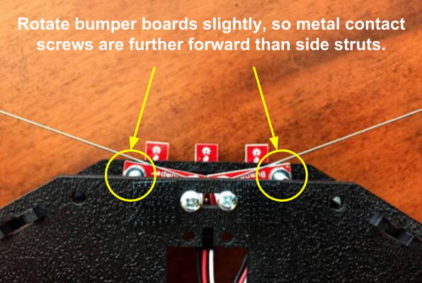

# Mechanical Bumpers

The RedBot has two mechanical bumpers \(left and right\) at its front to detect collisions with obstacles.

Each mechanical bumper has a wire "whisker" that extends to one side about 6 inches. If the wire whisker collides with an obstacle, the wire will bend and eventually make contact with a metal screw attached to the bumper board. When this happens, it acts like an electrical switch, which the robot can detect has been closed.


Each mechanical bumper is connected to the RedBot circuit board by a 3-wire jumper cable \(white, red, and black wires for data, power, and ground\):

* The left mechanical bumper data wire should be connected to I/O pin 3
* The right mechanical bumper data wire should be connected to I/O pin 11

## Check Bumper Positions

In order for the bumpers to detect collisions accurately, you may need to adjust the positions of the wire whiskers and the bumper boards. Otherwise, it may not be physically possible for the whiskers to make contact with the metal screw on the bumper boards.

#### WIRE WHISKERS

In the normal position \(no collision\), each wire whisker should be positioned very close to the metal screw on its bumper board.  There should only be about ⅛ inch between the wire and the screw. Otherwise, if the wire is too far away, it may not be physically possible for an obstacle to bend the wire far enough to make contact with the screw.

To adjust the position of a wire whisker, you have to loosen the plastic standoff screw on the **bottom** of the bumper board. In order to physically access this screw on an assembled robot, you may have to **remove the entire bumper** \(by removing the top screw of the plastic standoff, which attaches the bumper to the front of the RedBot chassis\). You might need to also unplug the 3-wire cable connected to the bumper. After adjusting the wire whisker, correctly reconnect the 3-wire cable, and then reattach the bumper to the robot chassis.

#### BUMPER BOARDS

Each bumper board should be rotated slightly so the metal screw on the bumper board is positioned slightly in front of the black plastic struts at the front corners of the RedBot chassis. Otherwise, the struts might physically block the wire whisker from making contact with the metal screw on the bumper board.

The photo below shows the mechanical bumpers in the correct position. When looking down on the front of the robot, the metal screw of each bumper board \(where the wire whisker will make contact\) is visible. If you cannot see these metal screws, your bumpers might not be able to work.

To adjust the position of a bumper board, you have to loosen the the top screw of the plastic standoff, which attaches the bumper to the robot chassis. Rotate the bumper board slightly, so the metal contact screw is further forward than the side strut. Then tighten the top screw of the plastic standoff to secure the bumper in place.



## How to Use Bumpers

To use the mechanical bumpers in your robot app, you need to:

1. Create a `RedBotBumper` object for each mechanical bumper \(left and right\)
2. Use each object's `read()` method to detect whether a collision has occurred
3. Add code statement\(s\) to perform action\(s\) when a bumper collision is detected

## Create Objects for Bumpers

The SparkFun `RedBot` library has a class named `RedBotBumper` which contains methods \(functions\) to control the RedBot's mechanical bumpers.

As part of your global variables before the `setup()` function, create a `RedBotBumper` object for each bumper by assigning each to a variable and indicating its pin number:

```cpp
RedBotBumper leftBumper(3);
RedBotBumper rightBumper(11);
```


**REDBOT LIBRARY:**  Be sure your robot app has an `#include` statement for the SparkFun RedBot library. [Here's how to include the RedBot library](../arduino-code-editor/include-redbot-library.md).


## Read Bumpers

To check the mechanical bumpers for collisions with obstacles, use the `RedBotBumper` object's `read()` method to detect whether or not a bumper has collided with an obstacle:

* `leftBumper.read()`
* `rightBumper.read()`

Each bumper acts like a switch or button. The `read()` method will return a value of either `HIGH` or `LOW`:

* `LOW` indicates the bumper has **collided with an obstacle** \(i.e., the wire whisker has bent  far enough to make electrical contact with the metal screw on the bumper board\).

The `leftBumper.read()` and `rightBumper.read()` methods can inserted within an if-else statement:

```cpp
  if (leftBumper.read() == LOW) {
    // add code if left whisker collides: brake, back up, turn right
    motors.brake();
    
  }
  else if (rightBumper.read() == LOW) {
    // add code if right whisker collides: brake, back up, turn left
    motors.brake();
    
  }
```

You will need to decide what code to perform if the left or right bumper collides with an obstacle. Most likely, the first thing that you should do is brake the motors.


**CUSTOM FUNCTION:**  You can also use a custom function named [`checkBumpers()`](../robot-behaviors/detecting-objects.md#checkbumpers) to check the bumpers and perform any necessary actions.


