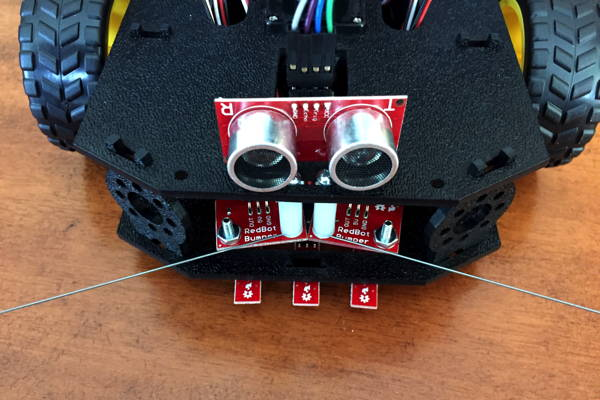

# Ultrasonic Sensor \*


**ADD-ON COMPONENT:** The SparkFun RedBot Kit does **NOT** include an ultrasonic sensor. However, the [HC-SR04 Ultrasonic Sensor](https://www.sparkfun.com/products/13959) can be easily connected to a RedBot. Your teacher may have added this sensor to your RedBot kit.


An ultrasonic sensor uses sound waves to measure distance. The sensor has a transmitter \(i.e., speaker\) that produces high-frequency sound \(beyond the range of human hearing\). The sensor has a receiver \(i.e., microphone\) that detects the echo of the high-frequency sound when it reflects back from an object. You can calculate the distance between the sensor and the closest object by measuring how much time it takes for the echo to arrive.


If you want to add an ultrasonic sensor to the front of your RedBot, you will need:

* [Ultrasonic Sensor HC-SR04](https://www.sparkfun.com/products/13959)
* [4 connected female-to-female jumper wires \(6" length\)](https://www.sparkfun.com/products/12796) — SparkFun sells these in packs of 20 connected wires, so one pack can be divided to provide wires for 5 sensors
* [Velcro tape](https://www.walmart.com/ip/Self-Adhesive-Hook-Loop-Sticky-Back-Tape-Kit-From-5-to-50-Feet-Width-1-or-2/191948030) \(or double-sided foam tape\) to mount the sensor at the front of the robot 

The HC-SR04 ultrasonic sensor measures distances in a narrow cone of about 15° in front of the sensor. This sensor can detect obstacles located up to 400 cm away \(about 13 feet\). The distances calculated from the sensor measurements are very accurate, within about 3 mm \(about 0.1 inch\) of the actual distance.

The ultrasonic sensor can be used to perform several useful robot behaviors:

1. The robot can [**measure the distance to the nearest object**](../robot-behaviors/detecting-objects.md#measuredistance) in its path.
2. The robot can [**avoid collisions with objects**](../robot-behaviors/detecting-objects.md#avoidcollision) in its path.
3. The robot can [**find the closest object**](../robot-behaviors/detecting-objects.md#findclosestobject) in a 360° scan and drive towards it

## Connect Sensor Wires

If necessary, use a set of 4 connected female-to-female jumper wires to connect the ultrasonic sensor pins to the open pins on the front-left corner of the RedBot mainboard:

| Ultrasonic Sensor Pin | RedBot Pin |
| :--- | :--- |
| VCC | 5V |
| Trig | A0 |
| Echo | A1 |
| GND | GND |

For the 5V and GND pins on the RedBot mainboard, you can use the pins adjacent to A0 or A1 \(either side is fine\). This means three wires will be connected on one side \(such as the A0 side\), while the fourth wire is connected to the I/O pin on the other side \(such as A1\).

## Mount Sensor to Robot

If necessary, use velcro tape or foam tape to mount the ultrasonic sensor at the front of the robot on top of its chassis. The sensor's transmitter and receiver should face forward, like a pair of eyes. The sensor will be mounted "upside-down" with its wires pointing up.



1. Take a section of velcro tape \("hook-and-loop"\) or double-sided foam tape about 1 inch × 0.5 inch, and cut it in half to form two pieces about 0.5 inch × 0.5 inch.
2. Place one piece of tape on the transmitter and the other piece of tape on the receiver \(on the opposite end from where the sensor wires come out\).
3. Attach the sensor onto the front edge of the robot top chassis plate, so it is attached securely. Be sure the sensor is mounted "upside-down" and facing forward.

## How to Code Sensor

To use the ultrasonic sensor in your robot app, you need to:

1. Declare global variables to store the sensor's pin numbers
2. Set the pin modes for the sensor pins, and turn the transmitter off
3. Call a custom function to measure the distance to the closest object

## Add Variables for Sensor

You'll need to create global variables to store the pin numbers of the ultrasonic sensor's transmitter \(Trig\) and receiver \(Echo\), which should be connected to I/O pins A0 and A1 on the RedBot's circuit board. Add this code **before** the `setup()` function:

```cpp
int TRIG_PIN = A0;
int ECHO_PIN = A1;
```

## Set Pin Modes for Sensor

You'll need to set the pin modes for the ultrasonic sensor's transmitter \(Trig\) and receiver \(Echo\). Add this code **within** the `setup()` function:

```cpp
  pinMode(TRIG_PIN, OUTPUT);
  pinMode(ECHO_PIN, INPUT);
  digitalWrite(TRIG_PIN, LOW);
```

Notice that a `digitalWrite()` statement was included to ensure the transmitter is turned off \(`LOW`\) when the app first starts.

## Measure Distance to Object

A custom function named `measureDistance()` uses readings from the ultrasonic sensor to measure the distance between the sensor and the closest object.

The `measureDistance()` function will return the distance as a `float` value \(decimal\). The function will return the distance in inches, but you can modify the `return` statement at the end of the function to return the distance in centimeters.

Your code should assign the returned distance value to a local variable, and then perform actions based on the value of the variable:

```cpp
float distance = measureDistance();
// add code to perform action based on value of distance

```

You'll need to add code to perform actions based on the distance measurement. For example, if the distance is less than 12 inches, you may want to brake the robot's motors to avoid a collision. Then you may want to change the robot's direction before driving again.

Add the `measureDistance()` custom function **after** the `loop()` function:

```cpp
float measureDistance() {
  // uses HC-SR04 ultrasonic sensor
  unsigned long start_time, end_time, pulse_time;

  // trigger ultrasonic signal for 10 microseconds
  digitalWrite(TRIG_PIN, HIGH);
  delayMicroseconds(10);
  digitalWrite(TRIG_PIN, LOW);

  // wait until echo received
  while (digitalRead(ECHO_PIN) == 0);

  // measure how long echo lasts (pulse time)
  start_time = micros(); // get start time in microseconds
  while (digitalRead(ECHO_PIN) == 1); // wait until echo pulse ends
  end_time = micros(); // get end time
  pulse_time = end_time - start_time; // subtract to get duration

  // pulse time of 23200 represents maximum distance for this sensor
  if (pulse_time > 23200) pulse_time = 23200;

  // calculate distance to object using pulse time
  float dist_cm = pulse_time / 58.0;
  float dist_in = pulse_time / 148.0;

  // need 60 ms delay between ultrasonic sensor readings
  delay(60);

  // return distance value
  return dist_in; // or can return dist_cm
}
```

## Test Ultrasonic Sensor

To test out your ultrasonic sensor, you can view distance measurements from the sensor using the serial monitor in the Arduino code editor.

Add this code statement **within** the `setup()` function:

```cpp
Serial.begin(9600);
```

This starts a serial data connection between your robot and your computer and sets the data transfer rate to 9600 bits per second.

Add this code **within** the `loop()` function:

```cpp
  float distance = measureDistance();
  Serial.print(distance);
  Serial.println(" inches");
```

Be sure to add the `measureDistance()` custom function **after** the `loop()` function.

After uploading the app to your robot, do **not** unplug the USB cable. You have to keep the robot connected to your computer to allow the serial data communication.

In your Arduino code editor, open the serial monitor, so you can view the serial data:

* **Arduino Create \(Web Editor\):**  Click the **Monitor** menu link in the left navigation to display the serial monitor in the middle panel.
* **Arduino IDE \(Desktop Editor\):**  Under the **Tools** menu, select "Serial Monitor." A new window will appear displaying the serial monitor.

It may take a few seconds for the serial connection to be detected by the editor. Then you should see the sensor measurements being displayed in the serial monitor window.

Place your hand \(or an object\) in front of the ultrasonic sensor, and move your hand \(or the object\) further or closer to see how the distance measurements change. If desired, you can use a ruler or measuring tape to verify the accuracy of the distance measurements.

Small objects \(such as your hand\) can be detected accurately if they are within about 24 inches. For farther distances, the object needs to be have a larger surface area to produce an accurate measurement.

