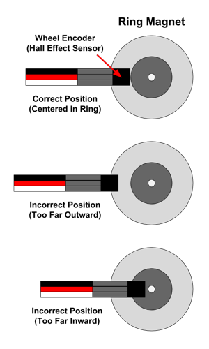

# Wheel Encoders

Located directly behind each motor is a wheel encoder. Each wheel encoder is used to count the number of times the motor \(left or right\) has rotated. This can be used to calculate the distance that the robot has driven or turned.

Each wheel encoder actually consists of two parts:

* a **Hall Effect sensor** that can measure the strength of a magnetic field
* a **ring magnet** \(looks like a metal washer\) attached to the motor shaft


When the motor rotates the wheel, it also rotates the ring magnet. The Hall effect sensor positioned near the ring detects changes in the magnetic field as the ring rotates. This is how the sensor can count how many times the motor has rotated.

When you think of a magnet, you probably think of a magnet that has 2 poles: north and south. It is true that magnets have pairs of N-S poles. However, a magnet can be created with multiple pairs of N-S poles. The ring magnets attached to the RedBot motors each have 4 pairs of N-S poles, similar to the diagram below.


Each wheel encoder is connected to the RedBot circuit board by a 3-wire jumper cable \(white, red, and black wires for data, power, and ground\):

* The left wheel encoder data wire should be connected to I/O pin A2
* The right wheel encoder data wire should be connected to I/O pin 10

The wheel encoder counts can be used to perform to several useful robot behaviors:

1. The robot can [**drive in a straight line**](../robot-behaviors/driving.md#drivestraight) by making small adjustments in the left and right motor powers to make sure both motors rotate at the same average speed.
2. The robot can [**drive for a specific distance**](../robot-behaviors/driving.md#drivedistance) by calculating how far the wheels have traveled. This is combined with adjusting the motor powers to drive straight.
3. The robot can ****[**pivot on both wheels by a specific angle**](../robot-behaviors/turning.md#pivotangle) by calculating how far the wheels have traveled while pivoting in a circle.
4. The robot can [**turn on one wheel by a specific angle**](../robot-behaviors/turning.md#turnangle) by calculating how far the driving wheel has traveled while turning in a circle

## Calculate Distance with Encoders

As each motor shaft rotates, it also rotates its attached ring magnet at the same rate. As the ring magnet completes one full rotation, the Hall effect sensor detects 4 changes \(or "ticks"\) in the magnetic field as each magnetic pole passes by the sensor.

However, each rotation of the motor only turns the wheel a certain number of degrees. The RedBot motors have a gearbox ratio of 48:1, which means it takes 48 rotations of the motor to turn the wheel one complete revolution \(360°\).

We can use this information to calculate how many "ticks" counted by the wheel encoder represent one revolution of the wheel:

**4 ticks per motor rotation × 48 motor rotations per wheel revolution = 192 ticks per wheel revolution**

Based on the size of the robot's wheels, we can also calculate the distance that the robot travels during one wheel revolution. This distance is equal to the circumference of the wheel \(i.e., the distance around the outer edge of the wheel\). The circumference of a circle is its diameter multiplied by pi \(approximately 3.14\). Since the RedBot's wheels have a diameter of 65 mm \(2.56 inches\), the distance traveled per wheel revolution is:

**C = 𝛑 × d = 3.14 × 2.56 inches = 8.04 inches per wheel revolution**

So for your RedBot's wheel encoders, the following is true:

**192 ticks of wheel encoder = 1 wheel revolution = 8.04 inches traveled**

This information can be used to convert any encoder count into distance traveled — or to convert a desired distance into a target encoder count.

## Check Encoder Positions

In order to function accurately, each wheel encoder sensor must be positioned correctly, relative to its ring magnet. The sensor tip must be centered within the silver band of the ring magnet \(not too far inward or outward\) and must be close to the ring magnet's surface \(about ⅛" inch away\).

Visually check the position of the left and right encoder sensors. If necessary, you might need to push \(or pull\) a sensor to position it correctly.




**CHECK ENCODERS AFTER CHANGING BATTERIES:**  Whenever you change the robot's batteries, be sure to check the encoder sensor positions **afterwards**. It's  common to accidentally move the encoder sensors when changing the batteries.


## How to Use Encoders

To use the wheel encoders in your robot app, you will need to:

1. Create a `RedBotEncoder` object for the wheel encoders
2. Use the object's `clearEnc()` method to clear the encoder counters \(reset to zero\)
3. Add code statement\(s\) to drive one or both motors
4. Use the object's `getTicks()` method to get the current encoder counts
5. Add code statement\(s\) to perform action\(s\) based on the encoder counts

## Create RedBotEncoder Object

The SparkFun `RedBot` library has a class named `RedBotEncoder` which contains methods \(functions\) to control the wheel encoders.

Before the `setup()` function, create a `RedBotEncoder` object by assigning it to a variable name and indicating the pin numbers for the left and right encoders in parentheses:

```cpp
RedBotEncoder encoder(A2, 10);
```


**REDBOT LIBRARY:**  Be sure your robot app has an `#include` statement for the SparkFun RedBot library. [Here's how to include the RedBot library](../arduino-code-editor/include-redbot-library.md).


## Clear Encoder Counters

The `RedBotEncoder` object has counters to keep track of how many total magnetic "ticks" have been detected by each wheel encoder.

Before using the wheel encoders, you will typically want to clear the counters by resetting them to zero.

Use the `clearEnc()` function to clear the encoder counter:

```cpp
encoder.clearEnc(BOTH);
```

Using a value of `BOTH` will clear both encoder counters. If necessary, you can use a value of `LEFT` or `RIGHT` to only clear a specific encoder counter.

## Get Encoder Counts

The `RedBotEncoder` object has a `getTicks()` method that returns a `long` value \(long integer\) representing the total number of magnetic "ticks" that have been counted by the wheel encoder as its motor rotates.

Since you will typically want to compare the readings from both encoders at the same time, your code could assign the encoder counts to local variables, and then perform actions based on the values stored in those variables:

```cpp
// get current wheel encoder counts
long leftCount = encoder.getTicks(LEFT);
long rightCount = encoder.getTicks(RIGHT);

// add code to do something based on encoder counts
```

**NOTE:** Each encoder will count "ticks" whether its motor is driving forwards or backwards.

## Test Wheel Encoders

To test out your wheel encoders, you can view the encoder counts using the serial monitor in the Arduino code editor.

Your app will need to create new objects \(as global variables\) for these three classes. Add these code statements **before** the `setup()` function:

```cpp
RedBotMotors motors;
RedBotButton button;
RedBotEncoder encoder(A2, 10);
```

Add this code statement **within** the `setup()` function:

```cpp
Serial.begin(9600);
```

This starts a serial data connection between your robot and your computer and sets the data transfer rate to 9600 bits per second.

A custom function named `testWheelEncoders()` can be used to get each encoder count and send \(`print`\) the counts to your computer as serial data.

Add the `testWheelEncoders()` function **after** the `loop()` function:

```cpp
void testWheelEncoders() {

    // if button is pressed, reset encoder counters and start motors
    if (button.read() == true) {
        encoder.clearEnc(BOTH);
        motors.drive(150);
    }
    
    // get current encoder counts
    long leftCount = encoder.getTicks(LEFT);
    long rightCount = encoder.getTicks(RIGHT);

    // send data to serial monitor
    Serial.print("Left: ");
    Serial.print(leftCount);
    Serial.print("\t"); // insert tab
    Serial.print("Right: ");
    Serial.println(rightCount);

    // if either count reaches 1000, brake motors
    if (leftCount >= 1000 || rightCount >= 1000) {
        motors.brake();
    }
}
```

Add this code statement **within** the `loop()` function to call the custom function:

```cpp
testWheelEncoders();
```

This should be only code statement listed within the `loop()` function.

After uploading the app to your robot, do **not** unplug the USB cable. You have to keep the robot connected to your computer to allow the serial data communication.

**IMPORTANT:**  Be sure the robot is standing upright on its back end \(with its wheels in the air\), so the robot won't drive way while it's connected to your computer.

In your Arduino code editor, open the serial monitor, so you can view the serial data:

* **Arduino Create \(Web Editor\):**  Click the **Monitor** menu link in the left navigation to display the serial monitor in the middle panel.
* **Arduino IDE \(Desktop Editor\):**  Under the **Tools** menu, select "Serial Monitor." A new window will appear displaying the serial monitor.

Press the D12 button on your robot's circuit board. Your robot's wheels will start driving. In the serial monitor, view the wheel encoder counts. When either one of the wheel encoder counts reaches 1000 \(which should take about 3-4 seconds\), the motors will brake.

* You'll notice that the wheel encoder counts do **not** stop exactly at 1000. This is normal because it takes a brief amount of time for the motors to brake. The final counts should probably be between 1000-1050.
* You'll probably notice that your left and right wheel encoder counts are **not** exactly the same. This is normal — they should be close to each other \(within about 25\), but they probably won't be identical.
* If one or both wheel encoders are **not** working properly \(the count stays at zero\), turn off the robot's power, and check the encoder sensor position\(s\). After correcting the sensor position\(s\), turn the robot's power back on and test again.

