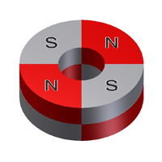

# Wheel Encoders

Located directly behind each motor is a wheel encoder. Each wheel encoder is used to count the number of times the motor \(left or right\) has rotated. This can be used to calculate the distance that the robot has driven or turned.

Each wheel encoder actually consists of two parts:

* a **Hall Effect sensor** that can measure the strength of a magnetic field
* a **ring magnet** \(looks like a metal washer\) attached to the motor shaft


When the motor rotates the wheel, it also rotates the ring magnet. The Hall effect sensor positioned near the ring detects changes in the magnetic field as the ring rotates. This is how the sensor can count how many times the motor has rotated.

When you think of a magnet, you probably think of a magnet that has 2 poles: north and south. It is true that magnets have pairs of N-S poles. However, a magnet can be created with multiple pairs of N-S poles. The ring magnets attached to the RedBot motors each have 4 pairs of N-S poles, similar to the diagram below.



Each wheel encoder is connected to the RedBot circuit board by a 3-wire jumper cable \(white, red, and black wires for data, power, and ground\):

* The left wheel encoder data wire should be connected to I/O pin A2
* The right wheel encoder data wire should be connected to I/O pin 10

The wheel encoder counts can be used to perform to several useful robot behaviors:

1. The robot can [**drive in a straight line**](../robot-behaviors/driving.md#drivestraight) by making small adjustments in the left and right motor powers to make sure both motors rotate at the same average speed.
2. The robot can [**drive for a specific distance**](../robot-behaviors/driving.md#drivedistance) by calculating how far the wheels have traveled. This is combined with adjusting the motor powers to drive straight.
3. The robot can ****[**pivot on both wheels by a specific angle**](../robot-behaviors/turning.md#pivotangle) by calculating how far the wheels have traveled while pivoting in a circle.
4. The robot can [**turn on one wheel by a specific angle**](../robot-behaviors/turning.md#turnangle) by calculating how far the driving wheel has traveled while turning in a circle

## Calculate Distance with Encoders

As the motor shaft rotates, it also rotates the attached ring magnet at the same rate. As the ring magnet completes one full rotation, the Hall effect sensor detects 4 changes \(or "ticks"\) in the magnetic field as each magnetic pole passes by the sensor.

However, each rotation of the motor only turns the wheel a certain number of degrees. The RedBot motors have a gearbox ratio of 48:1, which means it takes 48 rotations of the motor to turn the wheel one complete revolution \(360°\).

We can use this information to calculate how many "ticks" counted by the wheel encoder represent one revolution of the wheel:

**4 ticks per motor rotation × 48 motor rotations per wheel revolution = 192 ticks per wheel revolution**

Based on the size of the robot's wheels, we can also calculate the distance that the robot travels during one wheel revolution. This distance is equal to the circumference of the wheel \(i.e., the distance around the outer edge of the wheel\). The circumference of a circle is its diameter multiplied by pi \(approximately 3.14\). Since the RedBot's wheels have a diameter of 65 mm \(2.56 inches\), the distance traveled per wheel revolution is:

**C = 𝛑 × d = 3.14 × 2.56 inches = 8.04 inches per wheel revolution**

So for your RedBot's wheel encoders, the following is true:

**192 ticks of wheel encoder = 1 wheel revolution = 8.04 inches traveled**

This information can be used to convert any encoder count into distance traveled — or to convert a desired distance into a target encoder count.

## Check Encoder Positions

In order to function accurately, each wheel encoder sensor must be positioned correctly, relative to its ring magnet. The sensor tip must be centered within the silver band of the ring magnet \(not too far inward or outward\) and must be close to the ring magnet's surface \(about ⅛" inch away\).

Visually check the position of the left and right encoder sensors. If necessary, you might need to push \(or pull\) a sensor to position it correctly.



**CHECK ENCODERS AFTER CHANGING BATTERIES:**  Whenever you change the robot's batteries, be sure to check the encoder sensor positions **afterwards**. It's  common to accidentally move the encoder sensors when changing the batteries.


## How to Use Encoders in App

To use the wheel encoders in your robot app, you will need to:

1. Create a `RedBotEncoder` object for the wheel encoders
2. Use the object's `clearEnc()` method to clear the encoder counters \(reset to zero\)
3. Add code statement\(s\) to drive one or both motors
4. Use the object's `getTicks()` method to get the current encoder counts
5. Add code statement\(s\) to perform action\(s\) based on the encoder counts

## Create RedBotEncoder Object

The SparkFun `RedBot` library has a class named `RedBotEncoder` which contains methods \(functions\) to control the wheel encoders.

Before the `setup()` function, create a `RedBotEncoder` object by assigning it to a variable name and indicating the pin numbers for the left and right encoders in parentheses:

```cpp
RedBotEncoder encoder(A2, 10);
```


**REDBOT LIBRARY:**  Be sure your robot app has an `#include` statement for the SparkFun RedBot library. [Here's how to include the RedBot library](../arduino-code-editor/include-redbot-library.md).


## Clear Encoder Counters

The `RedBotEncoder` object has counters to keep track of how many total magnetic "ticks" have been detected by each wheel encoder.

Before using the wheel encoders, you will typically want to clear the counters by resetting them to zero.

Use the `clearEnc()` function to clear the encoder counter:

```cpp
encoder.clearEnc(BOTH);
```

Using a value of `BOTH` will clear both encoder counters. If necessary, you can use a value of `LEFT` or `RIGHT` to only clear a specific encoder counter.

## Get Encoder Counts

The `RedBotEncoder` object has a `getTicks()` method that returns a `long` value \(long integer\) representing the total number of magnetic "ticks" that have been counted by the wheel encoder as its motor rotates.

Since you will typically want to compare the readings from both encoders at the same time, your code could assign the encoder counts to local variables, and then perform actions based on the values stored in those variables:

```cpp
// get current wheel encoder counts
long leftCount = encoder.getTicks(LEFT);
long rightCount = encoder.getTicks(RIGHT);

// add code to do something based on encoder counts
```

**NOTE:** Each encoder will count "ticks" whether its motor is driving forwards or backwards.

## Test Wheel Encoders

To test out your wheel encoders, you can view the encoder counts using the serial monitor in the Arduino code editor.

Your app will need to create new objects \(as global variables\) for these three classes. Add these code statements **before** the `setup()` function:

```cpp
RedBotMotors motors;
RedBotButton button;
RedBotEncoder encoder(A2, 10);
```

Add this code statement **within** the `setup()` function:

```cpp
Serial.begin(9600);
```

This starts a serial data connection between your robot and your computer and sets the data transfer rate to 9600 bits per second.

A custom function named `testWheelEncoders()` can be used to get each encoder count and send \(`print`\) the counts to your computer as serial data.

Add the `testWheelEncoders()` function **after** the `loop()` function:

```cpp
void testWheelEncoders() {

    // if button is pressed, reset encoder counters and start motors
    if (button.read() == true) {
        encoder.clearEnc(BOTH);
        motors.drive(150);
    }
    
    // get current encoder counts
    long leftCount = encoder.getTicks(LEFT);
    long rightCount = encoder.getTicks(RIGHT);

    // send data to serial monitor
    Serial.print("Left: ");
    Serial.print(leftCount);
    Serial.print("\t"); // insert tab
    Serial.print("Right: ");
    Serial.println(rightCount);

    // if either count reaches 1000, brake motors
    if (leftCount >= 1000 || rightCount >= 1000) {
        motors.brake();
    }
}
```

Add this code statement **within** the `loop()` function:

```cpp
testWheelEncoders();
```

This should be only code statement listed within the `loop()` function.

After uploading the app to your robot, do **not** unplug the USB cable. You have to keep the robot connected to your computer to allow the serial data communication.

**IMPORTANT:**  Be sure the robot is standing upright on its back end \(with its wheels in the air\), so the robot won't drive way while it's connected to your computer.

In your Arduino code editor, open the serial monitor, so you can view the serial data:

* **Arduino Create \(Web Editor\):**  Click the **Monitor** menu link in the left navigation to display the serial monitor in the middle panel.
* **Arduino IDE \(Desktop Editor\):**  Under the **Tools** menu, select "Serial Monitor." A new window will appear displaying the serial monitor.

Press the D12 button on your robot's circuit board. Your robot's wheels should start driving. In the serial monitor, view the data showing the wheel encoder counts.  When either one of the wheel encoder counts reaches 1000 \(which should take about 3-4 seconds\), the motors will brake.

You'll probably notice that the wheel encoder counts do **not** stop exactly at 1000. This is normal —  it takes a brief amount of time for the braking to occur. The final counts should be less than 1050.

You'll probably notice that your left and right wheel encoder counts are **not** exactly the same. This is normal — they should be close to each other \(within about 25\), but they probably won't be identical.

If one or both wheel encoders are **not** working properly \(the count stays at zero\), then turn off the robot's power, and check the wheel encoder sensor position\(s\). After correcting the sensor position\(s\), turn the robot's power back on to restart the app and test again.

## Drive Straight Continuously

Driving perfectly straight requires the left and right motors to rotate at the same rate. If your RedBot drifts slightly to the left \(or right\) when driving, then your motors are not rotating at the exact same rate \(even though you may be using the same power for each motor\).

You can compare the left and right wheel encoder counts as your RedBot drives to see whether they are the same or not. If they aren't the same, the left and right motor powers can be individually adjusted to make the encoder counts more similar. The result is that your RedBot will drive in straight line.

A custom function named `driveStraight()` can be used to make your RedBot drive straight continuously. You'll probably need to combine this with other commands that will make your RedBot avoid obstacles \(or lines, etc.\) by braking or turning.

The `driveStraight()` custom function relies on several global variables that are used to track the wheel encoders counts, as well as the powers for the left and right motors.

Add this code before your `setup()` function to declare these global variables:

```cpp
// global variables needed for driveStraight() function
int leftPower, rightPower;
long prevLeftCount, prevRightCount;
```

You'll also use another custom function named `clearEncoders()` that will reset the wheel encoder counters back to zero and reset the values of these global variables. 

### clearEncoders\(\) function

Add the `clearEncoders()` function after your `loop()` function:

```cpp
void clearEncoders() {
  // call this function in setup() and after any turn or pivot
  encoder.clearEnc(BOTH);
  prevLeftCount = 0;
  prevRightCount = 0;
  leftPower = 175; // can change this value to adjust average speed
  rightPower = leftPower;
}
```

The `clearEncoders()` function will need to be called **before** you can start driving your RedBot in a straight line.  Add this code inside your `setup()` function to call this function:

```cpp
clearEncoders();
```

**IMPORTANT:** If your RedBot needs to turn or pivot \(e.g., to avoid an obstacle, to change direction, etc.\), then you will need to call the `clearEncoders()` function again after the turn or pivot is complete. You will add this call **within** the `pivotAngle()` function \(or **within** the `turnAngle()` function\) at the end after the pivot \(or turn\) is complete \(i.e., after the motors are braked\).

### driveStraight\(\) function

Add the `driveStraight()` function after your `loop()` function:

```cpp
void driveStraight() {

  // use wheel encoders to drive straight continuously

  // amount to offset motor powers to drive straight
  int offset = 5;

  // get current wheel encoder counts
  leftCount = encoder.getTicks(LEFT);
  rightCount = encoder.getTicks(RIGHT);
  
  // calculate increase in count from previous reading
  long leftDiff = leftCount - prevLeftCount;
  long rightDiff = rightCount - prevRightCount;

  // store current counts as "previous" counts for next reading
  prevLeftCount = leftCount;
  prevRightCount = rightCount;

  // adjust left & right motor powers to keep counts similar (drive straight)
  // if left rotated more than right, slow down left & speed up right
  if (leftDiff > rightDiff) {
    leftPower = leftPower - offset;
    rightPower = rightPower + offset;
  }
  // if right rotated more than left, speed up left & slow down right
  else if (leftDiff < rightDiff) {
    leftPower = leftPower + offset;
    rightPower = rightPower - offset;
  }

  // apply adjusted motor powers
  motors.leftDrive(leftPower);
  motors.rightDrive(rightPower);
  delay(10);  // short delay before next reading
}
```

Then you will call the `driveStraight()` function inside your `loop()` function:

```cpp
void loop() {

    driveStraight();

    // add other code to check for obstacles, turn, etc.

}
```

Again, you will probably want to add other code inside the `loop()` function to check for obstacles, etc.

**REMINDER:** If your code makes the RedBot turn or pivot, then be sure to call the `clearEncoders()` function again after the turn or pivot is complete. You can add this at the end of the `pivotAngle()` or `turnAngle()` functions.

## Drive Straight for Specific Distance

You can also use the wheel encoder counts to stop the RedBot after it has driven for a specific distance.

A custom function named `driveDistance()` can be used to make your RedBot drive straight for a specified distance by using the wheel encoders.

When calling this custom function, you must pass in a value for the **distance** \(inches\). For example, to make your RedBot drive 24 inches:

```cpp
driveDistance(24);
```

You can even drive backwards by passing in a negative value for the distance:

```cpp
driveDistance(-12);
```

**NOTE:** The `driveDistance()` function does not require declaring global variables for the wheel encoders counts or the left and right motor powers. Instead, all these variables are declared inside the function as local variables. Furthermore, the `clearEncoders()` function is not required because the encoders and variables are reset within the `driveDistance()` function itself.

### driveDistance\(\) function

Add the `driveDistance()` function after your `loop()` function:

```cpp
void driveDistance(float distance) {

    // use wheel encoders to drive straight for specified distance at specified power

    // set initial power for left and right motors
    int leftPower = 175;
    int rightPower = leftPower;

    // amount to offset motor powers to drive straight
    int offset = 5;

    // if negative distance, make motor powers & offset also negative
    if (distance < 0) {
        leftPower *= -1;
        rightPower *= -1;
        offset *= -1;
    }

    // use correction to improve distance accuracy
    // adjust correction value based on test results
    float correction = -1.5; // need decimal point for float value
    if (distance > 0) distance += correction;
    else if (distance < 0) distance -= correction;

    // variables for tracking wheel encoder counts
    long leftCount = 0;
    long rightCount = 0;
    long prevLeftCount = 0;
    long prevRightCount = 0;
    long leftDiff, rightDiff;

    // RedBot values based on encoders, motors & wheels
    float countsPerRev = 192.0; // 192 encoder ticks per wheel revolution
    float wheelDiam = 2.56;  // wheel diameter = 65 mm = 2.56 in
    float wheelCirc = PI * wheelDiam; // wheel circumference = 3.14 x 2.56 in = 8.04 in

    // based on distance, calculate number of wheel revolutions
    float numRev = distance / wheelCirc;

    // calculate target encoder count
    float targetCount = numRev * countsPerRev;

    // reset encoder counters and start driving
    encoder.clearEnc(BOTH);
    delay(100);
    motors.leftDrive(leftPower);
    motors.rightDrive(rightPower);

    // keeps looping while right encoder count less than target count
    while (abs(rightCount) < abs(targetCount)) {

        // get current wheel encoder counts
        leftCount = encoder.getTicks(LEFT);
        rightCount = encoder.getTicks(RIGHT);

        // calculate increase in count from previous reading
        leftDiff = abs(leftCount - prevLeftCount);
        rightDiff = abs(rightCount - prevRightCount);

        // store current counts as "previous" counts for next reading
        prevLeftCount = leftCount;
        prevRightCount = rightCount;

        // adjust left & right motor powers to keep counts similar (drive straight)

        // if left rotated more than right, slow down left & speed up right
        if (leftDiff > rightDiff) {
            leftPower = leftPower - offset;
            rightPower = rightPower + offset;
        }
        // else if right rotated more than left, speed up left & slow down right
        else if (leftDiff < rightDiff) {
            leftPower = leftPower + offset;
            rightPower = rightPower - offset;
        }

        // apply adjusted motor powers
        motors.leftDrive(leftPower);
        motors.rightDrive(rightPower);
        delay(10);  // short delay before next reading
    }

    // target count reached
    motors.brake(); // or use: motors.stop()
    delay(500); // brief delay to wait for complete stop
}
```

**NOTE:** You will notice that a variable named `correction` is used to adjust the distance. This is needed if your RedBot is consistently driving too far \(or not far enough\). During testing, our RedBot was consistently driving about 1.5 inch too far \(when using a motor power of 175\), which is why `correction` was assigned a value of `-1.5`.

1. Start by changing the value of `correction` to zero \(`0.0`\).
2. Conduct repeated tests using the custom function to drive your RedBot to various distances \(such as 12, 24, 36, etc.\). Use a ruler or tape measure to measure the actual distance your RedBot drives. What is the average amount of error \(in inches\)?
3. Based on your test results, adjust the value assigned to `correction` to represent the number of inches to use as a correction for the error:
   * If your RedBot is driving **too far**, use a **negative** value to correct the error.
   * If your RedBot is driving **not far enough**, use a **positive** value to correct the error.

## Pivot Both Wheels by Specific Angle

The wheel encoders can also be used to pivot \(turn\) your RedBot by a specific angle by measuring the distance traveled while pivoting.

When pivoting, the RedBot turns in a circle that is centered between its wheels. The distance between the centers of the RedBot wheel treads is 6.125 inches, which represents the diameter of its pivot circle. If the RedBot pivoted 360°, the distance traveled by each wheel would be equal to the circumference of this pivot circle:

**C = 𝛑 × d = 3.14 × 6.125 = 19.23 inches**

Usually you will want your RedBot to pivot by a specific angle that is less than 360° — such as 45°, 90°, 180°, etc. Based on the specific angle, you can calculate its **arc length** \(i.e., a "partial circumference"\):

**L = 𝛂 / 360° × 𝛑 × d**

The arc length \(L\) represents the distance that each wheel will travel while pivoting by that specific angle \(𝛂\).

For example, when pivoting by 90°, the arc length is:

L = 90° / 360° × 𝛑 × d = 0.25 × 3.14 × 6.125 = 4.81 inches

A custom function named `pivotAngle()` can be used to make your RedBot pivot by a specified angle. The custom function calculates the arc length for the specified angle, which represents how far the wheels must travel while pivoting. The wheel encoders are used to stop the pivoting once that distance has been reached.

When calling this custom function, you must pass in a value for the **angle** \(degrees\). A positive value will pivot the RedBot clockwise to the right. A negative value will pivot the RedBot counter-clockwise to the left.

For example, to make your RedBot pivot 90 degrees clockwise to the right:

```cpp
pivotAngle(90);
```

To make your RedBot pivot 90 degrees counter-clockwise to the left:

```cpp
pivotAngle(-90);
```

### pivotAngle\(\) function

Be sure to include the custom function after your `loop()` function:

```cpp
void pivotAngle(float angle) {

    // use wheel encoders to pivot (turn) by specified angle

    // set motor power for pivoting
    int power = 100; // clockwise
    if (angle < 0) power *= -1; // negative power for counter-clockwise

    // use correction to improve angle accuracy
    // adjust correction value based on test results
    float correction = -5.0; // need decimal point for float value
    if (angle > 0) angle += correction;
    else if (angle < 0) angle -= correction;

    // variable for tracking wheel encoder counts
    long rightCount = 0;

    // values based on RedBot's encoders, motors & wheels
    float countsPerRev = 192.0; // 192 encoder ticks per wheel revolution
    float wheelDiam = 2.56; // wheel diameter = 65 mm = 2.56 in
    float wheelCirc = PI * wheelDiam; // wheel circumference = 3.14 x 2.56 in = 8.04 in
    float pivotDiam = 6.125; // pivot diameter = distance between centers of wheel treads = 6.125 in
    float pivotCirc = PI * pivotDiam; // pivot circumference = 3.14 x 6.125 in = 19.23 in

    // based on angle, calculate distance (arc length) for pivot
    float distance = abs(angle) / 360 * pivotCirc;

    // based on distance, calculate number of wheel revolutions
    float numRev = distance / wheelCirc;

    // based on number of revolutions, calculate target encoder count
    float targetCount = numRev * countsPerRev;

    // reset encoder counters and start pivoting
    encoder.clearEnc(BOTH);
    delay(100);
    motors.pivot(power);

    // keeps looping while right encoder count less than target count
    while (abs(rightCount) < abs(targetCount)) {
        // get current wheel encoder count
        rightCount = encoder.getTicks(RIGHT);
        delay(10);  // short delay before next reading
    }

    // target count reached
    motors.brake();
    delay(250);
}
```

**NOTE:** You will notice that a variable named `correction` is used to adjust the angle. This is needed if your RedBot is consistently pivoting too far \(or not far enough\). During testing, our RedBot was consistently pivoting about 5 degrees too far \(when using a motor power of 100\), which is why `correction` was assigned a value of `-5.0`.

1. Start by changing the value of `correction` to zero \(`0.0`\).
2. Conduct repeated tests using the custom function to pivot your RedBot to various angles \(such as 90, 180, -90, etc.\). Use a protractor to measure the actual angle your RedBot pivots. What is the average amount of error \(in degrees\)?
3. Based on your test results, adjust the value assigned to `correction` to represent the number of degrees to use as a correction for the error:
   * If your RedBot is pivoting **too much**, use a **negative** value to correct the error.
   * If your RedBot is pivoting **too little**, use a **positive** value to correct the error.

## Turn on One Wheel By Specific Angle

You can also make your RedBot turn by driving one wheel while the other wheel is stopped. In this case, the RedBot rotates in a circle that is centered on the stopped wheel. This type of turn is less tight than pivoting, but it helps retain the forward momentum of the robot.

Here is a visual comparison of pivoting on both wheels versus turning on one wheel:


When turning on one wheel, the RedBot turns in a circle that is centered on the stopped wheel. The distance between the centers of the RedBot wheel treads is 6.125 inches, which represents the radius of this turn circle. So the diameter of the turn circle is twice the radius - i.e., 12.25 inches. If the RedBot turned 360°, the distance traveled by the driving wheel would be equal to the circumference of this turn circle:

**C = 𝛑 × d = 3.14 × 12.25 = 38.47 inches**

Usually you will want your RedBot to turn by a specific angle that is less than 360° — such as 45°, 90°, 180°, etc. Based on the specific angle, you can calculate its **arc length** \(i.e., a "partial circumference"\):

**L = 𝛂 / 360° × 𝛑 × d**

The arc length \(L\) represents the distance that the driving wheel will travel while turning by that specific angle \(𝛂\).

For example, when turning on one wheel by 90°, the arc length is:

L = 90° / 360° × 𝛑 × d = 0.25 × 3.14 × 12.25 = 9.62 inches

A custom function named `turnAngle()` can be used to make your RedBot turn on one wheel by a specified angle. The custom function calculates the arc length for the specified angle, which represents how far the driving wheel must travel while turning. The wheel encoders are used to stop the turning once that distance has been reached.

When calling this custom function, you must pass in a value for the **angle** \(degrees\). A positive value will turn the RedBot clockwise to the right. A negative value will turn the RedBot counter-clockwise to the left.

For example, to make your RedBot turn on one wheel 90 degrees clockwise to the right:

```cpp
turnAngle(90);
```

To make your RedBot turn on one wheel 90 degrees counter-clockwise to the left:

```cpp
turnAngle(-90);
```

### turnAngle\(\) function

Be sure to include the custom function after your `loop()` function:

```cpp
void turnAngle(float angle) {

    // use wheel encoders to turn on one wheel by specified angle

    // set motor power for pivoting
    int power = 100;

    // use correction to improve angle accuracy
    // adjust correction value based on test results
    float correction = 5.0; // need decimal point for float value
    if (angle > 0) angle += correction;
    else if (angle < 0) angle -= correction;

    // variable for tracking wheel encoder counts
    long leftCount = 0;
    long rightCount = 0;

    // values based on RedBot's encoders, motors & wheels
    float countsPerRev = 192.0; // 192 encoder ticks per wheel revolution
    float wheelDiam = 2.56; // wheel diameter = 65 mm = 2.56 in
    float wheelCirc = PI * wheelDiam; // wheel circumference = 3.14 x 2.56 in = 8.04 in
    float turnDiam = 12.25; // turn diameter = 2 x distance between centers of wheel treads = 2 x 6.125 in
    float turnCirc = PI * turnDiam; // turn circumference = 3.14 x 12.25 in = 38.47 in

    // based on angle, calculate distance (arc length) for turn
    float distance = abs(angle) / 360.0 * turnCirc;

    // based on distance, calculate number of wheel revolutions
    float numRev = distance / wheelCirc;

    // based on number of revolutions, calculate target encoder count
    float targetCount = numRev * countsPerRev;

    // reset encoder counters
    encoder.clearEnc(BOTH);
    delay(100);

    // based on turn angle, turn using either left wheel or right wheel
    if (angle > 0) {
        // turn clockwise using left wheel only
        motors.rightStop();
        motors.leftDrive(power);

        // keeps looping while left encoder count less than target count
        while (leftCount < targetCount) {
            // get current wheel encoder count
            leftCount = encoder.getTicks(LEFT);
            delay(10);  // short delay before next reading
        }
    }
    else {
        // turn counter-clockwise using right wheel only
        motors.leftStop();
        motors.rightDrive(power);

        // keeps looping while right encoder count less than target count
        while (rightCount < targetCount) {
            // get current wheel encoder count
            rightCount = encoder.getTicks(RIGHT);
            delay(10); // short delay before next reading
        } 
    }

    // target count reached
    motors.stop();
    delay(250);

    // uncomment following statements only if using driveStraight() elsewhere in program
    // encoder.clearEnc(BOTH);
    // prevLeftCount = 0;
    // prevRightCount = 0;
}
```

**NOTE:** You will notice that a variable named `correction` is used to adjust the angle. This is needed if your RedBot is consistently turning too far \(or not far enough\). During testing, our RedBot was consistently turning about 5 degrees too little, which is why `correction` was assigned a value of `5.0`.

1. Start by changing the value of `correction` to zero \(`0.0`\).
2. Conduct repeated tests using the custom function to turn your RedBot to various angles \(such as 90, 180, -90, etc.\). Use a protractor to measure the actual angle your RedBot turns. What is the average amount of error \(in degrees\)?
3. Based on your test results, adjust the value assigned to `correction` to represent the number of degrees to use as a correction for the error:
   * If your RedBot is turning too far, use a negative value to correct the error.
   * If your RedBot is not turning far enough, use a positive value to correct the error.

