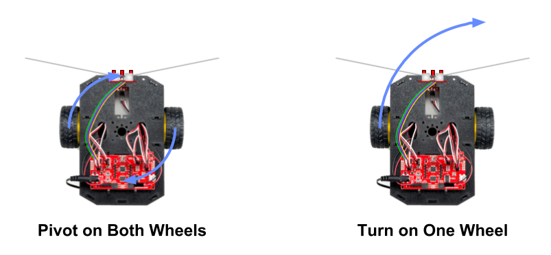

# Motors

The RedBot is a two-wheeled robot. It also has a semi-circular plastic "nub caster" on the underside of its chassis at the back. This caster acts as a third point of contact to balance the robot \(similar to a third wheel, except the caster doesn't rotate\).

Each wheel is driven by its own motor, which is connected to the RedBot circuit board by a pair of red and black wires. These left and right motors can be controlled as a set or independently, in order to make the robot drive forward, backwards, or make turns.

You can also determine how much power each motor receives, in order to rotate the wheels faster or slower, to control the speed of your robot as it drives and turns.


The RedBot has a [wheel encoder](../physical-inputs/wheel-encoders.md) located directly behind each motor. The wheel encoders count the number of times each motor has rotated. This information can be used to calculate the distance that the robot has driven or turned.

Together, the motors and wheel encoders can perform several useful robot behaviors:

1. The robot can [**drive in a straight line**](../robot-behaviors/driving.md#drivestraight) by making small adjustments in the left and right motor powers to make sure both motors rotate at the same average speed.
2. The robot can [**drive for a specific distance**](../robot-behaviors/driving.md#drivedistance) by calculating how far the wheels have traveled. This is combined with adjusting the motor powers to drive straight.
3. The robot can ****[**pivot on both wheels by a specific angle**](../robot-behaviors/turning.md#pivotangle) by calculating how far the wheels have traveled while pivoting in a circle.
4. The robot can [**turn on one wheel by a specific angle**](../robot-behaviors/turning.md#turnangle) by calculating how far the driving wheel has traveled while turning in a circle.

## How to Code Motors

To use the motors in your robot app, you will need to:

1. Create `RedBotMotors` object for the motors
2. Use the object's methods to control the motors:  `drive()`, `brake()`, `pivot()`, etc.

## Create RedBotMotors Object

The SparkFun `RedBot` library has a class named `RedBotMotors` which defines methods \(functions\) to control the left and right motors.

Before the `setup()` function, create a `RedBotMotors` object by assigning it to a variable name:

```cpp
RedBotMotors motors;
```


**REDBOT LIBRARY:**  Be sure your robot app has an `#include` statement for the SparkFun RedBot library. [Here's how to include the RedBot library](../arduino-code-editor/include-redbot-library.md).


## Driving

The `RedBotMotors` object has several methods for driving the robot's motors forward \(or in reverse\). Both motors can be driven together, or each motor can be driven separately:

* `drive()` — drives both motors
* `leftDrive()` or `leftMotor()` — drives the left motor only
* `rightDrive()` or `rightMotor()` – drives the right motor only

Each of these methods requires a **motor power** to be listed within its parentheses. The motor power can be can be any integer value \(whole number\) between `-255` and `255`:

* **Positive** values drive the robot **forward**.
* **Negative** values drive the robot in **reverse**.
* A **larger absolute value** produces a **faster driving speed** \(i.e., `255` is the fastest speed for driving forward, `-255` is the fastest speed for driving in reverse, etc.\).


**ONE EXCEPTION TO RULE:**  The `leftMotor()` method works differently. Positive values rotate the left motor clockwise, which is actually in reverse. Negative values rotate the left motor counterclockwise, which is forward.


For example, to drive both motors forward at a power \(speed\) of 150: 

```cpp
motors.drive(150);
```

For example, to drive both motors in **reverse** at a power \(speed\) of 100: 

```cpp
motors.drive(-100);
```

For example, to drive just the **left** motor forward at a power \(speed\) of 125: 

```cpp
motors.leftDrive(125);
```

**KEEP ON DRIVING**

Once a code statement is used to start driving one or both motors, the motor\(s\) will keep driving continuously until a separate code statement is used to stop the motor\(s\). This is similar to how separate code statements are needed to turn an LED light on and then off.

The `delay()` method can be used to allow the motor\(s\) to drive for a certain amount of time before stopping the motor\(s\).

For example, this code will drive the robot forward at a motor power of 150 for 3 seconds and then stop the motors:

```cpp
motors.drive(150);
delay(3000);
motors.brake();
```

#### NOT TOO FAST – AND NOT TOO SLOW

If you run the motors at a **very high power**, the wheels might "spin out" due to insufficient traction with the surface. If you notice this issue, use a lower motor power. In general, use a motor power of 200 or less, depending on the surface.

If you run the motors at a **very low power**, they might not have enough torque to actually rotate the wheels. If you notice this issue, use a higher motor power. In general, use a motor power of 50 or more, depending on the surface.

#### DRIFTING WHILE DRIVING

When driving both motors, you may notice your robot drifts slightly to the left \(or right\), instead of driving in a perfectly straight line. This is actually a common occurrence with independent wheel drive vehicles. This happens because the motors are rotating at slightly different speeds, even though they may be receiving the same amount of power.

If necessary, there are custom functions that use the wheel encoders to adjust the left and right motor powers while the robot is driving, in order to make it [drive in a straight line](../robot-behaviors/driving.md).

## Stopping

The `RedBotMotors` object has several methods for stopping the robot's motors. Both motors can be stopped together, or each motor can be stopped separately:

* `brake()` — abruptly stops both motors \(quick braking\)
* `coast()` or `stop()` — stops both motors \(coast to a stop\)
* `leftBrake()` — abruptly stops the left motor only
* `rightBrake()` — abruptly stops the right motor only
* `leftCoast()` or `leftStop()` – stops the left motor only
* `rightCoast()` or `rightStop()` – stops the left motor only 

For example, to brake both the motors:

```cpp
motors.brake();
```

For example, to stop just the **left** motor: 

```cpp
motors.leftStop();
```

## Turning

There are three ways to turn the robot, depending on how tight the turn needs to be:

* **Pivot on Both Wheels** – both motors drive at same power, but in opposite directions
* **Turn on One Wheel** – one motor drives, while other motor is stopped
* **Drive in Curved Path** – both motors drive in same direction, but at different powers

### Pivot on Both Wheels

The `RedBotMotors` object has a `pivot()` method which drives one motor forward, while driving the other motor in reverse. This makes the robot pivot either clockwise \(to the right\) or counter-clockwise \(to the left\).

Pivoting results in a perfectly tight turn \("zero turn radius"\) as the robot's axis of rotation is centered between its wheels.

The `pivot()` method requires a **motor power** to be listed within its parentheses. The motor power can be can be any integer value \(whole number\) between `-255` and `255`:

* **Positive** values pivot the robot **clockwise to the right**.
* **Negative** values pivot the robot **counter-clockwise to the left**.
* A **larger absolute value** produces a **faster pivot speed** \(i.e., `255` is the fastest clockwise speed, `-255` is the fastest counter-clockwise speed, etc.\).


**PIVOT SLOWLY:**  Pivot the robot at a lower motor power to avoid wheel slippage. In general, try using a power of 100 for pivoting, depending on the surface.


For example, to pivot the robot **clockwise** to the right at a power \(speed\) of 100: 

```cpp
motors.pivot(100);
```

For example, to pivot the robot **counter-clockwise** to the left at a power \(speed\) of 100: 

```cpp
motors.drive(-100);
```

**KEEP ON PIVOTING**

Once a code statement is used to start pivoting the motors, the motors will keep pivoting continuously until a separate code statement is used to stop the motors. This is similar to how separate code statements are needed to turn an LED light on and then off.

The `delay()` method can be used to allow the motors to pivot for a certain amount of time before stopping the motors.

For example, this code will pivot the robot clockwise to the right at a motor power of 100 for 0.75 seconds and then stop:

```cpp
motors.pivot(100);
delay(750);
motors.brake();
```

### Turn on One Wheel

Alternatively, you can turn the robot on one wheel by driving one motor while stopping the other motor. The robot will turn in a circle centered on the stopped wheel.

Turning on one wheel produces a less tight turn compared to pivoting on both wheels:



 For example, to turn clockwise on the right wheel:

```cpp
// turn CW to right
motors.leftDrive(100);
motors.rightStop();
```

For example, to turn counter-clockwise on the left wheel:

```cpp
// turn CCW to left
motors.leftStop();
motors.rightDrive(100);
```

**KEEP ON TURNING**

Once a code statement is used to start driving one motor to turn the robot, the motor will keep driving continuously until a separate code statement is used to stop the motor. This is similar to how separate code statements are needed to turn an LED light on and then off.

The `delay()` method can be used to allow the motor to drive for a certain amount of time before stopping the motor.

For example, this code will turn the robot clockwise on the right wheel at a motor power of 100 for 1.5 seconds and then stop:

```cpp
// turn CW to right
motors.leftDrive(100);
motors.rightStop();
delay(1500);
motors.leftStop();
```

### Drive in Curved Path

Finally, you can also drive the robot in a curved path by driving both motors in the same direction \(both forward or both in reverse\) but at different motor powers:

* Applying more power to the **left motor** will cause the robot to curve to the **right**.
* Applying more power to the **right motor** will cause the robot to curve to the **left**.
* A **larger difference** in the motor powers will make the robot drive in a **sharper curve** \(while a smaller difference will make the robot drive in more gentle curve\).

For example, this code will make the robot drive in a curved path to the **left**:

```cpp
// curve to left
motors.leftDrive(100);
motors.rightDrive(150);
```

For example, this code will make the robot drive in a curved path to the **right**:

```cpp
// curve to right
motors.leftDrive(150);
motors.rightDrive(100);
```

For example, this code will make the robot drive in a **sharper** curved path to the right:

```cpp
// curve to right more sharply
motors.leftDrive(200);
motors.rightDrive(100);
```

**KEEP ON CURVING**

Once code statements are used to start driving the motors in a curve, the motors will keep driving continuously until a separate code statement is used to stop the motors. This is similar to how separate code statements are needed to turn an LED light on and then off.

The `delay()` method can be used to allow the motors to drive for a certain amount of time before stopping the motors.

For example, this code will make the robot drive in a curved path to the left for 3 seconds and then stop:

```cpp
// curve to left
motors.leftDrive(100);
motors.rightDrive(150);
delay(3000);
motors.brake();
```

