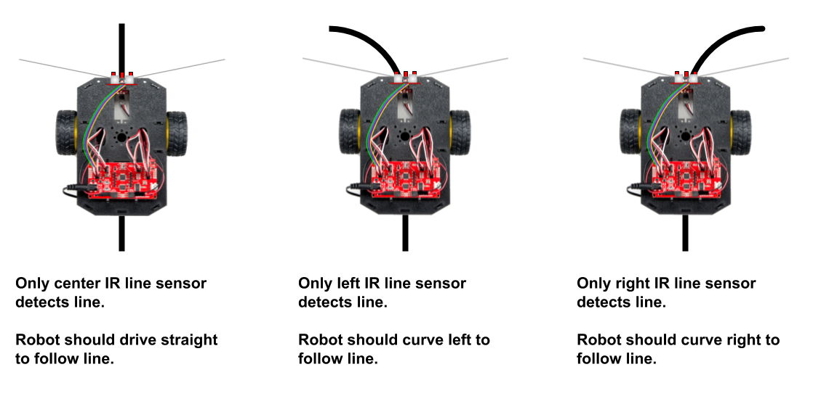
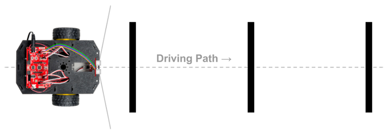
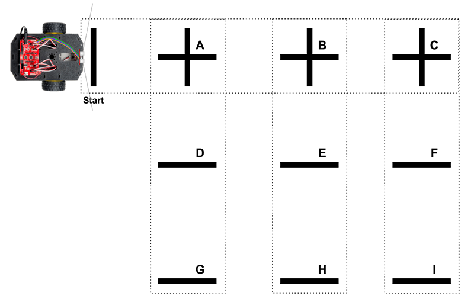

# Detecting Lines

These custom functions use the [IR line sensors](../physical-inputs/ir-line-sensors.md):

* `testLineSensors()` — test the IR sensors by sending serial data
* `followLine()` — follow a line automatically
* `avoidLine()` — avoid a line automatically \(acts like border to contain robot\)
* `countLine()` — drive straight while counting lines crossed and stop at specific line number
* `followCountLine()` — follow a line while counting lines crossed and stop at specific line number

## followLine\(\)

A custom function named `followLine()` uses the IR line sensors to make your robot follow a line. The line determines the robot's path.

In order to work, the `followLine()` function must be continuously called by the `loop()` function \(or continuously called by a loop within another function\).

The robot's goal during line following is to try stay centered on the line as the robot drives. To do this, the robot must check all three IR line sensors.



If the robot is trying to follow a line, there are 3 possible situations at any given point:

* **If only the center IR line sensor detects the line**, this means the robot is centered on the line. In this situation, the robot should drive straight to keep following the line.
* **If only the left IR sensor detects the line**, this means the line has started to curve to the left. In this situation, the robot should adjust its motors to curve left and keep following the line.
* **If only the right IR line sensor detects the line**, this means the line has started to curve to the right. In this situation, the robot should adjust its motors to curve right and keep following the line.

The `followLine()` function requires these objects as part of your global variables **before** the `setup()` function:

```cpp
RedBotMotors motors;
RedBotSensor leftLine(A3);
RedBotSensor centerLine(A6);
RedBotSensor rightLine(A7);
```

Add the `followLine()` custom function **after** the `loop()` function:

```cpp
void followLine() {
  /* FOLLOW LINE
  To follow dark line on light surface:
  Use high threshold & see if sensors greater than threshold
  
  To follow light line on dark surface:
  Use low threshold & see if sensors less than threshold
  */

  int leftPower, rightPower;
  int power = 100;
  int powerShift = 50;
  int lineThreshold = 800; // change value if necessary

  // get IR sensor readings
  int leftSensor = leftLine.read();
  int centerSensor = centerLine.read();
  int rightSensor = rightLine.read();

  // if line under center sensor, drive straight to stay aligned
  if (centerSensor > lineThreshold) {
    // set both motors to same power
    leftPower = power;
    rightPower = power;
  }
  // if line under left sensor, curve left to realign
  else if (leftSensor > lineThreshold) {
    // decrease left motor, increase right motor
    leftPower = power - powerShift;
    rightPower = power + powerShift;
  }
  // if line under right sensor, curve right to realign
  else if (rightSensor > lineThreshold) {
    // increase left motor, decrease right motor
    leftPower = power + powerShift;
    rightPower = power - powerShift;
  }

  // drive motors using power values from above
  motors.leftDrive(leftPower);
  motors.rightDrive(rightPower);

  delay(25);  // can change delay to adjust line following sensitivity    
}
```

Sometimes it can be challenging to get your robot to follow a line consistently. Here are some troubleshooting tips:

* You may need to change the value for `power`. A lower motor power \(such as `100`\) generally works better for line following. However, you may need to try different powers to find the value that works best.
* You may need to change the value for `powerShift`, which is used to adjust the left and right motor powers in order to steer the robot back towards the line.
* You may need to change the value for `lineThreshold` based on your line color. Use the serial monitor to view IR sensor measurements for your line. Be sure there is sufficient difference between the readings for the line vs. the surface.
* You may need to change the `delay()` value at the end of the function to adjust the sensitivity. This delay determines how long the robot is allowed to drive before the IR sensors are checked again \(and the motor powers are potentially adjusted again\).
* You may need to try different types of lines and surfaces to find the right combination that works effectively. You need high contrast between the line and the surface:  either a dark line on a light surface \(or the opposite\).
* You may need to adjust the line path. Lines that have sharp angles or turns are difficult for the robot to follow closely.
* If your robot was previously successful at line following but starts to have problems, you may need to replace the robot's batteries. As the battery power depletes, the IR sensors will stop working properly \(even though there might be enough power for the motors to still work\).

## avoidLine\(\)

A custom function named `avoidLine()` uses the IR line sensors to make your robot avoid a line. The line acts as a border to keep the robot inside \(or outside\) an area or path.

In order to work, the `avoidLine()` function must be continuously called by the `loop()` function \(or continuously called by a loop within another function\).

The robot's goal when avoiding a line is to check for a line as the robot drives and turn away when a line is detected. To do this, the robot can just check the left and right IR line sensors \(rather than all three\).


If the robot is trying to avoid a line, there are 3 possible situations when a line is detected:

* **If both the left and right IR line sensors detect the line**, this means the robot has "hit" the line head-on. In this situation, the robot should turn around to avoid the line.
* **If only the left IR sensor detects the line**, this means robot has "hit" the line at angle from the left. In this situation, the robot should turn right to avoid the line.
* **If only the right IR line sensor detects the line**, this means robot has "hit" the line at angle from the right. In this situation, the robot should turn left to avoid the line.

The `avoidLine()` function generates a **random** number for the amount of time \(in milliseconds\) for each turn \(pivot\) in order to produce variation in the robot's new direction. The ranges for the random numbers were selected to make the pivot times close to a 90° turn or a 180° turn. However, you can modify the function to instead use **fixed** pivot times \(such as 650 ms for a 90° turn and 1300 ms for a 180° turn\).


**MINIMUM PIVOT:**  Be sure to make the robot turn at least 90° whenever it detects a line. If the robot were to "hit" a line at a nearly perpendicular angle \(almost head-on\), then a pivot of less than 90° might **not** be enough to turn away from the line.


The `avoidLine()` function requires these objects as part of your global variables **before** the `setup()` function:

```cpp
RedBotMotors motors;
RedBotSensor leftLine(A3);
RedBotSensor centerLine(A6);
RedBotSensor rightLine(A7);
```

Add the `avoidLine()` custom function **after** the `loop()` function:

```cpp
void avoidLine() {
  /* AVOID LINE
  To avoid dark line on light surface:
  Use high threshold & see if sensors greater than threshold

  To avoid light line on dark surface:
  Use low threshold & see if sensors less than threshold
  */

  // adjust value if necessary
  int lineThreshold = 800;

  // get IR sensor readings (only need left and right)
  int leftSensor = leftLine.read();
  int rightSensor = rightLine.read();

  // if either sensor detects line, first brake motors
  if (leftSensor > lineThreshold || rightSensor > lineThreshold) {
    motors.brake();
    delay(250);
  }

  // if both sensors on line, turn around (about 180 degrees)
  if (leftSensor > lineThreshold && rightSensor > lineThreshold) {
    long randomNum = random(975, 1625); // approx 135-225 degree pivot
    motors.pivot(100);
    delay(randomNum);
    motors.stop();
  }
  // if line under left sensor only, turn right (min 90 degrees)
  else if (leftSensor > lineThreshold) {
    long randomNum = random(650, 975); // approx 90-135 degree pivot
    motors.pivot(100); // pivot clockwise to right
    delay(randomNum);
    motors.stop();
  }
  // if line under right sensor only, turn left (min 90 degrees)
  else if (rightSensor > lineThreshold) {
    long randomNum = random(650, 975); // approx 90-135 degree pivot
    motors.pivot(-100); // pivot counter-clockwise to left
    delay(randomNum);
    motors.stop();
  }
  // otherwise, keep driving straight
  else motors.drive(100);

  delay(25);  // can change delay to adjust line following sensitivity    
}
```

## countLine\(\)

A custom function named `countLine()` uses the wheel encoders to make the robot drive straight while also using the IR line sensors to count line markers the robot crosses. The robot will stop driving when it reaches a specific line number. You can then make the robot turn and start driving in a new direction.



The `countLine()` function requires two other custom functions, in order to work. Be sure to add these two functions **after** the `loop()` function:

* `driveStraight()` function — used to make the robot drive straight
* `driveDistance()` function — used to center the robot on the target line marker

Once your robot reaches a specific line marker using the `countLine()` function, you'll usually turn the robot to start driving in a new direction. Typically, you'll pivot the robot 90° right, 90° left, or 180° around. So you'll also want to add the `pivotAngle()` custom function after the `loop()` function.

The `countLine()` function requires these objects as part of your global variables **before** the `setup()` function:

```cpp
RedBotMotors motors;
RedBotEncoder encoder(A2, 10);
RedBotSensor leftLine(A3);
RedBotSensor centerLine(A6);
RedBotSensor rightLine(A7);
```

Add the `countLine()` custom function **after** the `loop()` function:

```cpp
void countLine(int target) {
  /* DRIVE STRAIGHT WHILE COUNTING LINES CROSSED
  Requires driveStraight() and driveDistance() functions
  
  To count dark lines on light surface:
  Use high threshold & see if sensors greater than threshold

  To count light lines on dark surface:
  Use low threshold & see if sensors less than threshold
  */

  int lineThreshold = 800; // change value if necessary

  // variables for counting lines
  int lineCount = 0;
  boolean lineDetected = false;

  // keeps looping while line count is less than target
  while (lineCount < target) {

    driveStraight();

    // get IR sensor readings
    int leftSensor = leftLine.read();
    int centerSensor = centerLine.read();
    int rightSensor = rightLine.read();

    // toggle between checking for line vs. checking for no line
    if (lineDetected == false) {
      // if all 3 sensors detect line, increase line count and toggle to checking for no line
      if (leftSensor > lineThreshold && centerSensor > lineThreshold && rightSensor > lineThreshold) {
        lineCount++;
        lineDetected = true;
      }
    }
    else if (lineDetected == true) {
      // if all 3 sensors detect no line, toggle back to checking for line
      if (leftSensor < lineThreshold && centerSensor < lineThreshold && rightSensor < lineThreshold) {
        lineDetected = false;
      }
    }
  }
  // target line count reached
  motors.brake();
  delay(250);
  driveDistance(3.5); // drive forward to center robot on target line
}
```

The `countLine()` function uses a `while` loop to keep driving straight and counting lines as long as the total number of detected lines is less than the target number.

Inside this `while` loop, the value of a variable named `lineDetected` is toggled back and forth between `true` and `false`. The reason for this is to ensure accurate line counting, so the code doesn't accidentally count the same line more than once:

* Once a line has been detected, the code will increase the line count and immediately start checking for **no** line \(i.e., giving the robot time to drive past the current line\).
* Once it detects that the robot has completely crossed the current line \(i.e., once **no** line is detected\), the code will start checking again for a new line.

Once the line count reaches the target number, the `while` loop ends. The robot's motors are braked, and then the robot drives forward a short distance \(3.5 inches\) to center itself on the target line.

#### GRID-LIKE LINE MARKER PATTERNS

If necessary, you can also place line markers in a "grid-like" pattern, in order to allow your robot to travel between different locations. For example, this diagram shows a series of line markers with a starting location plus a set of locations labeled with letters A-I:



Imagine this diagram represents a top-down view of a grocery store layout with three aisles of food \(i.e., the three vertical columns of markers\). The top horizontal row \(i.e., with the "plus" markers\) is used to travel from one aisle to another. How could the RedBot travel from the starting location to location E?

```cpp
// travel from Start to location E
countLine(3); // start line + line A + line B
pivotAngle(90); // turn 90 degrees clockwise
countLine(1); // next line will be location E
```

## followCountLine\(\)

A custom function named `followCountLine()` uses IR line sensors to make the robot follow a line while also counting line markers the robot crosses. The robot will stop driving when it reaches a specific line number. You can then make the robot turn and start following a new line.

The `followCountLine()` function requires two other custom functions, in order to work. Be sure to add these two functions **after** the `loop()` function:

* `followLine()` function — used to make the robot follow the current line
* `driveDistance()` function — used to center the robot on the target line marker

Once your robot reaches a specific line marker using the `followCountLine()` function, you'll usually turn the robot to start following a new line. Typically, you'll pivot the robot 90° right, 90° left, or 180° around. So you'll also want to add the `pivotAngle()` custom function after the `loop()` function.

The `followCountLine()` function requires these objects as part of your global variables **before** the `setup()` function:

```cpp
RedBotMotors motors;
RedBotEncoder encoder(A2, 10);
RedBotSensor leftLine(A3);
RedBotSensor centerLine(A6);
RedBotSensor rightLine(A7);
```

Add the `followCountLine()` custom function **after** the `loop()` function:

```cpp
void followCountLine(int target) {
  /* FOLLOW LINE WHILE COUNTING LINES CROSSED
  Requires followLine() and driveDistance() functions
  
  To follow and count dark lines on light surface:
  Use high threshold & see if sensors greater than threshold
  
  To follow and count light lines on dark surface:
  Use low threshold & see if sensors less than threshold
  */

  int lineThreshold = 800;  // change value if necessary

  // variables for counting lines
  int lineCount = 0;
  boolean lineDetected = false;

  // while line count is less than target, follow current line and count lines crossed
  while (lineCount < target) {
    followLine();
    
    // get IR sensor readings
    int leftSensor = leftLine.read();
    int centerSensor = centerLine.read();
    int rightSensor = rightLine.read();
    
    // toggle between checking for line versus checking for no line
    if (lineDetected == false) {
      // when all 3 sensors detect line, increase line count and toggle to checking for no line
      if (leftSensor > lineThreshold && centerSensor > lineThreshold && rightSensor > lineThreshold) {
        lineCount++;
        lineDetected = true;
      }
    }
    else if (lineDetected) {
      // when all 3 sensors detect no line, toggle back to checking for line
      if (leftSensor < lineThreshold && centerSensor < lineThreshold && rightSensor < lineThreshold) {
        lineDetected = false;
      }
    }
  }
  // target line count reached
  motors.brake();
  delay(250);
  driveDistance(3.5); // drive forward to center robot on target line
}
```

