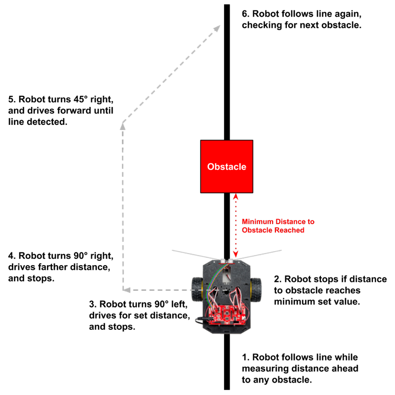

# Detecting Objects

These custom functions use the [mechanical bumpers](../physical-inputs/mechanical-bumpers.md) or [ultrasonic sensor](../physical-inputs/ultrasonic-sensor.md):

* `checkBumpers()` — detect bumper collision with object on left or right side
* `measureDistance()` — measure distance ahead to nearest object in path
* `avoidCollision()` — avoid collision with nearby object in path
* `findClosestObject()` — find the closest object \(360° scan\) and drive towards it

## checkBumpers\(\)

A custom function named `checkBumpers()` uses the mechanical bumpers to detect collisions with obstacles.

The left and right mechanical bumpers each have a "whisker" that extends out to one side. The "whisker" is a flexible metal wire that will bend during a collision. If the wire bends far enough, it will make electrical contact with a metal screw on the bumper board. It is similar to how a switch or button works.

The `checkBumpers()` function requires these objects as part of your global variables before the `setup()` function:

```cpp
RedBotMotors motors;
RedBotBumper leftBumper(3);
RedBotBumper rightBumper(11);
```

Add the `checkBumpers()` custom function **after** the `loop()` function:

```cpp
void checkBumpers() {
  if (leftBumper.read() == LOW) {
    // add code for left collision: e.g., brake, back up, turn right
    motors.brake();
    
  }
  else if (rightBumper.read() == LOW) {
    // add code for right collision: e.g., brake, back up, turn left
    motors.brake();
    
  }
}
```


**ADD CODE TO FUNCTION:**  You need to add code within the `checkBumpers()` function to perform actions \(brake, back up, turn, etc.\) for each bumper collision.


**NOTE:** The `checkBumpers()` function does **not** check for a simultaneous collision with both bumpers. If a simultaneous bumper collision did occur, the function will treat it as a left bumper collision \(because that's the first check performed in the `if` statement\). However, you could modify the function to check for all three possibilities:  both bumpers, left bumper only, or right bumper only.

## measureDistance\(\)

A custom function named `measureDistance()` uses an ultrasonic sensor to measure the distance ahead to the nearest object in the robot's path.

The ultrasonic sensor has a transmitter \(i.e., a speaker\) that can produce high-frequency sound, which cannot be heard by the human ear. The sensor also has a receiver \(i.e., a microphone\) that detects the echo of the high-frequency sound when it is reflected back from a nearby object. By measuring how much time it takes for the echo to arrive, you can calculate the distance between the sensor and the object.

When the `measureDistance()` function is called, it will return the distance measurement as a `float` value \(decimal number\). Your app will typically store this value in a local variable, and then do something with the value.

For example, this code statement declares a local variable named `sensorDist` to store the `float` value returned by calling the `measureDistance()` function:

```cpp
float distance = measureDistance();
```

The `measureDistance()` function requires these global variables before the `setup()` function:

```cpp
int TRIG_PIN = A0;
int ECHO_PIN = A1;
```

You need to set the pin modes for the ultrasonic sensor's transmitter \(Trig\) and receiver \(Echo\). In addition, you want to be sure the transmitter is turned off \(`LOW`\) when the app first starts. Add this code **within** the `setup()` function:

```cpp
  pinMode(TRIG_PIN, OUTPUT);
  pinMode(ECHO_PIN, INPUT);
  digitalWrite(TRIG_PIN, LOW);
```

Add the `measureDistance()` custom function **after** the `loop()` function:

```cpp
float measureDistance() {
  // uses HC-SR04 ultrasonic sensor
  
  // variables for measuring echo time
  unsigned long start_time, end_time, pulse_time;

  // trigger ultrasonic signal for 10 microseconds
  digitalWrite(TRIG_PIN, HIGH);
  delayMicroseconds(10);
  digitalWrite(TRIG_PIN, LOW);

  // wait until echo received
  while (digitalRead(ECHO_PIN) == 0);

  // measure how long echo lasts (pulse time)
  start_time = micros(); // get start time in microseconds
  while (digitalRead(ECHO_PIN) == 1); // wait until echo pulse ends
  end_time = micros(); // get end time
  pulse_time = end_time - start_time; // subtract to get duration

  // pulse time of 23200 represents maximum distance for this sensor
  if (pulse_time > 23200) pulse_time = 23200;

  // calculate distance to object using pulse time
  float dist_cm = pulse_time / 58.0;
  float dist_in = pulse_time / 148.0;

  // need 60ms delay between ultrasonic sensor readings
  delay(60);

  // return distance value (inches or centimeters)
  return dist_in; // or can return dist_cm
}
```


**GO METRIC:**  The `measureDistance()` function returns the distance in inches, but the function can be modified to return the distance in centimeters.


## avoidCollision\(\)

A custom function named `avoidCollision()` uses an ultrasonic sensor to avoid collisions with a nearby object in the robot's path.

The `avoidCollision()` function requires the `measureDistance()` function, so be sure to add that function **after** the `loop()` function.

The `avoidColliion()` function requires this object as part of your global variables before the `setup()` function:

```cpp
RedBotMotors motors;
```

Add the `avoidCollision()` custom function **after** the `loop()` function:

```cpp
void avoidCollision() {
  // uses HC-SR04 ultrasonic sensor
  // requires measureDistance() function
  
  // set minimum allowed distance between robot and obstacle
  float minDist = 8.0; // change value as necessary (need decimal)

  // measure distance to nearest obstacle
  float distance = measureDistance();

  // if obstacle is too close, avoid collision
  if (distance <= minDist) {
    // add code to perform (brake, change direction, etc.)
    motors.brake();

  }
}
```


**ADD CODE TO FUNCTION:**  You need to add code within the `avoidCollision()` function to perform actions \(brake, turn, etc.\) when an obstacle is too close.


You'll need to decide what actions the robot should perform when an obstacle is too close. Depending on the purpose and context of your robot, your solution will be different:

* Maybe the robot should turn around and drive in the opposite direction.
* Maybe the robot should turn 90° right \(or left\) and then continue driving.
* Maybe the robot should scan left and right to check for a clear path.
* Maybe the robot should navigate around the obstacle to maintain its original direction.
* etc.

### While Following Line

Avoiding collisions while [following a line](detecting-lines.md#followline) is possible, but it presents a challenge:

* When the robot detects that an obstacle is nearby in the path ahead, the robot has to leave the line, detour around the obstacle, and then find the line again.

This diagram shows a possible solution to detour around an obstacle while following a line.



Notice in step 5 of the diagram that the robot makes a 45° turn to approach the line at an angle \(instead of making a 90° turn\). The reason for this is to ensure that one IR line sensor will detect the line first, so the `followLine()` function can steer the robot to center itself on the line again. \(Otherwise, if the robot approaches the line head-on at a 90° angle, the robot will simply drive over the line.\)

The code for the `loop()` function could be as simple as:

```cpp
void loop() {
    followLine();
    avoidCollision();
}
```

The code for detouring around an obstacle would be placed **within** the `avoidCollision()` custom function, which might look like this:

```cpp
void avoidCollision() {
  // uses HC-SR04 ultrasonic sensor
  // requires measureDistance() function
  
  // set minimum allowed distance between robot and obstacle
  float minDist = 8.0; // change value as necessary (need decimal)

  // set detour distance (should be larger than width and depth of obstacle)
  float detourDist = 12.0; // change value as necessary (need decimal)

  // measure distance to nearest obstacle
  float distance = measureDistance();

  // if obstacle is too close, avoid collision
  if (distance <= minDist) {
    // add code to perform (brake, change direction, etc.)
    motors.brake();
    pivotAngle(-90);
    driveDistance(detourDist, 100);
    pivotAngle(90);
    driveDistance(minDist + detourDist, 100);
    pivotAngle(45);
    motors.drive(100);
  }
}
```

This version of the `avoidCollision()` function has a local variable named `detourDist` set to a value of `12.0` inches. This represents how far the robot will detour around an obstacle, so this value needs to be larger than the width or depth \(whichever is larger\) of the actual obstacle. As needed, adjust the value of `detourDist` based on the size of your obstacles. Just be sure to include a decimal point, since it is a `float` value.

The diagram and sample code shown above represent just one possible solution for avoiding obstacles while following a line. You might need to create a different solution that works better for your particular task scenarios.

## findClosestObject\(\)

A custom function named `findClosestObject()` uses an ultrasonic sensor and the wheel encoders to perform a 360° scan of the environment to find the closest object and then drive towards it.

To accomplish this, the robot perform two pivots:

1. The **first pivot** turns the robot 360° to find the direction and distance to the closest object. The ultrasonic sensor is used to measure the distance to the object, while the wheel encoder count is used to indicate the "direction" of the object. Variables are used to compare the measurements and keep track of which object is the closest.
2. The **second pivot** turns the robot to face the direction of the closest object found in the first pivot. Then the robot drives towards the object based the distance to the object.

The `findClosetObject()` function requires two other custom functions, in order to work. Be sure to add these two functions **after** the `loop()` function:

* `measureDistance()` function — used to measure distance to nearby objects
* `driveDistance()` function — used to drive towards the closest object

The `findClosestObject()` function requires these objects as part of your global variables before the `setup()` function:

```cpp
RedBotMotors motors;
RedBotEncoder encoder(A2, 10);
```

The `findClosestObject()` function produces an alert sound after completing each of its two pivots. It assumes the speaker's pin number is stored in a global variable named `speaker`. If necessary, modify this variable name \(or remove the sounds\).

Add the `findClosetObject()` custom function **after** the `loop()` function:

```cpp
void findClosestObject() {
  /* CONDUCT 360 SCAN TO FIND CLOSEST OBJECT
  Uses HC-SR04 ultrasonic sensor
  Requires measureDistance() and driveDistance() functions
  
  Measures distance (every 60 ms) while pivoting for 360 degrees
  Keeps track of "direction" (encoder count) and distance to closest object
  After scan, pivots to direction of closest object and drives towards it
  NOTE: Robot might not align perfectly with direction of object
  */

  // variables for pivot power and tracking wheel encoder count
  int power = 75; // slightly slower than normal pivot
  long rightCount = 0; // track current wheel encoder count

  // variables for 360 degree scan
  float scanAngle = 360.0;
  float scanCorrection = -2.5; // change value based on test results
  scanAngle += scanCorrection; // add correction to scan angle

  // variables to track distance and encoder count for closest object
  float minDist = 157.0; // set to max range of sensor (157 in, 400 cm)
  long minCount = 0;

  // values based on RedBot's encoders, motors & wheels
  float countsPerRev = 192.0; // 192 encoder ticks per wheel revolution
  float wheelDiam = 2.56; // wheel diameter = 65 mm = 2.56 in
  float wheelCirc = PI * wheelDiam; // wheel circumference = 3.14 x 2.56 in = 8.04 in
  float pivotDiam = 6.125; // pivot diameter = distance between centers of wheel treads = 6.125 in
  float pivotCirc = PI * pivotDiam; // pivot circumference = 3.14 x 6.125 in = 19.23 in

  // based on angle, calculate distance (arc length) for pivot
  float distance = abs(scanAngle) / 360.0 * pivotCirc;

  // based on distance, calculate number of wheel revolutions
  float numRev = distance / wheelCirc;

  // calculate target encoder count
  float targetCount = numRev * countsPerRev;

  // 1st PIVOT - 360 degree scan of environment
  // reset encoder counters and start pivoting
  encoder.clearEnc(BOTH);
  delay(100);
  motors.pivot(power);

  // keeps looping while right encoder count less than target count
  while (abs(rightCount) < abs(targetCount)) {
    // get ultrasonic sensor measurement
    float sensorDist = measureDistance();

    // see if measurement is new minimum distance
    if (sensorDist < minDist) {
      minDist = sensorDist;
      minCount = rightCount;
    }

    // get current wheel encoder count
    rightCount = encoder.getTicks(RIGHT);
  }

  // 360 SCAN COMPLETE - stop motors
  motors.brake();
  delay(500);

  // OPTIONAL: play sound to indicate scan complete
  tone(speaker, 3000, 500);

  // 2nd PIVOT - turn to face direction of closest object
  rightCount = 0;
  targetCount = minCount;

  // reset encoder counters and start pivoting
  encoder.clearEnc(BOTH);
  delay(100);
  motors.pivot(power);

  // keeps looping while right encoder count less than target count
  while (abs(rightCount) < abs(targetCount)) {
    delay(10); // very brief delay to continue pivoting
    rightCount = encoder.getTicks(RIGHT); // check count again
  }
  
  // 2nd PIVOT COMPLETE - stop motors
  motors.brake();
  delay(500);

  // DRIVE TOWARDS OBJECT - adjusts distance to avoid collision
  float buffer = 6.0; // buffer distance between robot and object
  if (minDist > buffer) driveDistance(minDist - buffer);

  // OPTIONAL: play sound to indicate arrival at object
  tone(speaker, 3000, 500);
}
```

