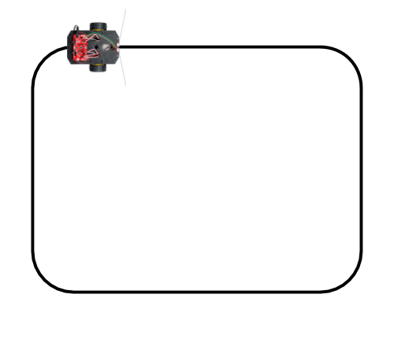

# E-2 Follow Line

Next, you'll code an app that uses the IR line sensors to make your robot follow a line. The line determines the robot's path.

## Create Line on Surface

Your teacher might have set up one or more line paths for the class to use for this tutorial

If not, then create a line on your floor or surface \(e.g., large sheet of paper, etc.\) that forms a closed path \(i.e., an oval or rounded rectangle\). The line should be about 0.5—0.75 inch wide. The line should **not** have any "sharp" turns — instead, use a curved path to make any turns.

The diagram below represents a line enclosing an area about 3 feet by 4 feet in size.  You'll also use your line for the next test \([E-3 Avoid Line](e-3-avoid-line.md)\), so be sure the area enclosed by the line is at least 2 feet by 3 feet.




## How Line Following Works

The robot's goal during line following is to try stay centered on the line as the robot drives.

Let's assume that the robot is trying to follow a dark line on a light-colored surface. When the robot is centered on the line, the center IR line sensor will have a high reading \(due to the dark line\) while the left and right sensors will have low readings \(due to the light-colored surface on either side of the line\).


If the robot is trying to follow a line, there are 3 possible situations at any given point:

* **If only the center IR line sensor detects the line**, this means the robot is centered on the line. In this situation, the robot should drive straight to keep following the line.
* **If only the left IR sensor detects the line**, this means the line has started to curve to the left. In this situation, the robot should adjust its motors to curve left and keep following the line.
* **If only the right IR line sensor detects the line**, this means the line has started to curve to the right. In this situation, the robot should adjust its motors to curve right and keep following the line.

## Save Copy of App With New Name <a id="save-copy-of-app-with-new-name"></a>

In your Arduino code editor, use the "Save As" command to save a copy of the `line_sensors_test` app as a different app named: `follow_line_test`

Once you saved the new app name, modify the block comment near the beginning of the app code to change `Line Sensors Test` to `Follow Line Test`.

## Create Objects for Motors and Button

Your app will need to create new objects \(as global variables\) to represent the robot's motors and button. Add this code **before** the `setup()` function:

```cpp
RedBotMotors motors;
RedBotButton button;
```

## Add Code for "Press to Start"

This app will use the "Press to Start" code. You'll press the D12 button to "start" the robot. Once the robot is "started," you can press the button again to "pause" the robot. \(Pressing the button yet again will "start" the robot again.\)

You need to declare global variables for the LED  pin and speaker pin. You also need a global variable to keep track of whether or not the robot has been "started."  Add this code **before** the `setup()` function:

```cpp
int LED = 13;
int speaker = 9;
bool started = false;
```

Set the pin modes for the LED and speaker by adding this code **within** the `setup()` function:

```cpp
    pinMode(LED, OUTPUT);
    pinMode(speaker, OUTPUT);
```

This app does **not** need the `Serial.begin()` statement within the `setup()` function. You can turn this code statement into a **comment** by typing two forward slashes `//` at the beginning of the statement.

Next, you need to add the custom function named `checkButton()` that will check whether the D12 button is pressed, in order to "start" or "pause" the robot.

Add this custom function **after** the `loop()` function:

```cpp
void checkButton() {
  if (button.read() == true) {
    // reverse value of started
    started = !started;
    
    // beep and blink as feedback
    digitalWrite(LED, HIGH);
    tone(speaker, 2000);
    delay(200);
    digitalWrite(LED, LOW);
    noTone(speaker);
    delay(200);
  }
}
```

Next, **delete** the code statement that calls the `testLineSensors()` function **within** the `loop()` function. This will give you an "empty" `loop()` function.

Now add this new code **within** the `loop()` function:

```cpp
  checkButton();
  if (started == true) {
    // add code to perform when "started"
    
  }
  else {
    // add code to perform when "paused"
    
  }
```

Later, you'll add the code to be performed when the robot is started or paused.

## Add Custom Function to Follow Line

You'll add a custom function named `followLine()` which will contain code to use readings from the three IR line sensors to decide whether to drive straight, curve to the left, or curve to the right.

Line following works best at slower speeds, so this function uses an initial value of `100` for the motor power \(but shifts each motor power up or down by `50` in order to curve left or right\).

This function assumes that your robot will be following a dark line on a light-colored surface. However, you can modify the function to instead follow a light line on a dark surface.

Add this custom function **after** the `loop()` function:

```cpp
void followLine() {
  /* FOLLOW LINE
  To follow dark line on light surface:
  Use high threshold & see if sensors greater than threshold
  
  To follow light line on dark surface:
  Use low threshold & see if sensors less than threshold
  */

  int leftPower, rightPower;
  int power = 100;
  int powerShift = 50;
  int lineThreshold = 800; // change value if necessary

  // get IR sensor readings
  int leftSensor = leftLine.read();
  int centerSensor = centerLine.read();
  int rightSensor = rightLine.read();

  // if line under center sensor, drive straight to stay aligned
  if (centerSensor > lineThreshold) {
    // set both motors to same power
    leftPower = power;
    rightPower = power;
  }
  // if line under left sensor, curve left to realign
  else if (leftSensor > lineThreshold) {
    // decrease left motor, increase right motor
    leftPower = power - powerShift;
    rightPower = power + powerShift;
  }
  // if line under right sensor, curve right to realign
  else if (rightSensor > lineThreshold) {
    // increase left motor, decrease right motor
    leftPower = power + powerShift;
    rightPower = power - powerShift;
  }

  // drive motors using power values from above
  motors.leftDrive(leftPower);
  motors.rightDrive(rightPower);

  delay(25);  // can change delay to adjust line detection sensitivity    
}
```

## Add Code to Perform When Robot is Started

When the D12 button is pressed to "start" the robot, we want the robot to follow the line.

Add this code statement **within** the `if` statement in the `loop()` function, so it will be performed when `started` is `true`:

```cpp
    followLine();
```

## Add Code to Perform When Robot is Paused

Once the robot has been "started," the D12 button can be pressed again to "pause" the robot.

When the robot is "paused," we want make the robot stop driving.

Add this code statement **within** the `else` statement in the `loop()` function, so it will be performed when `started` is `false`:

```cpp
    motors.brake();
```

## Upload App to Robot

Follow the steps to connect your robot to your computer, and upload the app.

Unplug the USB cable from the robot, and place the robot on your line, so only the robot's center IR line sensor is "on" the line.

Press the D12 button to "start" the robot. The robot should \(hopefully\) follow the line.

When you're done testing the robot, you can pick it up, and press the D12 button to "pause" the robot \(or you can press the Reset button\).

If you want to test further, place the robot back on the line, and press the button to "start" the robot again.

### TROUBLESHOOTING

If your robot is unable to consistently follow the line, here are several things you could investigate:

* Make sure your line path does **not** have sharp turns.
* Make sure your line is dark enough and the right width.  A uniform black line about 0.5–0.75 inch wide is ideal.
* Make sure your surface is lighter in color than your line. A uniform white surface is ideal. However, the surface could be another color or have a pattern, as long as the IR sensor readings for the surface are consistently and significantly lower than the readings for the line.
* You can use the `line_sensors_test` app to check the IR sensor readings for your line and surface. The readings for a dark line should be consistently high \(i.e., line readings of 800 or higher\). The readings for your surface should consistently be at least 100 less than your line readings. If necessary, you can modify the value assigned to `lineThreshold` in the `followLine()` function.


**LOW BATTERY:**  As your robot's battery power gets low, the IR line sensors will stop working — even though there still might be enough power to keep driving. If your robot was previously successful at line following and then starts having problems, try replacing the robot's batteries.


