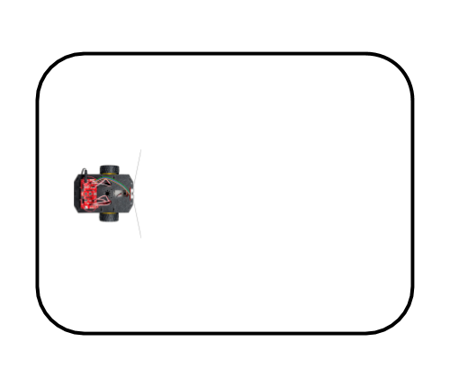
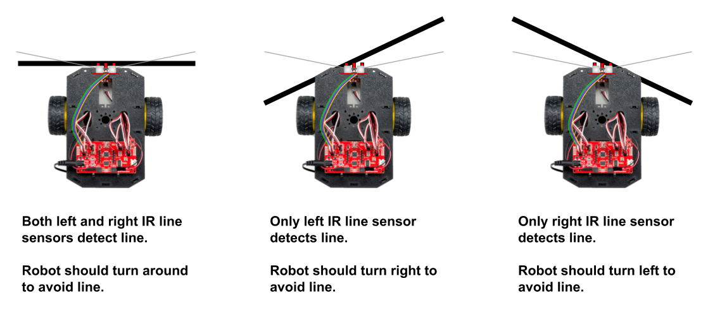

# E-3 Avoid Line

Next, you'll code an app that uses the IR line sensors to make your robot avoid a line. The line acts a border to keep the robot inside \(or outside\) a certain area or path.

## Use Existing Line on Surface

You'll use the same line as you did in the previous test — except for this test, the robot will be placed **inside** the area enclosed by the line. As the robot drives around, it will turn away from the line whenever the line is detected. In this case, the line will act like a border to keep the robot **inside** the area.



If you were to place the robot **outside** the area, then the line would act as a border to keep the robot **outside** of the area.

## How Line Avoiding Works

The robot's goal when avoiding a line is to check for a line as the robot drives and turn away when a line is detected. To do this, the robot can just check the left and right IR line sensors \(rather than all three\).



If the robot is trying to avoid a line, there are 3 possible situations when a line is detected:

* **If both the left and right IR line sensors detect the line**, this means the robot has "hit" the line head-on. In this situation, the robot should turn around to avoid the line.
* **If only the left IR sensor detects the line**, this means robot has "hit" the line at angle from the left. In this situation, the robot should turn right to avoid the line.
* **If only the right IR line sensor detects the line**, this means robot has "hit" the line at angle from the right. In this situation, the robot should turn left to avoid the line.

## Save Copy of App With New Name <a id="save-copy-of-app-with-new-name"></a>

In your Arduino code editor, use the "Save As" command to save a copy of the `follow_line_test` app as a different app named: `avoid_line_test`

Once you saved the new app name, modify the block comment near the beginning of the app code to change `Follow Line Test` to `Avoid Line Test`.

## Add Custom Function to Avoid Line

You'll add a custom function named `avoidLine()` which will contain code to use readings from the left and right IR line sensors to decide whether to drive straight, turn left, turn right, or turn around the right.

Similar to following a line, avoiding a line works best at slower speeds \(otherwise the robot might drive past the line before detecting it\), so this function uses a value of `100` for the motor power.

The function generates a random number for the amount of time \(in milliseconds\) for each turn \(pivot\) to produce some variation in the robot's path. The ranges for the random numbers were selected to make the pivot times close to a 90° turn or a 180° turn. However, you can modify this function to instead use fixed pivot times \(such as 650 ms for a 90° turn and 1300 ms for a 180° turn\).

The function assumes that your robot will be avoiding a dark line on a light-colored surface. However, you can modify this function to instead avoid a light line on a dark surface.

```cpp
void avoidLine() {
  /* AVOID LINE
  To avoid dark line on light surface:
  Use high threshold & see if sensors greater than threshold

  To avoid light line on dark surface:
  Use low threshold & see if sensors less than threshold
  */

  // adjust value if necessary
  int lineThreshold = 800;

  // get IR sensor readings (only need left and right)
  int leftSensor = leftLine.read();
  int rightSensor = rightLine.read();

  // if either sensor detects line, first brake motors
  if (leftSensor > lineThreshold || rightSensor > lineThreshold) {
    motors.brake();
    delay(250);
  }

  // if both sensors on line, turn around
  if (leftSensor > lineThreshold && rightSensor > lineThreshold) {
    long randomNum = random(975, 1625); // approx 145-225 degree pivot
    motors.pivot(100);
    delay(randomNum);
    motors.stop();
  }
  // if line under left sensor only, turn right
  else if (leftSensor > lineThreshold) {
    long randomNum = random(325, 975); // approx 45-135 degree pivot
    motors.pivot(100); // pivot clockwise to right
    delay(randomNum);
    motors.stop();
  }
  // if line under right sensor only, turn left
  else if (rightSensor > lineThreshold) {
    long randomNum = random(325, 975); // approx 45-135 degree pivot
    motors.pivot(-100); // pivot counter-clockwise to left
    delay(randomNum);
    motors.stop();
  }
  // otherwise, keep driving straight
  else motors.drive(100);

  delay(25);  // can change delay to adjust line following sensitivity    
}
```

## Modify Code to Perform When Robot is Started

When the D12 button is pressed to "start" the robot, we want make the robot drive forward while avoiding the line.

First, **delete** the existing code statement **within** the `if` statement in the `loop()` function that calls the `followLine()` function  when `started` is `true`.

Then add this code statement **within** the `if` statement in the `loop()` function, so it will be performed when `started` is `true`:

```cpp
    avoidLine();
```

## Upload App to Robot

Follow the steps to connect your robot to your computer, and upload the app.

Unplug the USB cable from the robot, and place the robot **inside** the area enclosed by the line, so **none** of the robot's IR line sensors are on the line.

Press the D12 button to "start" the robot. The robot should start driving and should avoid the line by making turns to stay within the area enclosed by the line.

When you're done testing the robot, you can pick it up, and press the D12 button to "pause" the robot.

If you want to test further, place the robot back on the line, and press the button to "start" the robot again.

