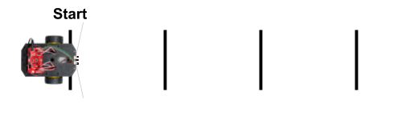
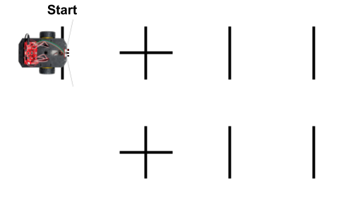
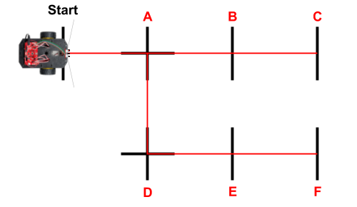

# E-4 Count Lines Crossed

Next, you'll code an app that uses the IR line sensors to make your robot count line markers it crosses as it drives straight. The robot will stop driving when it reaches a specific line number. You can then make the robot turn and start driving in a new direction.

The **advantage** of counting line markers while driving straight is that you can map out the robot's path by simply marking each point where the robot might stop or turn — **without** needing to create a continuous line to follow. You can also create complex patterns with intersecting paths.

The **limitation** of counting line markers while driving straight is that each specific path must be straight, and different paths must intersect each other at 90° angles.

## Create Line Markers on Surface

Your teacher might have set up one or more sets of line markers for the class to use for this tutorial.

If not, then create a set of 4 line markers on your floor or surface \(e.g., large sheet of paper, etc.\) similar to the diagram below:



* Each line marker should be about 0.5 inch wide and about 6-12 inches long. \(In theory, the line markers could be only 3 inches long if the robot always drives perfectly straight and makes perfect turns, but you'll make the lines longer to account for the fact that the robot won't be perfect.\)
* The set of line markers should be arranged in a straight row along the robot's path. Each line marker should be perpendicular to the robot's path.
* For this test, make the total distance from the 1st line to the 4th line about 48 inches \(4 feet\). This means you could space the line markers about 18 inches apart \(though they do **not** have to be even spaced for line counting to work\).
* If you are drawing the lines on a large sheet of paper \(approximately 3 feet wide by 6 feet long\), be sure to draw the lines along the **top** of the paper, so later you'll be able to add another set of lines along the bottom of the paper.

## Save Copy of App With New Name <a id="save-copy-of-app-with-new-name"></a>

In your Arduino code editor, use the "Save As" command to save a copy of the `drive_straight_test` app as a different app named: `count_lines_test`

Once you saved the new app name, modify the block comment near the beginning of the app code to change `Drive Straight Test` to `Count Lines Test`.

## Create Objects for Line Sensors

Your app will need to create new objects \(as global variables\) to represent the robot's IR line sensors. Add this code **before** the `setup()` function:

```cpp
RedBotSensor leftLine(A3);
RedBotSensor centerLine(A6);
RedBotSensor rightLine(A7);
```

## Add Custom Function to Count Lines While Driving Straight

You'll add a custom function named `countLine()` which will contain code to make your robot drive straight continuously while using readings from the IR line sensors to count each line marker that it crosses. The robot will stop when it reaches a specified line number. You can then make the robot turn and start driving straight in a new direction.

Add this custom function **after** the `loop()` function:

```cpp
void countLine(int target) {
  /* DRIVE STRAIGHT WHILE COUNTING LINES CROSSED
  To count dark lines on light surface:
  Use high threshold & see if sensors greater than threshold

  To count light lines on dark surface:
  Use low threshold & see if sensors less than threshold
  */

  int lineThreshold = 800; // change value if necessary

  // variables for counting lines
  int lineCount = 0;
  boolean lineDetected = false;

  // keeps looping while line count is less than target
  while (lineCount < target) {
    driveStraight();

    // get IR sensor readings
    int leftSensor = leftLine.read();
    int centerSensor = centerLine.read();
    int rightSensor = rightLine.read();

    // toggle between checking for line vs. checking for no line
    if (lineDetected == false) {
      // if all 3 sensors detect line, increase line count and toggle to checking for no line
      if (leftSensor > lineThreshold && centerSensor > lineThreshold && rightSensor > lineThreshold) {
        lineCount++;
        lineDetected = true;
      }
    }
    else if (lineDetected == true) {
      // if all 3 sensors detect no line, toggle back to checking for line
      if (leftSensor < lineThreshold && centerSensor < lineThreshold && rightSensor < lineThreshold) {
        lineDetected = false;
      }
    }
  }
  // target line count reached
  motors.brake();
  delay(250);
  driveDistance(3.5); // drive 3.5 inches to center robot on target line
}
```

**IMPORTANT:**  The `countLine()` function requires two other custom functions, in order to work:

* `driveStraight()` function — used to make the robot drive straight
* `driveDistance()` function — used to center the robot on the target line marker

So your app will also need to have both of these custom functions. Luckily, the saved app that you re-used for this current app already has the `driveStraight()` function.

## Add Custom Function to Drive Specific Distance

The `countLine()` function calls the `driveDistance()` function once the target line count is reached. The robot drives forward 3.5 inches, in order to center the robot's wheels on the target line marker.

So you'll need to add the `driveDistance()` custom function, which contains code to make your robot drive in a straight line for a specified distance by using the wheel encoders.

Copy the `driveDistance()` function from [tutorial C-4](../driving-and-turning/c-4-drive-for-specific-distance.md#add-custom-function-to-drive-specific-distance), and add this function **after** the `loop()` function.

## Add Custom Function to Pivot Specific Angle

Once your robot reaches a specific line marker using the `countLine()` function, you'll usually turn the robot to start driving in a new direction. Typically, you'll pivot the robot 90° right, 90° left, or 180° around.

So you'll also need to add the `pivotAngle()` custom function, which contains code to make your robot pivot by a specified angle by using the wheel encoders.

Copy the `pivotAngle()` function from [tutorial C-5](../driving-and-turning/c-5-pivot-by-specific-angle.md#add-custom-function-to-pivot-specific-angle), and add this function **after** the `loop()` function.

## Modify Code to Perform When Robot is Started

When the D12 button is pressed to "start" the robot, we want to make the robot drive straight until it has counted 3 line markers. Then we'll make the robot turn around \(180°\) and return by driving straight until it has counted another 3 line markers. Finally, the robot will turn around again \(180°\) and "pause" itself, so it's back in its starting position.

First, **delete** the existing code statement **within** the `if` statement in the `loop()` function that calls the `driveStraight()` function  when `started` is `true`.

Then add these code statements **within** the `if` statement in the `loop()` function, so they will be performed when `started` is `true`:

```cpp
    countLine(3); // drive until 3 line markers counted
    pivotAngle(180); // turn around
    countLine(3); // drive until 3 line markers counted
    pivotAngle(180); // turn around again
    started = false; // pause robot
```

## Upload App to Robot

Follow the steps to connect your robot to your computer, and upload the app.

Unplug the USB cable from the robot, and place the robot centered on the "start" line, so the robot's IR line sensors are in **front** of the line \(so the start line will **not** be counted as the first line\).


Press the D12 button to "start" the robot. The robot should start driving straight. After the robot has counted 3 line markers \(meaning it has reached the 3rd line after the start line\), the robot should stop, turn around, and then drive back. After counting another 3 line markers \(meaning the robot has returned to the start line\), the robot should stop and turn around again \(facing its original direction\). The robot will "pause" itself automatically.

If you want to test the robot again, press the D12 button to "start" the robot again.

## Modify Line Pattern

Next, you're going to modify the line maker pattern by adding more line markers to create a pattern similar to the diagram below:



1. Convert the 2nd line into a "plus sign" by creating another line \(same length\) at 90° to the original line.  A "plus sign" line marker indicates where two \(or more\) paths intersect each other.
2. Create a 2nd "plus sign" below the first "plus sign," so they are aligned with each other, and their centers are about 18 inches apart \(though the exact distance is not important\).
3. Create 2 more line markers that are aligned with the 2nd "plus sign" to form another straight path for the robot.

The diagram below has red lines to show you the possible paths that the robot can take using this new line marker pattern. Each of the line markers has been labeled with a letter \(A-F\). \(Do **not** add the red lines to your line marker pattern.\) As you can see, the robot's possible path has multiple branches. Each line marker represents a possible stopping point or turning point along a specific path.



For example, maybe this pattern represents a set of paths for a warehouse robot to drive down two different aisles of shelving to deliver \(or pick up\) boxes.  Path A-B-C represents the first aisle, while path D-E-F represent a second aisle. Path A-D connects the two aisles.

#### GUIDELINES FOR LINE MARKER PATTERNS

Here are guidelines to use when creating your own line marker patterns:

* Each line marker should be about 0.5 inch wide and about 6-12 inches long. 
* Line markers that are part of the same path should be **aligned to form a straight path**. Each line marker should be perpendicular to the robot's path.
* Line markers must be used to indicate the **beginning** and the **end** of a specific straight path.
* Line markers can be used in the **middle** of a path to represent places where the robot might stop or turn around. However, it is **not** required to have line markers in the middle of a path.
* Line markers that form a **"plus sign"** indicate where two \(or more\) paths **intersect at a 90° angle**.

## Modify App to Drive in Specific Pattern

You'll modify the app so the robot will drive from the "start" line to line marker F \(see previous diagram\) and then back again.

To do this, robot must drive to the 1st intersection \("plus sign"\) by counting 1 line marker. Then it should turn 90° right and drive to the 2nd intersection by counting 1 line marker. There it should turn 90° left and drive to the end of that path by counting 2 more line markers. Then it will turn 180° around and drive back to the "start" line again by counting lines and making turns.

First, **delete** the existing code statements  **within** the `if` statement in the `loop()` function that are performed when `started` is `true`.

Then add these code statements **within** the `if` statement in the `loop()` function, so they will be performed when `started` is `true`:

```cpp
    countLine(1); // drive until 1 line marker counted (1st intersection)
    pivotAngle(90); // turn right
    countLine(1); // drive until 1 line marker counted (2nd intersection)
    pivotAngle(-90); // turn left
    countLine(2); // drive until 2 line markers counted (end of path)
    pivotAngle(180); // turn around
    
    // return trip
    countLine(2); // drive until 2 line markers counted (back to 2nd intersection)
    pivotAngle(90); // turn right
    countLine(1); // drive until 1 line marker counted (back to 1st intersection)
    pivotAngle(-90); // turn left
    countLine(1); // drive until 1 line marker counted (back to start line)
    pivotAngle(180); // turn around (to face starting direction)

    started = false; // pause robot
```

## Upload Modified App to Robot

Follow the steps to connect your robot to your computer, and upload the modified app.

Unplug the USB cable from the robot, and place the robot centered on the "start" line, so the robot's IR line sensors are in **front** of the line \(so the start line will **not** be counted as the first line\).

Press the D12 button to "start" the robot. It should drive from the "start" line to the end of the 2nd path that you added and then return back to the "start" line again.

If you want to test the robot again, press the D12 button to "start" the robot again.

As further practice, you could modify the app to make the robot drive in different patterns using this same set of line markers.  For example, you could make the robot drive from the "start" line to line marker B, then turn around and drive to line marker E, and finally turn around and return to the start again.

