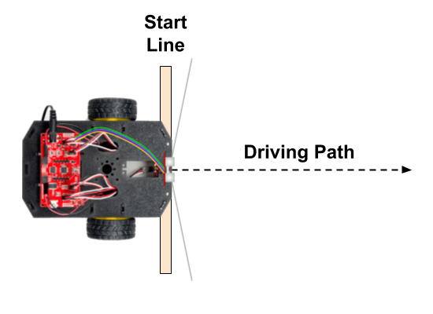

# C-4 Drive for Specific Distance

**STILL IN PROGRESS**

use wheel encoders to drive in straight line for specific distance \(such as:  24 inches, 36 inches, etc.\)

use driveDistance\(\) custom function - explain conceptually how it works

upload app to robot, and confirm it works - may need to adjust correction value in function to get as close to intended distance as possible - test, adjust correction value, upload revised app, test again

## Create New App

Open your Arduino code editor, and create a new app template.

Add a block comment at the beginning of the app code to identify your new app:

```cpp
/*
Drive Distance Test
Team Info
Teacher - Class Period
*/
```

## Include RedBot Library

[Follow the steps to include the SparkFun RedBot Library in your app](../../references/arduino-code-editor/include-redbot-library.md#include-redbot-library-in-app). \(You **don't** need to add the library to your code editor again — just include the library in this new app.\)

## Create Objects for Motors, Button, and Encoders

Your app will need to create new objects \(as global variables\) to represent the robot's motors, button, and wheel encoders. Add this code **before** the `setup()` function:

```cpp
RedBotMotors motors;
RedBotButton button;
RedBotEncoder encoder(A2, 10);
```

As you can see, the first code statement creates a `RedBotMotors` object named `motors`, which your app will use to control your left and right motors.

## Add Code for "Press to Start"

Create global variables for the LED pin and speaker pin by adding this code **before** the `setup()` function: 

```cpp
int LED = 13;
int speaker = 9;
```

Set the pin modes for the LED and speaker by adding this code **within** the `setup()` function:

```cpp
    pinMode(LED, OUTPUT);
    pinMode(speaker, OUTPUT);
```

Check whether the button has been pressed by adding this code **within** the `loop()` function:

```cpp
  if (button.read() == true) {
    // code to perform when button is pressed
    digitalWrite(LED, HIGH);
    tone(speaker, 2000);
    delay(200);
    digitalWrite(LED, LOW);
    noTone(speaker);
    // add code for other robot actions (driving, etc.)
    
  }
```

## Add Custom Function to Drive Specific Distance

You'll add a custom function named `driveDistance()` which contains code to make your robot drive in a straight line for a specified distance by using the wheel encoders.

Add this custom function **after** the `loop()` function \(i.e., after its closing curly brace\):

```cpp
void driveDistance(float distance) {

    // use wheel encoders to drive straight for specified distance at specified power

    // set initial power for left and right motors
    int leftPower = 175;
    int rightPower = leftPower;

    // amount to offset motor powers to drive straight
    int offset = 5;

    // if negative distance, make motor powers & offset also negative
    if (distance < 0) {
        leftPower *= -1;
        rightPower *= -1;
        offset *= -1;
    }

    // use correction to improve distance accuracy
    // adjust correction value based on test results
    float correction = -1.5; // need decimal point for float value
    if (distance > 0) distance += correction;
    else if (distance < 0) distance -= correction;

    // variables for tracking wheel encoder counts
    long leftCount = 0;
    long rightCount = 0;
    long prevLeftCount = 0;
    long prevRightCount = 0;
    long leftDiff, rightDiff;

    // RedBot values based on encoders, motors & wheels
    float countsPerRev = 192.0; // 192 encoder ticks per wheel revolution
    float wheelDiam = 2.56;  // wheel diameter = 65 mm = 2.56 in
    float wheelCirc = PI * wheelDiam; // wheel circumference = 3.14 x 2.56 in = 8.04 in

    // based on distance, calculate number of wheel revolutions
    float numRev = distance / wheelCirc;

    // calculate target encoder count
    float targetCount = numRev * countsPerRev;

    // reset encoder counters and start driving
    encoder.clearEnc(BOTH);
    delay(100);
    motors.leftDrive(leftPower);
    motors.rightDrive(rightPower);

    // keeps looping while right encoder count less than target count
    while (abs(rightCount) < abs(targetCount)) {

        // get current wheel encoder counts
        leftCount = encoder.getTicks(LEFT);
        rightCount = encoder.getTicks(RIGHT);

        // calculate increase in count from previous reading
        leftDiff = abs(leftCount - prevLeftCount);
        rightDiff = abs(rightCount - prevRightCount);

        // store current counts as "previous" counts for next reading
        prevLeftCount = leftCount;
        prevRightCount = rightCount;

        // adjust left & right motor powers to keep counts similar (drive straight)

        // if left rotated more than right, slow down left & speed up right
        if (leftDiff > rightDiff) {
            leftPower = leftPower - offset;
            rightPower = rightPower + offset;
        }
        // else if right rotated more than left, speed up left & slow down right
        else if (leftDiff < rightDiff) {
            leftPower = leftPower + offset;
            rightPower = rightPower - offset;
        }

        // apply adjusted motor powers
        motors.leftDrive(leftPower);
        motors.rightDrive(rightPower);
        delay(10);  // short delay before next reading
    }

    // target count reached
    motors.brake(); // or use: motors.stop()
    delay(500); // brief delay to wait for complete stop
}
```

## Call Custom Function in Loop

Remember that the code within a custom function is only performed if the custom function is "called" by its name within another function, such as the `setup()` function or `loop()` function.

When calling the `driveDistance()` custom function, you must pass in a value for the **distance** \(inches\) by listing a number inside the parentheses after the function's name.

You'll use the `driveDistance()` function to make your robot drive straight for 36 inches. Add this code statement **within** the `if` statement in the `loop()` function \(**after** the `noTone()` statement\):

```cpp
driveDistance(36);
```

By listing the name of the custom function, the custom function is "called" — so the code within that custom function will be performed one time. By listing `36` inside the parentheses, the robot will drive straight for 36 inches.

The `driveDistance()` function could also be used to make your robot **drive backward**  — just pass in a **negative** number when calling the function.

## Upload App to Robot

Follow the steps to connect your robot to your computer, and upload the app.

Unplug the USB cable from the robot, and place the robot on the floor. Create a "start line" on the floor \(using masking tape, etc.\). Line up the front edge of the robot with the front edge of the start line. Be sure a path of at least 3 feet in front of the robot is clear of any obstacles.



Press the D12 button on your robot's circuit board. Your robot should beep and then drive forward in a straight line for 36 inches.

Then measure the distance from the front of the start line to the front of the robot, in order to see how close the distance traveled is to 36 inches.

Line up the robot with the start line, and test again. Repeat the test several times to determine the average distance.

The `driveDistance()` function contains a local variable named `correction` which has been set to `-1.5` because during our testing, our robot was driving about 1.5 inches **too far** when using a motor power of 175. The reason for this is because it takes a small amount of time for the robot to apply the brakes and come to a complete stop.

If your robot is driving too far \(or not far enough\), you'll probably want to change the value assigned to `correction` in the `driveDistance()` function:

* If your robot is **driving too far**, make the correction a larger negative number. For example, if your robot is driving about 0.5 inch too far \(36.5 inches\), change the value of `correction` from `-1.5` to `-2.0`.
* If your robot is **not driving far enough**, make the correction a smaller negative number. For example, if your robot is driving about 0.5 inch too little \(35.5 inches\), change the value of `correction` from `-1.5` to `-1.0`.

If you do adjust the `correction` value, upload the modified app to your robot, and test again to ensure the driving distance is accurate \(within 0.5 inch of the intended distance\).


