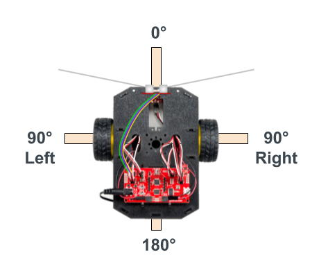

# C-5 Pivot By Specific Angle

As your last step of this tutorial, you'll code an app that uses the wheel encoders to make your robot pivot by a specific angle \(measured in degrees\).

## Using Wheel Encoder Counts to Calculate Pivot Angle

The wheel encoders can also be used to pivot \(turn\) your RedBot by a specific angle by measuring the distance traveled by the wheels while pivoting.

When pivoting, the robot turns in a circle centered between the robot's wheels. The distance between the centers of the RedBot wheel treads is 6.125 inches, which represents the diameter of the robot's pivot circle. If the robot pivoted 360°, the distance traveled by each wheel would be equal to the circumference of this pivot circle:

**C = 𝛑 × d = 3.14 × 6.125 = 19.23 inches**

Usually you will want your RedBot to pivot by a specific angle that is less than 360° — such as 45°, 90°, 180°, etc. For any specific angle, you can calculate its **arc length** \(i.e., a "partial circumference"\):

**L = 𝛂 / 360° × 𝛑 × d**

The arc length \(**L**\) represents the distance each wheel will travel while pivoting by a specific angle \(𝛂\).

For example, when pivoting by 90°, the arc length is:

L = 90° / 360° × 𝛑 × d = 0.25 × 3.14 × 6.125 = 4.81 inches

Once this arc length is calculated for a specific angle, the wheel encoders can be used to control how long the wheels are pivoted.

## Save Copy of App With New Name

In your Arduino code editor, use the "Save As" command to save a copy of your existing `drive_distance_test` app as a different app named:  `pivot_angle_test`

If necessary, here are [instructions for how to save a copy of an app with a new name](../../references/arduino-code-editor/save-and-rename-app.md).

Once you saved the new app name, modify the block comment near the beginning of the app code to change `Drive Distance Test` to `Pivot Angle Test`.

## Add Custom Function to Pivot Specific Angle

You'll add another custom function named `pivotAngle()` which contains code to make your robot pivot by a specified angle by using the wheel encoders.

Add this custom function **after** the `loop()` function \(i.e., after its closing curly brace\):

```cpp
void pivotAngle(float angle) {

    // use wheel encoders to pivot (turn) by specified angle

    // set motor power for pivoting
    int power = 100; // clockwise
    if (angle < 0) power *= -1; // negative power for counter-clockwise

    // use correction to improve angle accuracy
    // adjust correction value based on test results
    float correction = -5.0; // need decimal point for float value
    if (angle > 0) angle += correction;
    else if (angle < 0) angle -= correction;

    // variable for tracking wheel encoder counts
    long rightCount = 0;

    // values based on RedBot's encoders, motors & wheels
    float countsPerRev = 192.0; // 192 encoder ticks per wheel revolution
    float wheelDiam = 2.56; // wheel diameter = 65 mm = 2.56 in
    float wheelCirc = PI * wheelDiam; // wheel circumference = 3.14 x 2.56 in = 8.04 in
    float pivotDiam = 6.125; // pivot diameter = distance between centers of wheel treads = 6.125 in
    float pivotCirc = PI * pivotDiam; // pivot circumference = 3.14 x 6.125 in = 19.23 in

    // based on angle, calculate distance (arc length) for pivot
    float distance = abs(angle) / 360 * pivotCirc;

    // based on distance, calculate number of wheel revolutions
    float numRev = distance / wheelCirc;

    // based on number of revolutions, calculate target encoder count
    float targetCount = numRev * countsPerRev;

    // reset encoder counters and start pivoting
    encoder.clearEnc(BOTH);
    delay(100);
    motors.pivot(power);

    // keeps looping while right encoder count less than target count
    while (abs(rightCount) < abs(targetCount)) {
        // get current wheel encoder count
        rightCount = encoder.getTicks(RIGHT);
        delay(10);  // short delay before next reading
    }

    // target count reached
    motors.brake();
    delay(250);
    
    // uncomment next statement only if using driveStraight() elsewhere in program
    // clearEncoders();
}
```


**KEEP BOTH CUSTOM FUNCTIONS:**  Be sure to keep the `driveDistance()` custom function in your app code. You'll use this custom function again to modify this app as a final step.


## Call Custom Function in Loop

Remember that the code within a custom function is only performed if the custom function is "called" by its name within another function, such as the `setup()` function or `loop()` function.

When calling the `pivotAngle()` custom function, you must pass in a value for the **angle** \(degrees\) by listing a number inside the parentheses after the function's name:

* A **positive** angle will pivot the robot **clockwise** to the right.
* A **negative** angle will pivot the robot **counter-clockwise** to the left.

You'll use the `pivotAngle()` function to make your robot pivot 90° right.

First, **delete** the `driveDistance(36);` code statement **within** the `if` statement in the `loop()` function \(**after** the `noTone()` statement\), and then replace it with this code statement instead:

```cpp
pivotAngle(90);
```

By listing the name of the custom function, the custom function is "called" — so the code within that custom function will be performed one time. By listing `90` inside the parentheses, the robot will pivot clockwise by 90 degrees.

## Upload App to Robot

Follow the steps to connect your robot to your computer, and upload the app.

Unplug the USB cable from the robot, and place the robot on the floor. Create a "plus sign" on the floor \(using masking tape, etc.\). The "plus sign" should consist of two lines about 12 inches long \(i.e., slightly longer than the robot\) that cross at a right angle \(90°\).

Place the robot on the "plus sign" so its wheels are centered on one line, while the front of the robot is aligned with the other line, which will act as the starting point \(0°\) for the pivot angle. The diagram below shows the proper starting alignment.



Press the D12 button on your robot's circuit board. Your robot should beep and then pivot 90° right.

Use the "plus sign" to visually check how the alignment of the pivoted robot compares to 90° right.

Align the robot with the lines, and test again. Repeat the test several times to determine if the pivoting needs to be adjusted with a correction value.

The `pivotAngle()` function contains a local variable named `correction` which has been set to `-5.0` because during our testing, our robot was pivoting about 5 degrees **too far** when using a motor power of 100. The reason for this is because it takes a small amount of time for the robot to apply the brakes and come to a complete stop.

If your robot is pivoting too much \(or too little\), you'll want to change the value assigned to `correction` in the `pivotAngle()` function:

* If your robot is **pivoting too much**, subtract from the correction value. For example, if your robot is pivoting 5 degrees too much \(95°\), subtract 5 from `correction`, changing it from `-5.0` to `-10.0`.
* If your robot is **pivoting too little**, add to the correction value. For example, if your robot is pivoting 5 degrees too little \(85°\),  add 5 to `correction`, changing it from `-5.0` to `0.0`.

If you do adjust the `correction` value, upload the modified app to your robot, and test again to ensure the pivot angle is accurate \(within 5 degrees of the intended angle\).

## Modify App to Turn Left

Next, you'll modify the app code so your robot will pivot 90° left. To pivot counter-clockwise to the the left, you specify a **negative** angle when calling the `pivotAngle()` function.

Modify the call to  `pivotAngle()` **within** the `loop()` by changing the angle from `90` to `-90`.

Upload the modified app to your robot. Align the robot on the "plus sign," and press the D12 button to verify that your robot pivots 90° left.

## Modify App to Turn Around

Next, you'll modify the app code so your robot will pivot 180° around.

Modify the call to  `pivotAngle()` **within** the `loop()` by changing the angle to `180`.

Upload the modified app to your robot. Align the robot on the "plus sign," and press the D12 button to verify that your robot pivots 180° around.

## Modify App to Drive and Pivot in Pattern

Finally, you'll modify the app to make your robot drive in a pattern using multiple calls to the `driveDistance()`function and the `pivotAngle()` function.

You'll make the robot follow the pattern shown in the diagram below. When the robot reaches the end, it will turn around and retrace its path back to the start.


First, **delete** the `pivotAngle(180);` code statement **within** the `loop()` function, and then replace it with this code instead:

```cpp
    driveDistance(36);
    pivotAngle(90);  // turn right
    driveDistance(12);
    pivotAngle(-90); // turn left
    driveDistance(24);
    pivotAngle(180); // turn around
    
    // return trip
    driveDistance(24);
    pivotAngle(90); // turn right
    driveDistance(12);
    pivotAngle(-90); // turn left
    driveDistance(36);
    pivotAngle(180); // turn around
```

Upload the modified app to your robot. Align the robot on the "plus sign," and press the D12 button to verify that your robot drives and pivots following the pattern. The robot should return back to its staring point \(though it probably won't be perfectly aligned back on the "plus sign"\).

In the next tutorial, you'll program apps to make your robot detect objects in its path.

