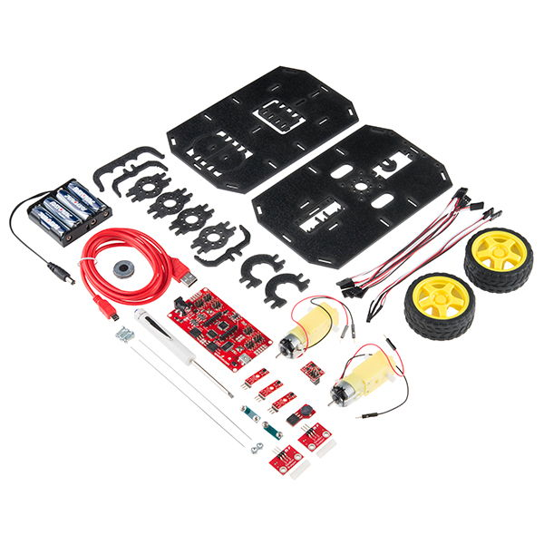
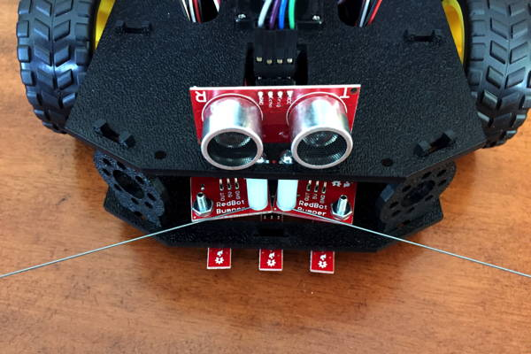

# A. Meet Your Robot

In this first tutorial, you'll become familiar with your team's robotics kit. Your team might receive a new robotics kit that needs to be assembled – or you might receive an existing robot that is ready to use.


**NEW ROBOT:**  If you need to assemble a new SparkFun RedBot robotics kit, carefully follow the instructions in the [SparkFun Assembly Guide for RedBot](https://learn.sparkfun.com/tutorials/assembly-guide-for-redbot-with-shadow-chassis).



**IMPORTANT:** Once a SparkFun RedBot has been assembled, it should remain assembled \(even after the project is completed\). The RedBot assembly is a one-time process.


## Tutorial Goals  

The goals of this tutorial are to help you:

* Understand the parts of your robot and their purposes
* Identify the physical inputs and outputs that your robot can use to sense and act 

## RedBot Kit 

This guidebook is tailored for a two-wheeled robotics kit called the [SparkFun Inventor's Kit for RedBot](https://www.sparkfun.com/products/13320), which will simply be referred to as the RedBot kit.

​[SparkFun](https://www.sparkfun.com/) is a company that sells products to help people build and program electronics devices. SparkFun created its RedBot kit by incorporating an Arduino-based microcontroller into an easy-to-use circuit board and packaged it with a set of motors, wheels, sensors, and other parts to help you learn how to program a wheeled robot. It is also possible to purchase additional parts \(sensors, servo motors, etc.\) that can be used with this RedBot kit.

Once assembled, your RedBot should look like this:

If you have an [ultrasonic sensor](../references/physical-inputs/ultrasonic-sensor.md), it should be mounted at the front of the robot on top of the chassis \(above the mechanical bumpers and IR line sensors\). The ultrasonic sensor should face forward, like a pair of "eyes" \(though an ultrasonic sensor actually uses high-frequency sound waves to "see"\).

  

