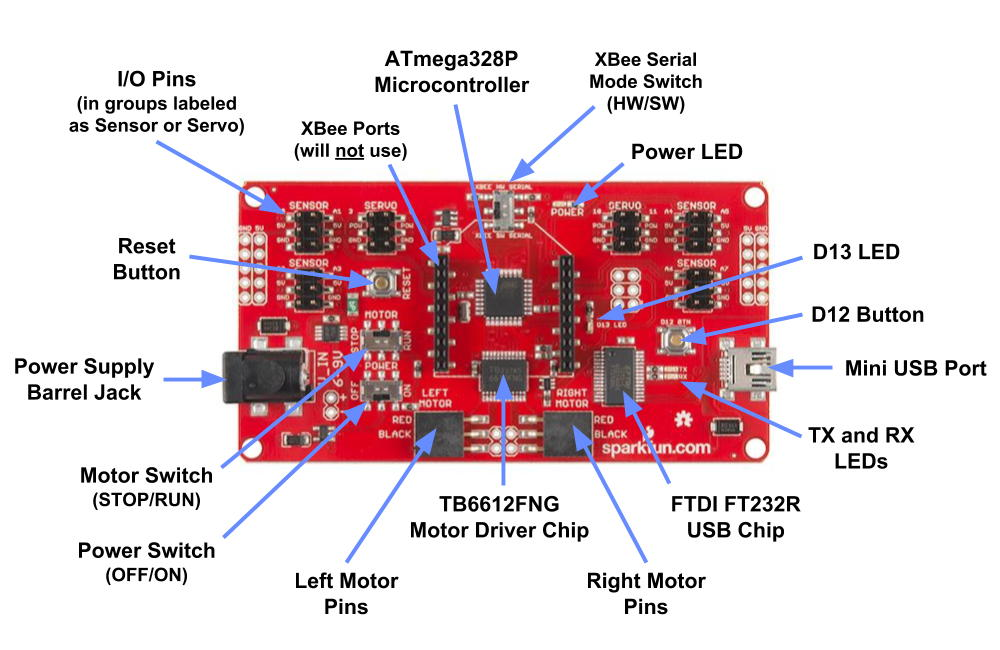

# A. Meet Your Robot

In this first tutorial, you'll become familiar with your team's robotics kit. Your team might receive a new robotics kit that needs to be assembled – or you might receive an existing robot that is ready to use.

If you need to assemble a new SparkFun RedBot robotics kit, carefully follow the instructions in the [SparkFun Assembly Guide for RedBot](https://learn.sparkfun.com/tutorials/assembly-guide-for-redbot-with-shadow-chassis).

**IMPORTANT:** Once a SparkFun RedBot has been assembled, it should remain assembled (even after the project is completed).

## Tutorial Goals 

The goals of this tutorial are to help you:

* Understand the parts of your robot and their purposes
* Identify the physical inputs and outputs that your robot can use to sense and act 

In progress...

