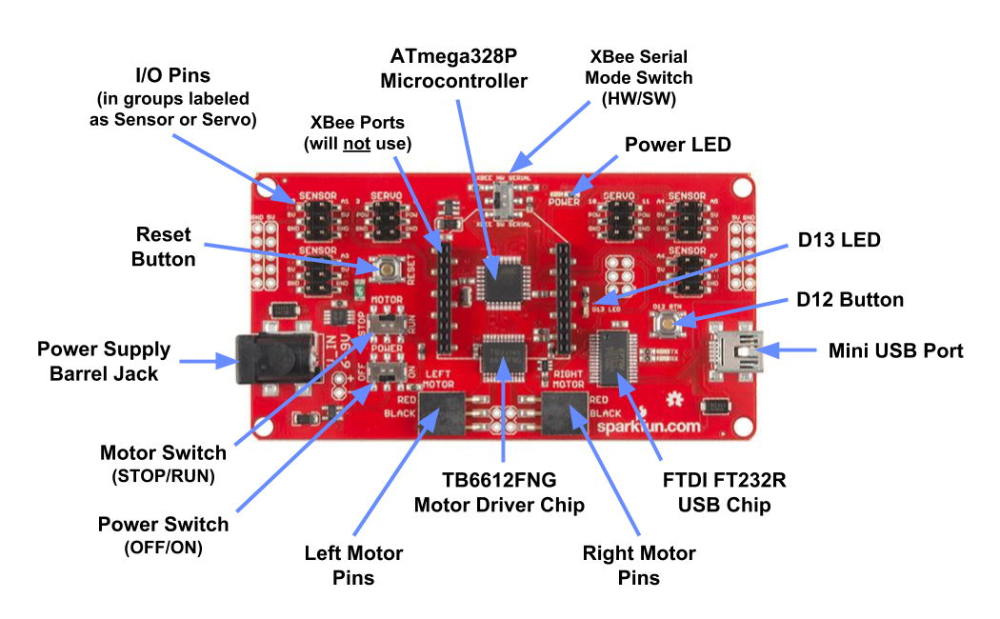

# A-1 Circuit Board

## Circuit Board

The SparkFun RedBot kit contains a printed circuit board \(PCB\) that incorporates an ATmega328P microcontroller, which will act like the “brain” of your robot. SparkFun refers to this circuit board as the RedBot mainboard.

A microcontroller is a small computer on a single integrated circuit that contains a processor \(CPU\), memory, storage, and programmable input/output pins.

Compared to the tech specs of a "regular" computer, a microcontroller is much less powerful – it has a slower processor, less memory, and less storage. This is because microcontrollers are used in devices that have dedicated functions \(such as: automobile engine control systems, medical devices, office machines, appliances, etc.\). These dedicated devices typically don’t require as much computing power to perform their specialized tasks.

The RedBot circuit board also has various pins, ports, buttons, switches, and LED lights. Wires from different inputs \(such as: sensors, etc.\) and outputs \(such as: motors, etc.\) are connected to the pins on the circuit board to create a functional robot. You control the robot by programming an app that will run on the microcontroller.

* **ATmega328P Microcontroller:**  controls entire robot and runs robot's app
  * Processor:  8-bit 20Mhz AVR
  * Memory:  2KB RAM
  * Storage:  32KB Flash
  * Input/Output: supports up to 23 general-purpose I/O pins
* **TB6612FNG Dual DC Motor Driver Chip:**  used to control the two wheel motors
* **FTDI FT232R USB Chip:**  used to send and receive data through the USB port
* **Input/Output Pins:**  used to connect wires for inputs \(sensors, etc.\) and outputs \(speaker, etc.\)
  * These I/O pins are in groups labeled as "Sensor" or "Servo" – each group has 6 pins, representing a set of 3 pins on the left and another set of 3 pins on the right.
  * Each set of 3 pins has one pin for input/output of data, a second pin for power \(5V = positive\), and a third pin for ground \(GND = negative\). Typically, a white wire connects to the I/O pin, a red wire connects to the 5V pin, and a black wire connects to the GND pin.
  * The "Sensor" I/O pins are numbered as:  A0, A1, A2, A3, A4, A5, A6, A7.
  * The "Servo" I/O pins are numbered as:  3, 9, 10, 11.
  * There are also I/O pins connected directly to a LED light \(pin D13\) and push button \(pin D12\).
* **Motor Pins:**  used to connect wires for left and right motors \(which are a type of output\)
* **Power Supply Jack:**  used to provide power to robot \(by plugging in barrel jack from battery pack\)
* **Mini USB Port:**  used to connect robot to computer \(either to download new app from computer or to send serial data to computer\)
* **LED Lights:**
  * **Power LED:**  Green LED that indicates the robot is powered on
  * **D13 LED:**  Green LED that can be controlled by your robot's app
  * **TX and RX LEDs:**  Green LEDs indicating data transfer between robot and computer
* **Buttons:**
  * **Reset Button:**  Restarts your robot's app \(similar to turning robot off and back on\)
  * **D12 Button:**  Robot's app can be coded to detect if this button is pressed
* **Switches:**
  * **Power Switch \(OFF/ON\):**  used to turn robot off or on \(be sure to turn off robot before storing to conserve battery power\)
  * **Motor Switch \(STOP/RUN\):** normally should be set to RUN, but can temporarily set to STOP to stop motors \(but robot's app will continue to run if power is on\)
  * **XBee Serial Mode Switch \(HW/SW\):**  used to set XBee serial communication mode \(leave this set to HW – unless you're using an XBee wireless antenna module\)
* **XBee Port:**  used to plug in an optional [XBee wireless antenna module](https://www.sparkfun.com/products/11215) \(which is not included in standard kit – and will **not** be used for this project\)


**XBEE:**  If you use an XBee wireless antenna module, pins A0 and A1 will be used as TX and RX for the XBee serial communication – which means you will **NOT** be able to use the A0 and A1 pins for another purpose, such as an ultrasonic sensor.


## Robot Firmware and App

A microcontroller is controlled by its firmware, which acts as its operating system. Your RedBot's microcontroller has Optiboot firmware installed, which is the same firmware used on Arduino Uno circuit boards. You'll code apps for your robot using the [Arduino programming language](../../references/arduino-language.md).

Unlike other computers, a microcontroller is designed to store and run only one app at a time. The app determines what actions the robot will perform. Whenever the robot is powered on, the robot's app will automatically start and will run in a continuous loop.

If you need to change your robot's app, the new app has to be downloaded over USB \(and will replace the old app\). Later, you will complete several practice tutorials to learn how to program and download apps that control your robot's actions.

