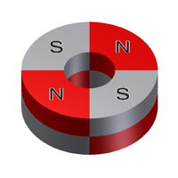

# A-2 Motors and Wheels

## Motors and Wheels

The RedBot is a two-wheeled robot. It also has a semi-circular plastic "nub caster" on the underside of its chassis at the back. This caster acts as a third point of contact to balance the robot \(similar to a third wheel, except the caster doesn't rotate\).

Each wheel is driven by its own motor, which is connected to the RedBot circuit board by a pair of red and black wires. These left and right motors can be controlled as a set or independently, in order to make the robot drive forward, backwards, or make turns.

You can also determine how much power each motor receives, in order to rotate the wheels faster or slower, to control the speed of your robot as it drives and turns.

## Wheel Encoders

Located directly behind each wheel motor is a wheel encoder. The wheel encoder is used to count exactly how many times that motor has rotated. These wheel encoder counts can be used to:

* **make the robot drive in a straight line** \(by adjusting the motor powers if one motor happens to be rotating slightly faster than the other\)
* **calculate how far the robot has driven** \(by determining how many times the wheel has turned and multiplying that by the wheel circumference\)

The wheel encoder actually consists of two parts:

* a **Hall Effect sensor** that can measure the strength of a magnetic field
* a **ring magnet** \(looks like a metal washer\) attached to the motor shaft

When the motor rotates the wheel, it also rotates the ring magnet. The Hall effect sensor positioned near the ring detects changes in the magnetic field as the ring rotates. This is how the sensor can count how many times the motor has rotated.

When you think of a magnet, you probably think of a magnet that has 2 poles: north and south. It is true that magnets have pairs of N-S poles. However, a magnet can be created with multiple pairs of N-S poles. The ring magnets attached to the RedBot motors each have 4 pairs of N-S poles, similar to the diagram below.

So as the ring magnet completes one full rotation, the Hall effect sensor detects 4 changes \(or "ticks"\) in the magnetic field as each magnetic pole passes by the sensor.

Each wheel encoder is connected to the RedBot circuit board by a 3-wire jumper cable \(white, red, and black wires for data, power, and ground\):

* The left wheel encoder data wire should be connected to I/O pin A2
* The right wheel encoder data wire should be connected to I/O pin 10

The wheel encoders are one of the most useful sensors on your robot because they can allow your robot to drive straight for specific distances and to make turns of specific angles \(such as:  90° right, 90° left, 180° around, etc.\).

