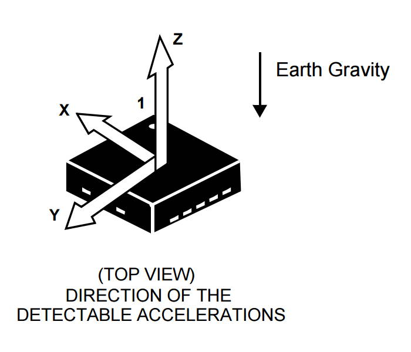
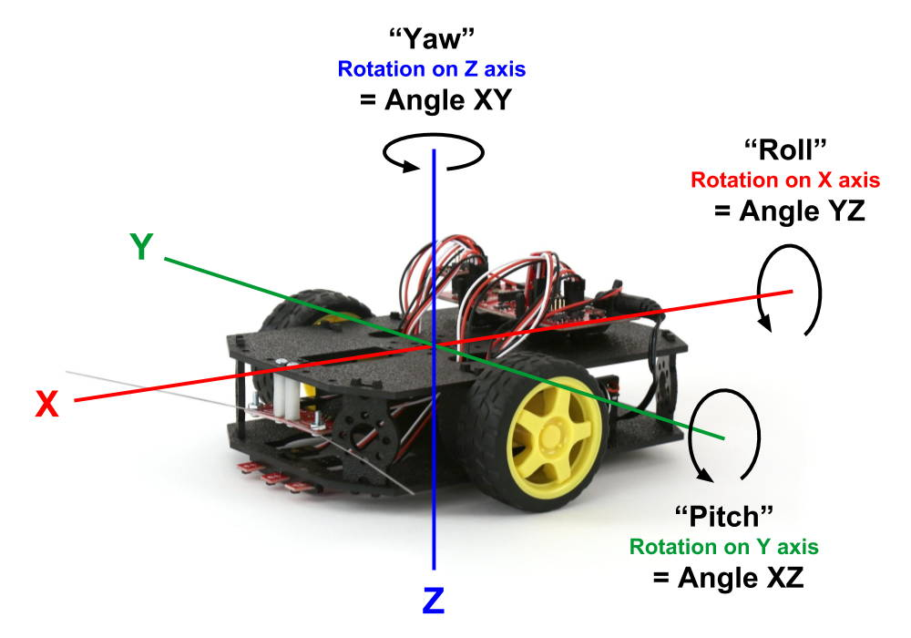
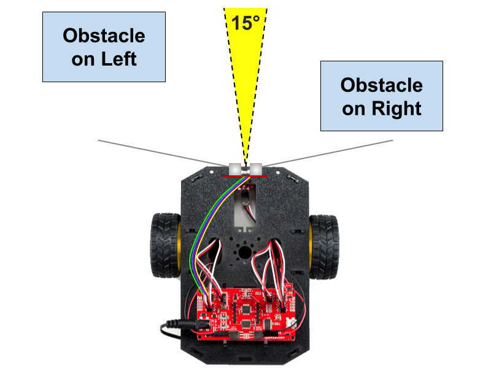

# A-3 Other Components

Your RedBot robot has other useful components, which can be categorized as either physical inputs or physical outputs.

**Physical inputs** \(such as sensors, etc.\) are components that gather data from the physical environment. The D12 push button on the circuit board and the wheel encoders are both examples of physical inputs. Most of the other components on your RedBot are physical inputs that help the robot sense its environment.

**Physical outputs** \(such as motors, etc.\) are components that can something in the physical environment. The D13 LED light on the circuit board and the motors are both examples of physical outputs. The only other component on your RedBot that is a physical output is its speaker.

## Speaker

The RedBot has a small speaker \(labeled as a "buzzer"\) that should be attached to I/O pin 9 on the circuit board.

This speaker can produce simple sounds. The speaker can only play one tone \(sound\) at a time, but you can create different sounds or sound patterns. You could even program it to play simple music by playing one note at a time.

Sounds can be useful as audio alerts or feedback to people interacting with your robot.

## Mechanical Bumpers

The RedBot has two mechanical bumpers \(left and right\) at its front to detect collisions with obstacles.

Each mechanical bumper has a wire "whisker" that extends to one side about 6 inches. If the wire whisker collides with an obstacle, the wire will bend and eventually make contact with a metal screw attached to the bumper board. When this happens, it acts like an electrical switch, which the robot can detect has been closed.

Each mechanical bumper is connected to the RedBot circuit board by a 3-wire jumper cable \(white, red, and black wires for data, power, and ground\):

* The left mechanical bumper data wire should be connected to I/O pin 3
* The right mechanical bumper data wire should be connected to I/O pin 11

## IR Line Sensors

The RedBot has three IR line sensors \(left, center, and right\) mounted at its front close to the surface. The bottom of each line sensor has an LED that transmits infrared \(IR\) light, which is invisible to the human eye. The bottom of each sensor also has an IR detector, which measures how much of the IR light is reflected back by the surface that the robot is driving on.

The amount of reflected IR light that is detected depends on several factors, including the color of the surface, as well as the distance between the sensor and the surface:

* A light-colored surface reflects more IR light, while a dark-colored surface reflects less IR light.
* If the surface is farther away from the sensor, the IR light becomes more scattered, and less IR light will be reflected back to the detector. Even a small increase in the distance between the sensor and the surface will significantly reduce the amount of reflected IR light.

There are several robot behaviors that can be performed using the IR sensors:

* The IR sensors can be used to make the robot **follow a line** by adjusting the left and right motor powers to keep the robot centered on the line as it drives.
* The IR sensors can be used to make the robot **avoid a line** by turning away from a detected line. In this case, lines act as "borders" to keep the robot inside \(or outside\) a certain area or path.
* The IR sensors can be used to **count line markers** that the robot crosses while driving and then make the robot stop or turn once it reaches a desired line number.
* The IR sensors can be used to **avoid driving over a drop-off** by stopping the motors if the IR sensor measurements are too high \(which may indicate the front edge of the robot is hanging over a drop-off, such as the edge of a table, a stair step leading down, a hole in the surface, etc.\).

Detecting lines with the IR sensors works best with a dark line on a uniform light surface \(or vice versa\). The line also needs to be the right width:  not too wide – but not too narrow. A line width between 0.25—0.75 inch is ideal.

Each IR line sensor is connected to the RedBot circuit board by a 3-wire jumper cable \(white, red, and black wires for data, power, and ground\):

* The left line sensor data wire should be connected to I/O pin A3
* The center line sensor data wire should be connected to I/O pin A6
* The right line sensor data wire should be connected to I/O pin A7

## Accelerometer

The RedBot has an accelerometer that can be used to measure changes in motion or orientation along 3 axes \(X, Y, Z\). Accelerometers are used in a variety of devices, including smartphones, fitness trackers, etc.

The accelerometer is a small circuit board that should be connected to I/O pins A4 and A5 on the main RedBot circuit board.

The accelerometer can measure:

* the acceleration of the device \(i.e., the device speeding up or slowing down\)
* the acceleration due to Earth's gravity \(i.e., the orientation of the device\)

Although you can measure the robot's acceleration, you **won't** use the accelerometer to measure the robot's speed. This is because when an object is traveling at a constant speed, its acceleration is actually **zero**. An object is only accelerating if its speed is changing \(i.e., speeding up or slowing down\). Besides you will be able to directly control your robot's speed by adjusting its motor power.

However, you can use the accelerometer to detect when the robot is physically bumped – this type of change in motion is a "pulse" acceleration that is detectable by the accelerometer.

The accelerometer can also detect the orientation of a device by measuring the acceleration due to Earth's gravity, which is a constant downward force acting on all objects. The accelerometer can determine if the device is parallel to Earth's surface or if the device is tilted at an angle.

The accelerometer measures the acceleration along each axis \(X, Y, Z\) and then uses these measurements to calculate the device's angle in the XZ plane, YZ plane, and XY plane.

This diagram shows how the accelerometer's X, Y, and Z axes are oriented on the RedBot and what the XZ, YZ, and XY angles represent. These angles are also referred to as **pitch**, **roll**, and **yaw**.

For a wheeled vehicle, pitch and roll are the most important angles to measure as they indicate the tilt of the vehicle from front-to-back and from side-to-side.

#### PITCH

Angle XZ represents **pitch**. Pitch is the front-to-back rotation on the device's Y axis. The pitch angle can range from -180° to 180°.

* If the RedBot is perfectly level from front-to-back, the pitch is zero \(angle XZ = 0\).
* If the front of the RedBot is rotated up, the pitch is a positive value \(angle XZ &gt; 0\). For example, if the front of the RedBot were pointing straight up, the pitch would be 90°.
* If the front of the RedBot is rotated down, the pitch is a negative value \(angle XZ &lt; 0\). For example, if the front of the RedBot were pointing straight down, the pitch would be -90°.

#### ROLL

Angle YZ represents **roll**. Roll is the side-to-side rotation on the device's X axis. The roll angle can range from -180° to 180°.

* If the RedBot is perfectly level from side-to-side, the roll is zero \(angle YZ = 0\).
* If the left side of the RedBot is rotated up, the roll is a positive value \(angle YZ &gt; 0\). For example, if the left side of the RedBot were pointing straight up, the roll would be 90°.
* If the left side of the RedBot is rotated down, the roll is a negative value \(angle XZ &lt; 0\). For example, if the left side of the RedBot were pointing straight down, the roll would be -90°.

#### YAW

Angle XY represents **yaw**. Yaw is the right-to-left rotation on the device's Z axis. The yaw angle can range from -180° to 180°. However, when the RedBot is on a level surface, the yaw value **cannot** be accurately determined because the acceleration due to Earth's gravity is acting in the same direction \(i.e., downward\) as the Z axis. Therefore, you **cannot** use the accelerometer's XY angle to determine which clockwise direction the robot is pointed. \(However, there are other sensors – not included in this kit – which can be used to accurately measure the yaw angle.\)

## Ultrasonic Sensor


**ADD-ON COMPONENT:** The SparkFun RedBot Kit does **NOT** include an ultrasonic sensor as a standard component. However, SparkFun sells the [HC-SR04 Ultrasonic Sensor](https://www.sparkfun.com/products/13959), which can be easily connected to a RedBot. Your teacher may have added this sensor to your kit.


An ultrasonic sensor uses sonar to measure the distance ahead to the closest object in the robot's path. This can be used to avoid collisions with obstacles.  This is similar to how bats and dolphins use echolocation for navigation and hunting.

The ultrasonic sensor has a transmitter \(i.e., a speaker\) that can produce high-frequency sound, which cannot be heard by the human ear. The sensor also has a receiver \(i.e., a microphone\) that detects the echo of the high-frequency sound when it is reflected back from a nearby object. By measuring how much time it takes for the echo to arrive, you can calculate the distance between the sensor and the closest object.

This ultrasonic sensor measures distances in a narrow cone of about 15° in front of the sensor. This sensor can detect obstacles located up to 400 cm away \(about 13 feet\). The distance measurements from the sensor are very accurate, within about 3 mm \(about 0.1 inch\) of the actual distance.

The primary use of the ultrasonic sensor is to prevent collisions. If the sensor detects a nearby obstacle in the path ahead, the robot can be programmed to avoid the obstacle by stopping or turning. You could even use this sensor to program your robot to navigate a maze on its own.

However, the ultrasonic sensor might **not** detect obstacles off to the left side or right side — if those obstacles are outside the 15° detection cone directly in front of the sensor. For these situations, you may want to use the mechanical bumpers as a fallback system to supplement the ultrasonic sensor. Since the mechanical bumper whiskers extend outwards on both sides, they can detect a collision with an obstacle that the ultrasonic sensor might not detect \(as shown below\).

The ultrasonic sensor should be connected to the RedBot circuit board by a 4-wire jumper cable \(will be different colors – two wires are for data, one is for power, and one is for ground\):

* The transmitter data wire \(TRIG\) should be connected to I/O pin A0.
* The receiver data wire \(ECHO\) should be connected to I/O pin A1.

