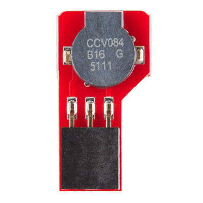

# A-3 Other Components

**STILL IN PROGRESS**

Your RedBot robot has other useful components, which can be categorized as either physical inputs or physical outputs.

**Physical inputs** \(such as sensors, etc.\) are components that gather data from the physical environment. The D12 push button on the circuit board and the wheel encoders are both examples of physical inputs. Most of the other components on your RedBot are physical inputs that help the robot sense its environment.

**Physical outputs** \(such as motors, etc.\) are components that can something in the physical environment. The D13 LED light on the circuit board and the motors are both examples of physical outputs. The only other component on your RedBot that is a physical output is its speaker.

## Speaker

The RedBot has a small speaker \(labeled as a "buzzer"\) that should be attached to I/O pin 9 on the circuit board.

This speaker can produce simple sounds. The speaker can only play one tone \(sound\) at a time, but you can create different sounds or sound patterns. You could even program it to play simple music by playing one note at a time.

Sounds could be useful as audio alerts or feedback to people interacting with your robot.

## Mechanical Bumpers

explain

Each mechanical bumper is connected to the RedBot circuit board by a 3-wire jumper cable \(white, red, and black wires for data, power, and ground\):

* The left mechanical bumper data wire should be connected to I/O pin 3
* The right mechanical bumper data wire should be connected to I/O pin 11

## IR Line Sensors

explain

Each IR line sensor is connected to the RedBot circuit board by a 3-wire jumper cable \(white, red, and black wires for data, power, and ground\):

* The left line sensor data wire should be connected to I/O pin A3
* The center line sensor data wire should be connected to I/O pin A6
* The right line sensor data wire should be connected to I/O pin A7

## Accelerometer

The accelerometer is a small circuit board that should be connected to I/O pins A4 and A5 on the main RedBot circuit board.

explain

## Ultrasonic Sensor


**ADD-ON COMPONENT:** The SparkFun RedBot Kit does **NOT** include an ultrasonic sensor as a standard component. However, SparkFun sells the [HC-SR04 Ultrasonic Sensor](https://www.sparkfun.com/products/13959), which can be easily connected to a RedBot. Your teacher may have added this sensor to your kit.


explain

The ultrasonic sensor should be connected to the RedBot circuit board by a 4-wire jumper cable \(will be different colors – two wires are for data, one is for power, and one is for ground\):

* The transmitter data wire \(TRIG\) should be connected to I/O pin A0.
* The receiver data wire \(ECHO\) should be connected to I/O pin A1.

